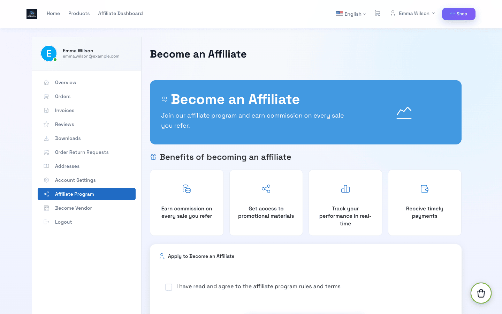
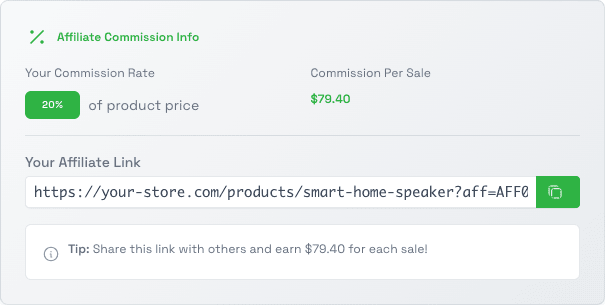
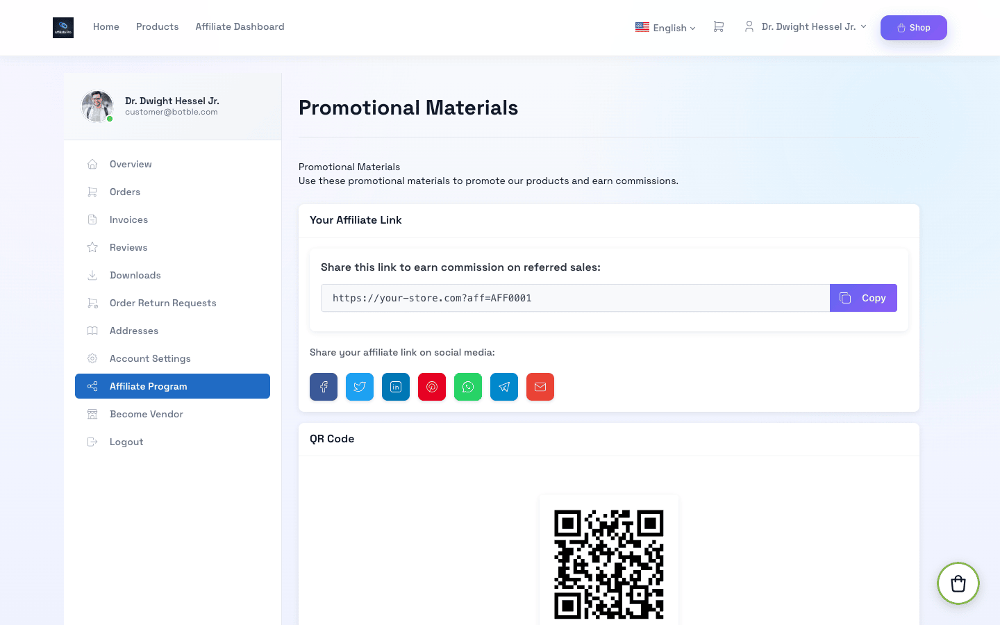
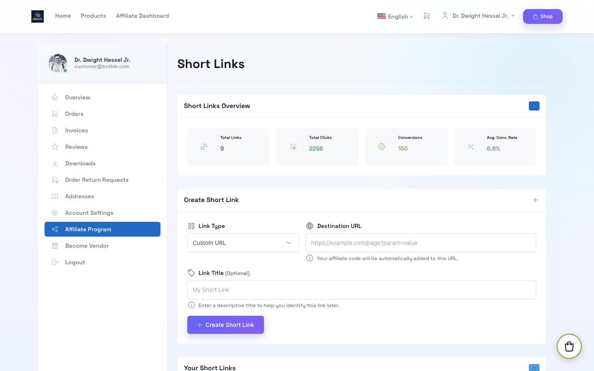
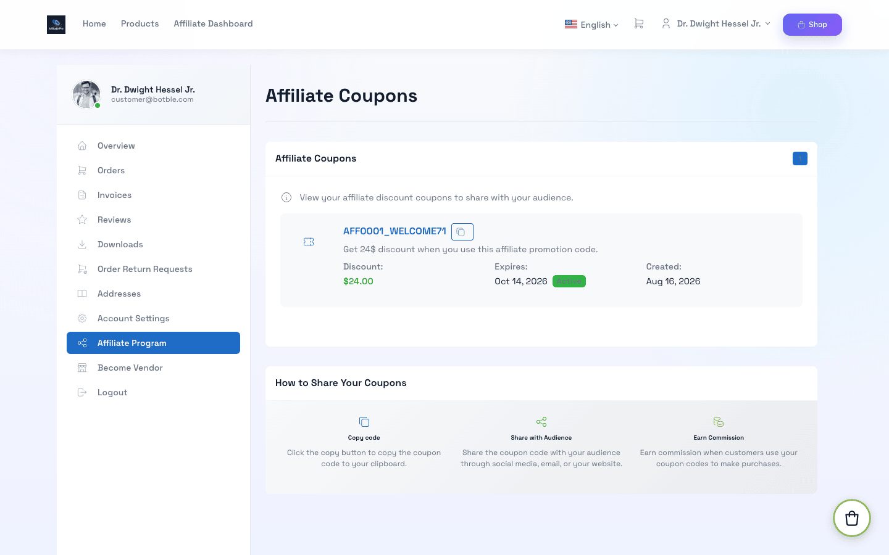
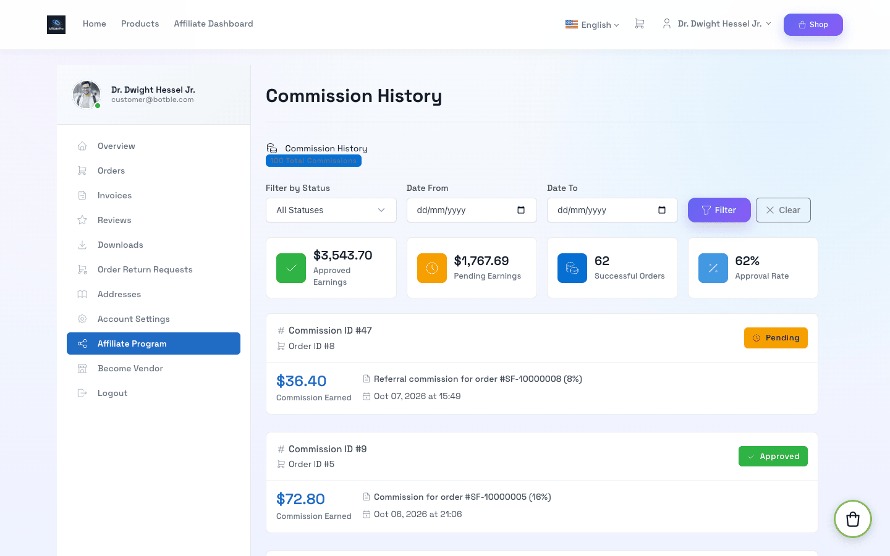
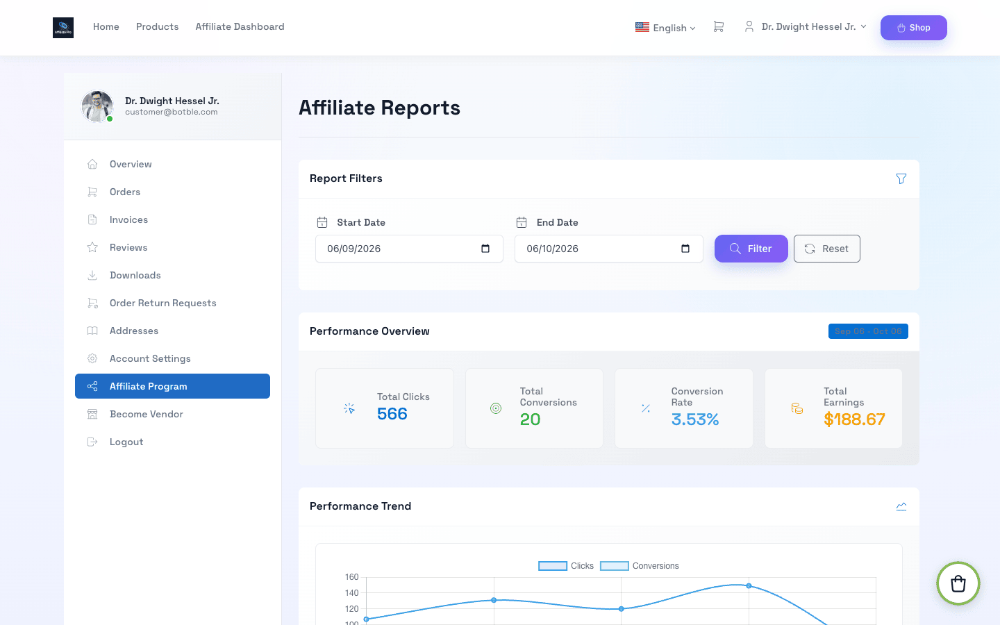
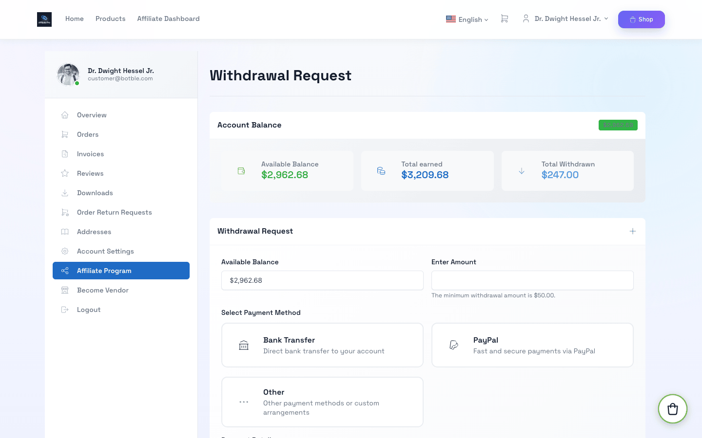

# Affiliate Dashboard

This page explains the program from the affiliate's side. Everything is under **My Account → Affiliate Program** on the storefront.

## Apply to Become an Affiliate

1. Log in (or register) a customer account.
2. Open **Affiliate Program** in the account menu.
3. Read the program terms, tick the agreement box and click **Apply to Become an Affiliate**.



Your application is reviewed by the store (or approved instantly if auto-approval is on). You get an email either way. If it is rejected, the email and the Affiliate Program page show the reason, and you can **re-apply**.

## Dashboard Overview


- **Balance** — money available to withdraw.
- **Total commission / Total withdrawn** — approved earnings and money already paid out.
- **This month commission** — commissions created this month, including pending ones.
- **Member level** — your current tier, its benefits and how much more commission you need for the next one.
- **Statistics** — total clicks and conversion rate.

## Share Your Link

Your affiliate link is any store URL with `?aff=YOUR_CODE` added:

```
https://your-store.com/?aff=AFF0001
https://your-store.com/products/smart-home-speaker?aff=AFF0001
```

Visitors who open your link are remembered for the number of days set by the store (30 by default). If they order within that time, you earn a commission — even if they leave and come back later. Orders placed with your own account do not count.

When you browse the store while logged in, every product page shows your commission for that product and a ready-to-copy link:



## Promotional Materials

**Promotional Materials** has everything you need to promote the store:

- your main link with a **Copy** button and one-click sharing to social networks,
- a **QR code** for print and offline use,
- **banners** with ready-to-paste HTML code for your website or blog.



## Short Links

Create short, clean links such as `https://your-store.com/go/x7K2pQ`. Each short link has its own click and conversion count, so you can see which channel works best. Your affiliate code is added to the link automatically.

1. Open **Short Links**.
2. Choose a type — **Product**, **Homepage** or **Custom URL** (any page of the store).
3. Add a title so you recognise it later, then click **Create Short Link**.



## Coupons

**Affiliate Coupons** lists the discount codes the store created for you. Customers who use your code at checkout get a discount and the order is credited to you — even if they never clicked your link. (If they clicked another affiliate's link first, that link wins.) Orders you place yourself never earn a commission.



## Commission History

**Commission History** lists every commission with order code, amount, date and status:

| Status | Meaning |
|--------|---------|
| Pending | Order placed, waiting for the store to approve it (usually after the order is completed) |
| Approved | The amount is in your balance |
| Rejected | Order cancelled, returned, or commission declined |



## Reports

**Detailed Reports** shows clicks, conversions, conversion rate and earnings for any date range, with a performance trend chart.



## Request a Withdrawal

1. Open **Withdrawal Request**.
2. Enter the amount — at least the minimum shown on the page and no more than your balance.
3. Choose a payment method and enter your payment details (bank account, PayPal email…). For **Stripe**, click **Connect with Stripe** first and finish Stripe's onboarding.
4. Submit. The amount is reserved from your balance until the store processes it.



You get an email when the withdrawal is approved or rejected. A rejected amount goes back to your balance.
