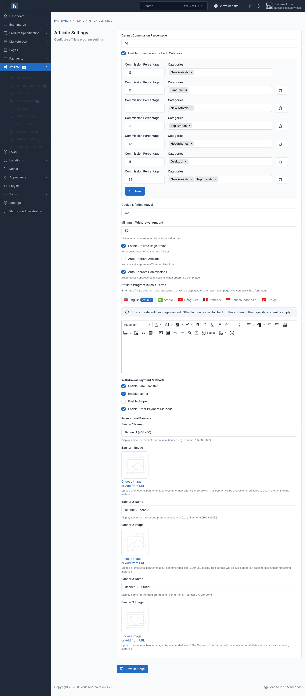
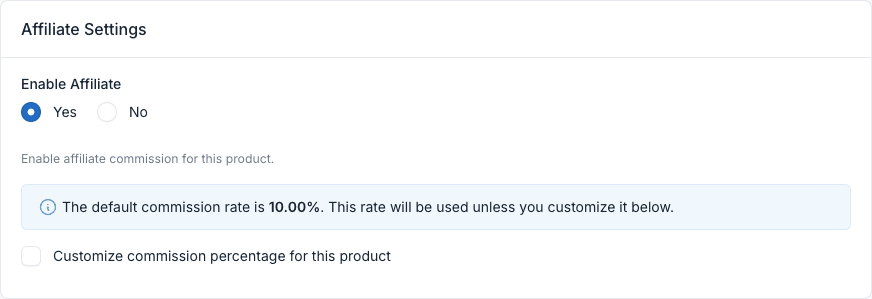

# Configuration

Open **Affiliate → Affiliate Settings** (also reachable from **Settings → E-commerce → Affiliate Settings**). Changes apply as soon as you click **Save settings**.

## Commission & Tracking

| Setting | Default | Description |
|---------|---------|-------------|
| Default Commission Percentage | 10 | Percentage of the product price paid to the affiliate when no product or category rate applies |
| Enable Commission for Each Category | Off | Set different rates for groups of categories (see below) |
| Cookie Lifetime (days) | 30 | How long a referral is remembered after a visitor clicks an affiliate link |

### Category Commission Groups

1. Turn on **Enable Commission for Each Category**.
2. Click **Add New** to add a group.
3. Enter the **commission percentage** and choose the **categories** it applies to.
4. Repeat for other groups, then save.

If a product belongs to several groups, the first matching group (top to bottom) wins.

### Which Rate Is Used?

For each product in an order, the plugin picks the first rate that applies:

1. **Affiliate disabled on the product** → no commission for that product.
2. **Product commission percentage** (set on the product edit page) — used as-is.
3. **Category group rate** (if category commissions are enabled) — used as-is.
4. **Base rate** — the affiliate's own commission rate if you set one, otherwise the default percentage. The base rate is multiplied by the affiliate's [member level](./usage-member-levels.md) multiplier.

Commission per product = `(price × quantity − the product's share of the order discount) × rate / 100`. Shipping and tax are not included. See [Commissions](./usage-commissions.md#how-the-amount-is-calculated).

::: tip Example
Default rate 10%, affiliate is at level **Gold** (multiplier 1.25). A $200 product with no product/category rate earns `200 × 10% × 1.25 = $25`. A product with its own 5% rate earns `$10` — the level multiplier does not apply to product or category rates.
:::

## Registration & Approval

| Setting | Default | Description |
|---------|---------|-------------|
| Enable Affiliate Registration | On | Show the **Affiliate Program** menu in the customer account. Turning it off hides the menu for everyone, including existing affiliates |
| Auto Approve Affiliates | Off | Approve applications instantly instead of sending them to **Pending Requests** |
| Auto Approve Commissions | On | Approve commissions automatically when the order is completed. Turn off to review and approve each commission yourself in **Affiliate → Commissions** |
| Affiliate Program Rules & Terms | Sample text | Terms shown on the application form. Customers must accept them to apply. Editable per language when multiple languages are active |

## Withdrawals

| Setting | Default | Description |
|---------|---------|-------------|
| Minimum Withdrawal Amount | 50 | Smallest amount an affiliate can request |
| Bank Transfer | On | Affiliate enters bank details |
| PayPal | On | Affiliate enters a PayPal email address |
| Stripe | Off | Available when the Stripe Connect plugin (included in Botble E-commerce scripts) is active. Affiliates connect their Stripe account from the withdrawal form |
| Other | On | Free-text payment details |

See [Withdrawals](./usage-withdrawals.md) for automatic payouts via PayPal Payout and Stripe Connect.

## Promotional Banners

Up to three banners that affiliates can copy as HTML from their **Promotional Materials** page. For each banner set a **name** and an **image**. Common sizes: 468×60, 728×90, 300×250. Leave the image empty to hide a banner.

## Product Settings

Each product has an **Affiliate Settings** box on its edit page (**Ecommerce → Products → Edit**):

- **Enable Affiliate** — turn off to pay no commission for this product.
- **Customize commission percentage for this product** — tick and enter a rate to override category and default rates.

Only admins with the `products.edit` permission can change these settings. See [Marketplace Integration](./marketplace-integration.md) for vendor products.

## Permissions

Assign permissions in **Settings → Roles And Permissions**, under **Affiliate**:

| Permission | Allows |
|------------|--------|
| `affiliate-pro.index` / `create` / `edit` / `destroy` | View, create, edit, delete affiliates (also approve/reject applications) |
| `affiliate.commissions.index` | View commissions |
| `affiliate.commissions.edit` | Approve and reject commissions |
| `affiliate.withdrawals.index` | View withdrawals |
| `affiliate.withdrawals.edit` | Approve and reject withdrawals |
| `affiliate.reports` | View reports |
| `affiliate.coupons.index` / `create` / `edit` / `destroy` | Manage affiliate coupons |
| `affiliate.short-links.index` / `create` / `edit` / `destroy` | Manage short links |
| `affiliate-pro.levels.index` / `create` / `edit` / `destroy` | Manage member levels |
| `affiliate.settings` | Change affiliate settings |

## Scheduled Tasks

The weekly [performance digest](./usage-email-notifications.md#weekly-performance-digest) needs the Laravel scheduler. Make sure your server runs the [cron job](/cms/cronjob).
