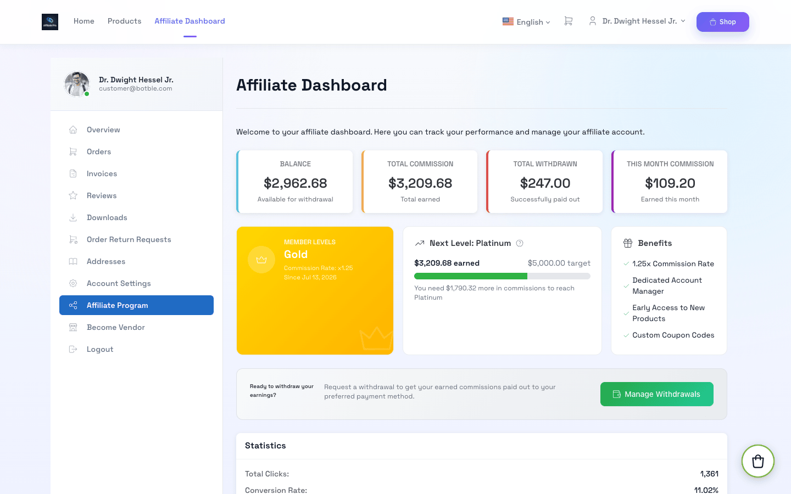

# Affiliate Pro

Affiliate Pro turns your customers into a sales team. Customers apply to become affiliates, share tracked links, coupons and banners, and earn a commission on every order they refer. You approve affiliates, review commissions and pay out withdrawals from the admin panel.

## How It Works

1. A customer applies from **My Account → Affiliate Program**. You approve the application, or turn on auto-approval.
2. The affiliate shares a link containing their code, for example `https://your-store.com/products/smart-speaker?aff=AFF0001`.
3. When a visitor opens the link, a cookie (`affiliate_code`) is stored for the configured lifetime (default 30 days).
4. If the visitor places an order while the cookie is valid — or uses the affiliate's coupon code — a **Pending** commission is created. Affiliates never earn on their own orders.
5. When the order is **Completed**, the commission is approved automatically (or you approve it manually if you turned auto-approval off). The amount is added to the affiliate's balance. Cancelled orders and completed returns reverse it.
6. The affiliate requests a withdrawal once their balance reaches the minimum amount, and you pay it out.

## Features

| Area | What you get |
|------|--------------|
| **Affiliates** | Application form with your own terms, manual or automatic approval, rejection reason, re-apply, ban/unban, per-affiliate commission rate |
| **Commissions** | Global rate, per-category rates, per-product rates, per-product opt-out, calculated after discounts, auto-approval on order completion (can be turned off), automatic reversal on cancellation and returns, self-referral protection |
| **Member levels** | Tiers (e.g. Bronze → Platinum) unlocked by total commission earned, each with a commission multiplier and benefit list |
| **Tracking** | Click tracking, conversion rate, referrer and landing URL, short links (`/go/{code}`) with their own click and conversion stats |
| **Marketing tools** | Affiliate coupon codes (credited to the affiliate), short links, up to 3 promotional banners with embed code, QR code, product-page link box |
| **Withdrawals** | Bank transfer, PayPal, Stripe and "Other" methods, minimum amount, approve/reject with balance refund, optional automatic payouts via the PayPal Payout / Stripe Connect plugins included in Botble E-commerce scripts |
| **Reports** | Admin reports with commission and withdrawal charts, top affiliates; affiliate-side reports with clicks, conversions and earnings trend |
| **Emails** | 10 email templates, including a weekly performance digest |
| **Marketplace** | Commission is deducted from the vendor's revenue for the referred order |
| **Translations** | 40+ languages included |

## Requirements

- Botble CMS 7.5.0 or higher
- PHP 8.3 or higher
- Botble **E-commerce** plugin activated
- MySQL 5.7+ or MariaDB 10.3+

## Where to Next

- [Install the plugin](./installation.md)
- [Configure commission, cookies and payouts](./configuration.md)
- [Admin guide](./usage-guide.md) — manage affiliates, commissions and payouts
- [Affiliate dashboard](./affiliate-dashboard.md) — what your affiliates see

## Support

Visit [botble.com](https://botble.com) or email [support@botble.com](mailto:support@botble.com).
