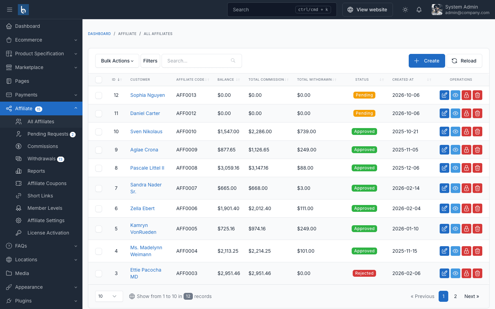

# Installation

## Requirements

- Botble CMS 7.5.0 or higher
- PHP 8.3 or higher
- Botble **E-commerce** plugin activated
- MySQL 5.7+ or MariaDB 10.3+

## Install the Plugin

1. Download the plugin from your [CodeCanyon downloads page](https://codecanyon.net/downloads).
2. Extract the zip and upload the `affiliate-pro` folder to `platform/plugins/`, so the path is `platform/plugins/affiliate-pro`.
3. In the admin panel, go to **Plugins → Installed Plugins** and click **Activate** on **Affiliate Pro**.

Activation runs the database migrations automatically. You can also activate from the command line:

```bash
php artisan cms:plugin:activate affiliate-pro
```

## Activate Your License

Log in as a super admin, go to **Affiliate → License Activation**, enter your CodeCanyon purchase code, tick the license agreement checkbox and click **Activate license**.

## Verify the Installation

After activation, an **Affiliate** menu appears in the admin sidebar:



| Menu item | Purpose |
|-----------|---------|
| All Affiliates | Every affiliate, whatever the status |
| Pending Requests | Applications waiting for review (badge shows the count) |
| Commissions | All commissions with Pending / Approved / Rejected status |
| Withdrawals | Payout requests (badge shows pending requests) |
| Reports | Charts and top affiliates |
| Affiliate Coupons | Discount codes assigned to affiliates |
| Short Links | Tracked short URLs (`/go/{code}`) |
| Member Levels | Commission tiers |
| Affiliate Settings | Plugin settings |
| License Activation | Purchase code activation (visible to super admins only) |

On the storefront, logged-in customers see an **Affiliate Program** item in their account menu (`/customer/affiliate`).

## Next Steps

1. [Configure the plugin](./configuration.md) — commission rate, cookie lifetime, payout methods.
2. Set up a cron job so scheduled tasks (weekly digest email) run — see [Cronjob](/cms/cronjob).
3. Review the [email templates](./usage-email-notifications.md).

## Installation Problems

| Problem | Fix |
|---------|-----|
| Plugin not listed | Check the folder is `platform/plugins/affiliate-pro` (not nested twice) and contains `plugin.json` |
| "Requires botble/ecommerce" | Activate the E-commerce plugin first |
| Menu missing after activation | Clear cache in **Platform Administration → Cache Management** |
| Migration error | Check database user permissions, then run `php artisan migrate` |
