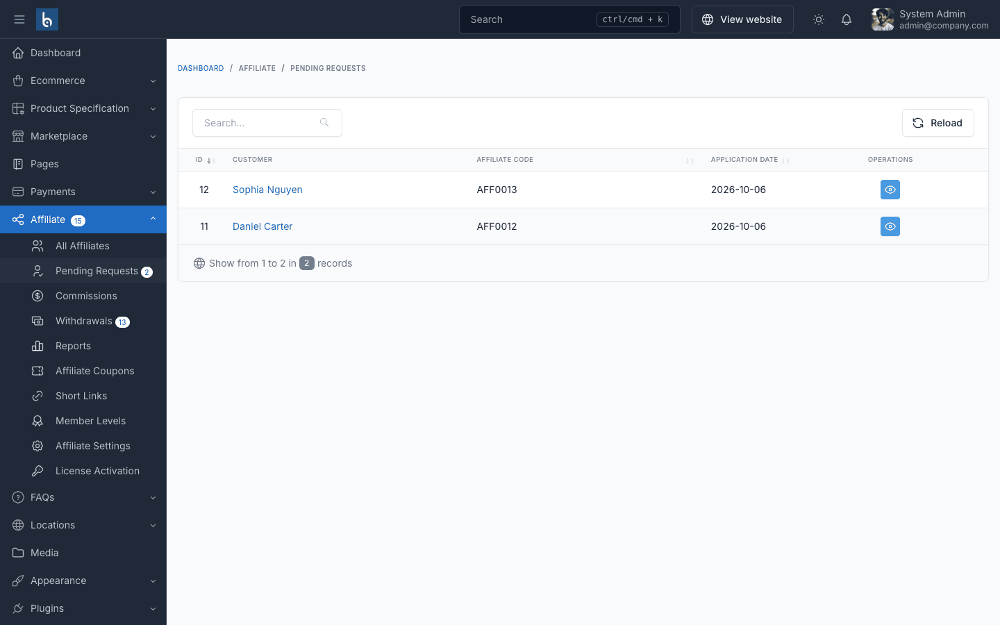
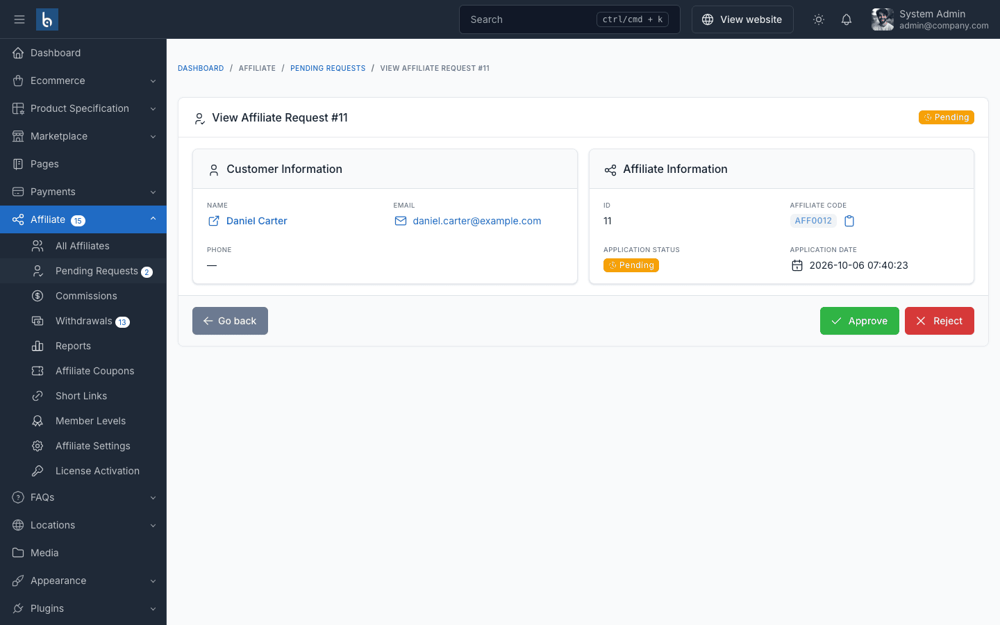
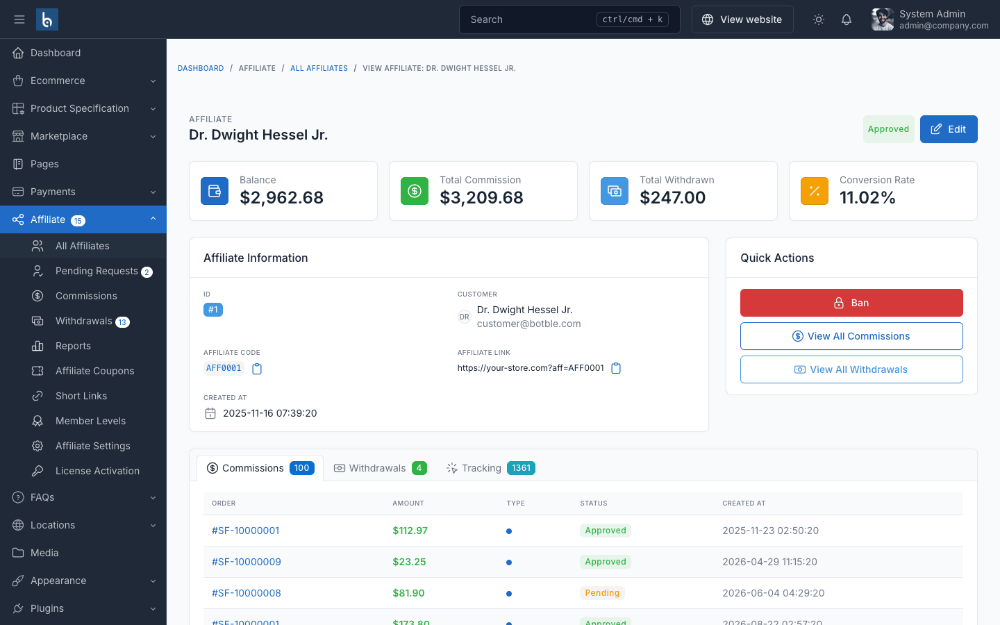

# Managing Affiliates

## Review Applications

When a customer applies and **Auto Approve Affiliates** is off, the application goes to **Affiliate → Pending Requests**. The menu badge shows how many are waiting.

Click **View** to open an application:

- **Approve** — the customer becomes an active affiliate and receives the *Application Approved* email.
- **Reject** — enter a reason (required, up to 400 characters). The customer receives the *Application Rejected* email with your reason, sees it on their Affiliate Program page, and can **re-apply** after fixing the issue.

## Affiliate List

**Affiliate → All Affiliates** lists every affiliate — whatever the status — with code, balance, total commission, total withdrawn and status. Use **Filters** or search to find an affiliate.

## Affiliate Detail

Click the eye (**View**) icon in the list to open the detail page:

- **Stats** — balance, total commission, total withdrawn, conversion rate.
- **Affiliate link** — copy the affiliate's main link.
- **Tabs** — the affiliate's commissions, withdrawals and click tracking (IP, referrer, landing page, converted or not).
- **Quick actions** — ban, view all commissions or withdrawals.

## Edit an Affiliate

Click **Edit** on the detail page (or the pencil icon in the list) to change:

- **Affiliate code** — the value used in `?aff=` links. Changing it breaks links already shared.
- **Commission rate** — a personal base rate for this affiliate. Leave empty to use the default rate. Product and category rates still take priority — see [Which Rate Is Used?](./configuration.md#which-rate-is-used).
- **Member level** — assign a level manually (levels also upgrade automatically, see [Member Levels](./usage-member-levels.md)).
- **Balance, totals and status** — adjust manually if needed.

You can also create an affiliate for an existing customer with **Create** on the list page.

## Ban and Unban

**Ban** an affiliate who breaks your terms, from the detail page or the row actions in the list. A banned affiliate:

- cannot open their affiliate dashboard (they see a "banned" page),
- no longer earns new commissions — their links, short links and coupons stop crediting them (commissions already pending can still be approved or rejected by you),
- receives the *Affiliate Banned* email.

Click **Unban** to restore the account. The affiliate receives the *Affiliate Unbanned* email.

## Affiliate Status Reference

| Status | Meaning |
|--------|---------|
| Pending | Application waiting for review |
| Approved | Active — links are tracked and commissions are earned |
| Rejected | Application declined; the customer can re-apply |
| Suspended | Set manually on the edit page — links are not tracked and the dashboard is unavailable |
| Banned | Account blocked by an admin |

## Orders From Affiliates

When an order comes from an affiliate, the order detail page (**Ecommerce → Orders**) shows the affiliate who referred it and the commission amount.
