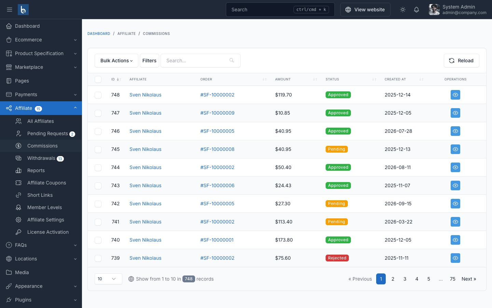
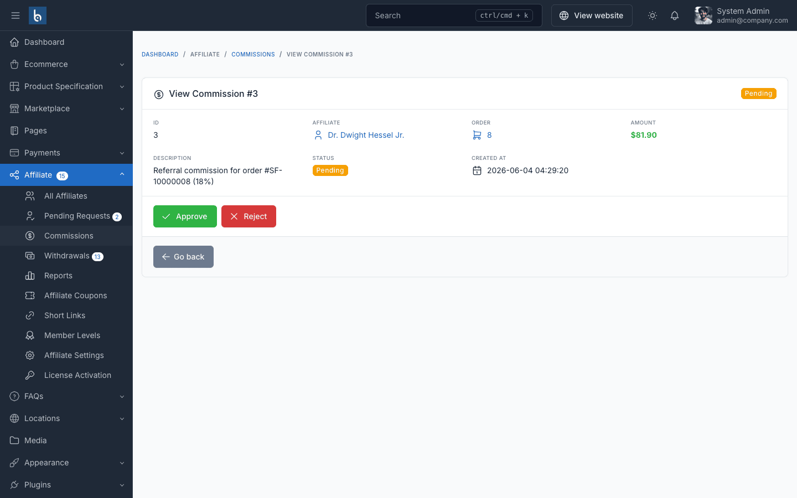

# Commissions

## Which Affiliate Gets the Order?

When an order is placed, the plugin looks for the referring affiliate in this order:

1. The **referral cookie** — the visitor opened an affiliate link (`?aff=CODE` or a `/go/...` short link) within the cookie lifetime.
2. The **affiliate coupon** — the order used a coupon code that belongs to an affiliate.

The affiliate must be **Approved**. Self-referrals are always blocked: an affiliate never earns commission on orders placed with their own customer account.

## Commission Lifecycle

| Event | Commission |
|-------|------------|
| Order placed by a referred customer | Created with status **Pending** |
| Order marked **Completed** | **Approved** automatically when **Auto Approve Commissions** is on (the default). If you turned it off, it stays Pending until you approve it |
| You approve it in **Affiliate → Commissions** | **Approved** |
| Order **Cancelled** | Pending → **Rejected**. Approved → reversed (amount taken back from the balance) |
| Order **return completed** | The returned share of the commission is reversed. A partial return reverses only that part |

When a commission is approved, the amount is added to the affiliate's balance and total commission, the affiliate may move up a [member level](./usage-member-levels.md), and the *New Commission Earned* email is sent.

## How the Amount Is Calculated

One order creates one commission — the sum over all eligible products:

```
product commission = (price × quantity − the product's share of the order discount) × rate / 100
```

- Shipping and tax are excluded.
- The order discount (coupon or promotion) is split across products in proportion to their value.
- Products with affiliate disabled earn nothing.
- The rate for each product is chosen as described in [Which Rate Is Used?](./configuration.md#which-rate-is-used)

## Commission List

Go to **Affiliate → Commissions** to see every commission with its affiliate, order, amount and status. Use **Filters** to show only *Pending* commissions.



## Approve or Reject Manually

Open a pending commission with the eye icon:



- **Approve** — credits the affiliate immediately.
- **Reject** — the affiliate earns nothing for this order.

Only pending commissions can be approved or rejected. To take back an approved commission, cancel the order or complete a return.

::: tip
Turning **Auto Approve Commissions** off and approving commissions after your return period ends means you rarely need to reverse them.
:::

Approving and rejecting requires the `affiliate.commissions.edit` permission.

## Affiliate View

Affiliates see their own commissions under **Affiliate Program → Commission History**. See [Affiliate Dashboard](./affiliate-dashboard.md#commission-history).
