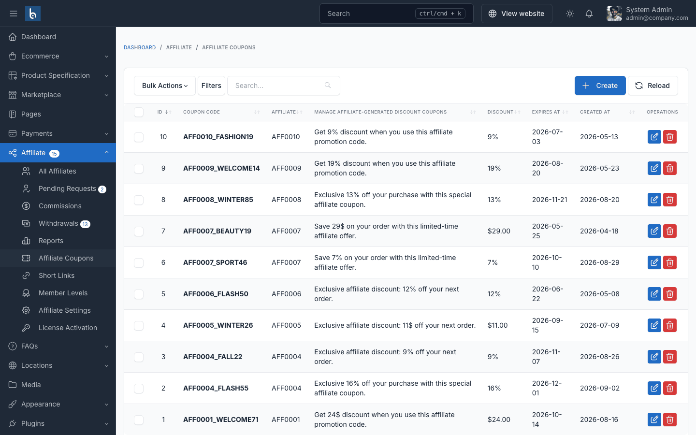
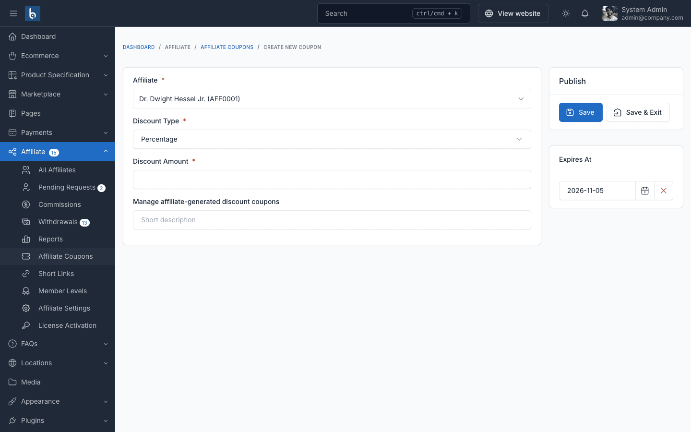
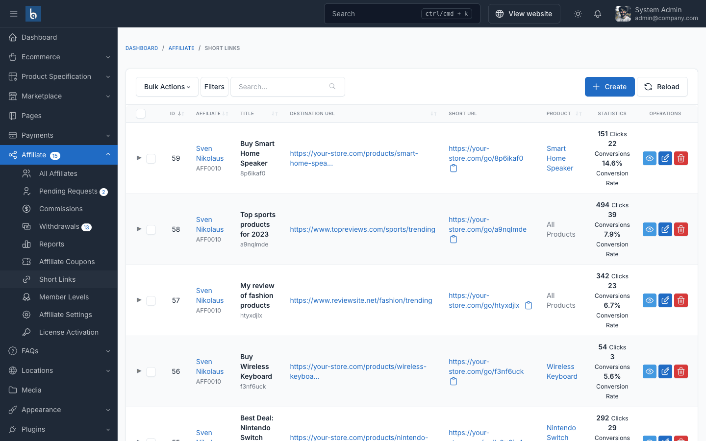

# Coupons & Short Links

## Affiliate Coupons

Give an affiliate a personal discount code to share with their audience. Coupons are created by the admin; affiliates see them on their **Affiliate Coupons** page.

### Create a Coupon

Go to **Affiliate → Affiliate Coupons → Create**:

| Field | Description |
|-------|-------------|
| Affiliate | Who owns the coupon |
| Discount Type | Percentage or fixed amount |
| Discount Amount | Value of the discount |
| Description | Shown to the affiliate |
| Expires At | End date, pre-filled with 30 days from today — change or clear it |

The plugin creates a matching coupon in **Ecommerce → Discounts** with a generated code (for example `AFF1A2B3C4D`). Customers enter it at checkout like any other coupon. Each coupon can be used up to 1,000 times and cannot be combined with other promotions.

::: tip Coupons credit the affiliate
An order that uses an affiliate's coupon is credited to that affiliate, even if the customer never clicked their link. If the customer also has a referral cookie from an affiliate link, the cookie wins. Affiliates never earn on their own orders.
:::

## Short Links

Short links turn a long affiliate URL into `https://your-store.com/go/{code}`. Each short link counts its own clicks and conversions (orders), so affiliates can compare channels (Instagram vs. newsletter, for example).

### Who Creates Short Links

- **Affiliates** create them from **Affiliate Program → Short Links** — for a product, the homepage, or any custom page of your store.
- **Admins** create them from **Affiliate → Short Links → Create** for any affiliate, with a short code of their choice (e.g. `summer2026`). Codes created by affiliates are generated automatically (6 characters).

The destination must be a page on your store. When a visitor opens a short link, the click is counted once, the referral cookie is set for the link's affiliate, and the visitor is redirected to the destination. You do not need to add `?aff=` to the destination yourself.

When that visitor places an order, the short link's conversion count goes up.

Short links stop working when their affiliate is banned or no longer approved.
