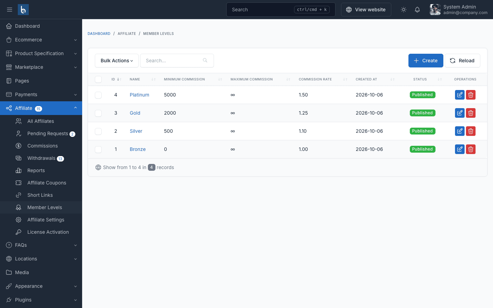
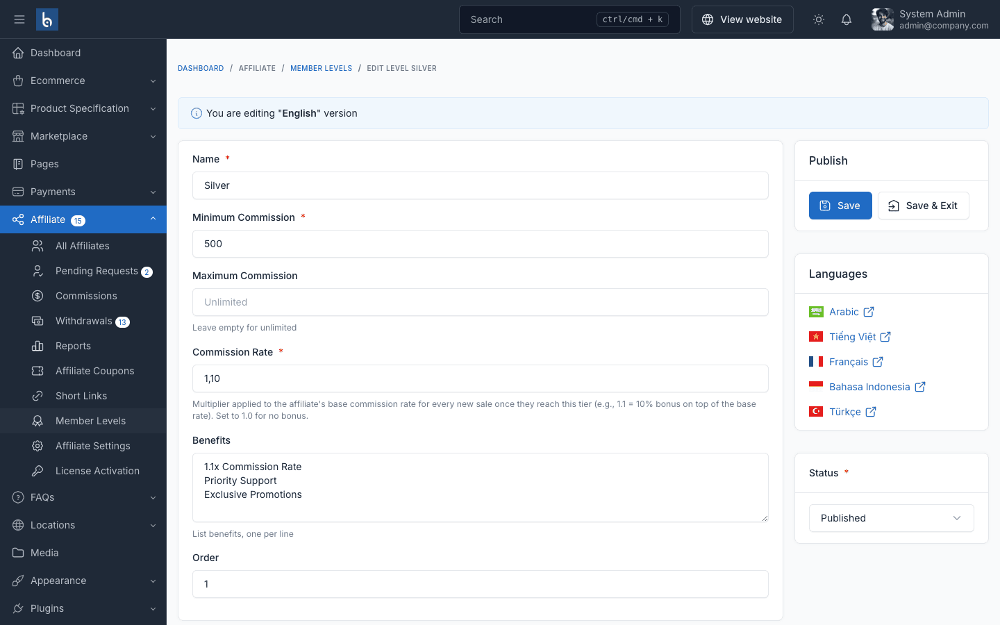

# Member Levels

Member levels (tiers) reward your best affiliates. Each level has a **minimum total commission** to unlock it and a **commission multiplier**. When an affiliate's total approved commission reaches a level's minimum, they move up automatically.

## Create a Level

Go to **Affiliate → Member Levels → Create**.

| Field | Description |
|-------|-------------|
| Name | Shown to the affiliate, e.g. *Gold* |
| Minimum Commission | Total commission needed to reach this level |
| Maximum Commission | Upper bound shown to affiliates. Leave empty for unlimited |
| Commission Rate | Multiplier on the affiliate's base rate. `1.00` = no change, `1.25` = +25%, `1.5` = +50% |
| Benefits | One benefit per line, listed on the affiliate dashboard |
| Status | Only **Published** levels are used |

Level names and benefits can be translated when multiple languages are active.

## Example Setup

| Level | Minimum Commission | Multiplier | With a 10% default rate |
|-------|--------------------|------------|-------------------------|
| Bronze | 0 | 1.00 | 10% |
| Silver | 500 | 1.10 | 11% |
| Gold | 2,000 | 1.25 | 12.5% |
| Platinum | 5,000 | 1.50 | 15% |

## How Upgrades Work

- The level is recalculated every time a commission is approved.
- Approving commissions only ever moves an affiliate **up**. When a commission is reversed (cancelled order, return or refund) and that reversal takes their total commission below their level's minimum, they move down to the highest level they still qualify for. A level you assigned by hand to an affiliate whose total was already below its minimum is kept.
- The multiplier applies to the **base rate** only (the default rate or the affiliate's custom rate). Product and category rates are not multiplied.
- You can set an affiliate's level by hand on the affiliate edit page.

Affiliates see their current level, benefits and progress to the next level on their dashboard:

