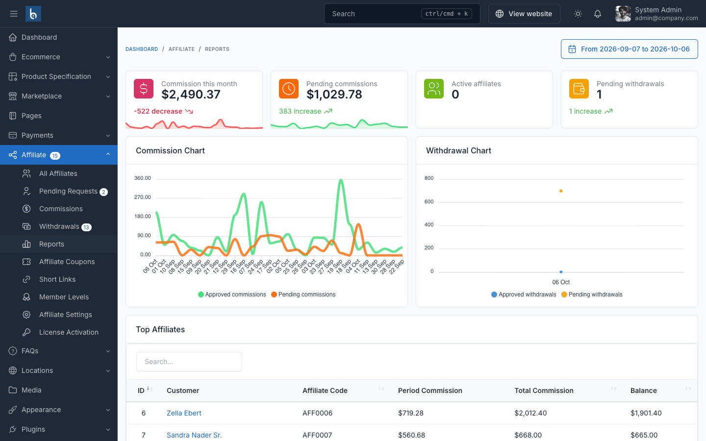

# Reports

Go to **Affiliate → Reports**. Use the date range picker (top right) to change the period.

## Summary Cards

All cards count records created in the selected period.

| Card | Shows |
|------|-------|
| Commission this month | Approved commission, with the change vs. the previous period |
| Pending commissions | Commission still waiting for approval |
| Active affiliates | Approved affiliates who joined in the period |
| Pending withdrawals | Withdrawal requests still pending |

## Sections

| Section | Shows |
|---------|-------|
| Commission Chart / Withdrawal Chart | Daily approved vs. pending amounts |
| Top Affiliates | Affiliates ranked by commission in the period, with total commission and balance |
| Recent Commissions / Recent Withdrawals | Latest records with links to each one |
| Products Enabled Affiliate | How many products have affiliate turned on |
| Performance Metrics | Total clicks, conversions, earnings and average commission, with a chart over time |
| Conversion Rate Analysis | Overall conversion rate and a breakdown by traffic source, with improvement tips |
| Geographic Data | Clicks by country — empty unless a geolocation service fills in the country |
| Short Link Performance | Clicks and conversions per short link |
| Commission Trends | Commission amounts over time |

## One Affiliate's Data

For one affiliate's clicks, conversions and commissions, open the affiliate's [detail page](./usage-affiliates.md#affiliate-detail). Affiliates see their own numbers on the [Detailed Reports page of their dashboard](./affiliate-dashboard.md#reports).
