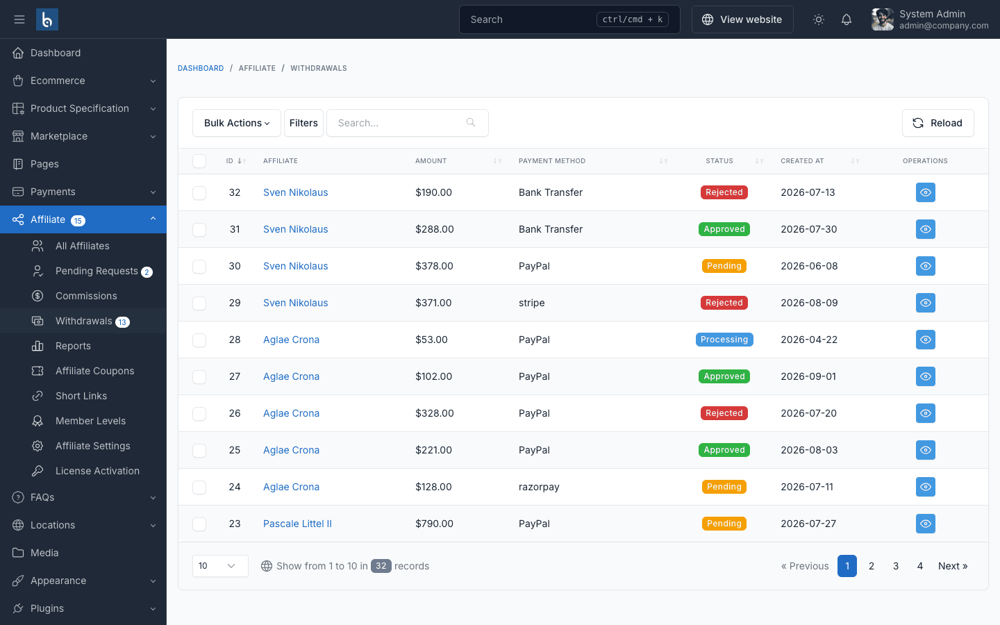

# Withdrawals

## How a Withdrawal Works

1. The affiliate requests an amount from their dashboard. It must be at least the **Minimum Withdrawal Amount** and not more than their balance. Amounts are always in your store's **default currency**, whatever currency the visitor has selected.
2. The amount is **deducted from the balance right away** and the request is **Pending**. You receive the *Withdrawal Requested* email.
3. You pay the affiliate outside the system (bank transfer, PayPal…), then **Approve** the request. The amount is added to the affiliate's *Total Withdrawn*.
4. If you **Reject** the request, the amount goes back to the affiliate's balance.

The affiliate receives an email in both cases.

## Process Requests

Go to **Affiliate → Withdrawals**. The menu badge shows pending requests.

Open a request with the eye icon to see the amount, payment method and the payment details entered by the affiliate (bank account, PayPal email…). Then:

- **Approve** — after you have sent the money.
- **Reject** — optionally enter a reason, then confirm. The amount is returned to the affiliate's balance; the reason is shown in the affiliate's withdrawal history and included in the *Withdrawal Request Rejected* email.

Approving and rejecting requires the `affiliate.withdrawals.edit` permission.

## Payment Methods

Enable the methods you support in [Configuration → Withdrawals](./configuration.md#withdrawals):

| Method | Affiliate provides |
|--------|--------------------|
| Bank Transfer | Bank account details |
| PayPal | PayPal email address (must be a valid email) |
| Stripe | A connected Stripe account (connected from the withdrawal form) |
| Other | Free-text payment details |

## Stripe Accounts

When an affiliate selects **Stripe** on the withdrawal form, a **Connect with Stripe** button appears (requires the Stripe Connect plugin, which ships with Botble E-commerce scripts such as Shofy, and a configured Stripe payment gateway). It opens Stripe's onboarding and brings the affiliate back to the withdrawal page when done. Affiliates who are also Marketplace vendors can use the account they already connected in their vendor payout settings. A Stripe withdrawal cannot be submitted until an account is connected.

The request page shows the affiliate's connected **Stripe account** ID. With Stripe Connect active, approving the request transfers the money automatically (see below).

## Automatic Payouts

With the **PayPal Payout** or **Stripe Connect** plugin active (both ship with Botble E-commerce scripts such as Shofy, not with Affiliate Pro), approving a PayPal or Stripe request sends the money automatically:

| Plugin | When you click **Approve** |
|--------|----------------------------|
| **PayPal Payout** | Sends the amount to the affiliate's PayPal email through the PayPal Payouts API (your PayPal gateway credentials). |
| **Stripe Connect** | Transfers the amount to the affiliate's connected Stripe account. |

If the payout succeeds, the request is approved and the payout ID is stored as its transaction ID. If it fails, the request goes back to **Pending**, nothing is deducted twice, and you see an error — fix the cause (credentials, balance, account) and approve again, or pay manually. A request cannot be paid twice, and it cannot be rejected while its payout is being sent.

Requests for Bank Transfer and Other are always paid manually.

::: tip
Test with your PayPal/Stripe sandbox first. Your PayPal or Stripe account must have enough balance to cover payouts.
:::
