# Amerce - Multi-Purpose eCommerce & Multivendor Marketplace Theme

## Introduction

Amerce is a Multi-Purpose eCommerce & Multivendor Marketplace theme built on top of Botble CMS. Ships with **21 niche home presets** covering fashion, electronics, furniture, cosmetics, organic, jewelry, sports, sneakers, audio, baby, pet care, automotive, construction, bags & accessories, home decor, garden, wellness, office equipment, and more — so you can launch any niche store with one install.

It built on top of Botble CMS, which is a Laravel based CMS. It offers remarkable flexibility for various use cases.

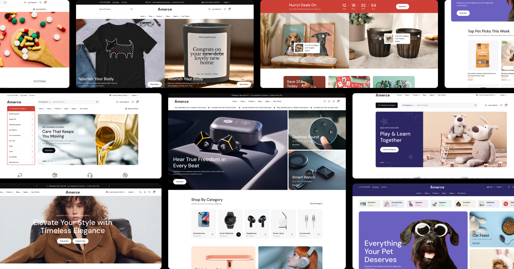

Released Date: **May 15, 2026**

Author: **[Botble Technologies](https://botble.com)**

Email: **contact@botble.com**

Thank you for purchasing our product. If you have any questions that are beyond the scope of this help file, please feel
free to email via our user page contact form [here](https://codecanyon.net/user/botble) for quickly support. Thank you
so much!

## Features Overview

* Buy One Time & Get Free Updates Forever
* **Free Theme Installation** – If you face any problem during installation – we will help you and it’s FREE
* **21 Niche Home Presets** — Fashion, Electronics, Furniture, Cosmetic, Organic, Jewelry, Sport, Sneaker, Headphone, Pod, Baby, Pet Care, Auto, Construction, Bag & Accessories, Home Decor, Garden, Wellness, Office Equipment, Fashion Modern.
* Bootstrap 5.x Framework: the most popular HTML, CSS, and JS framework for responsive, mobile-first projects.
* Based on our Botble CMS (modern Laravel framework) used by thousands of customers.
* Full eCommerce features with built-in **multivendor marketplace** support.
* Support many payment methods: PayPal, Stripe, Paystack, Razorpay, Mollie, SSLCommerz, and more.
* Touch Friendly: Easy browsing on touch devices.
* 100% Fully Responsive across all devices.
* Powerful admin panel — every section is editable, no hardcode.
* Demo data seeders for each niche preset — one-click install reproduces the demo site.
* Multi-language: unlimited languages support.
* Google Analytics: display analytics data in admin panel.
* Translation tool: easy to translate front theme and admin panel to your language.
* Right To Left (RTL) language support.
* Fast support: we always reply your ticket within 1 business day.

## Niche Home Presets

Amerce ships 21 niche home presets — pick the one that matches your store and seed it in one command. Live previews:

| | | |
|:---:|:---:|:---:|
| [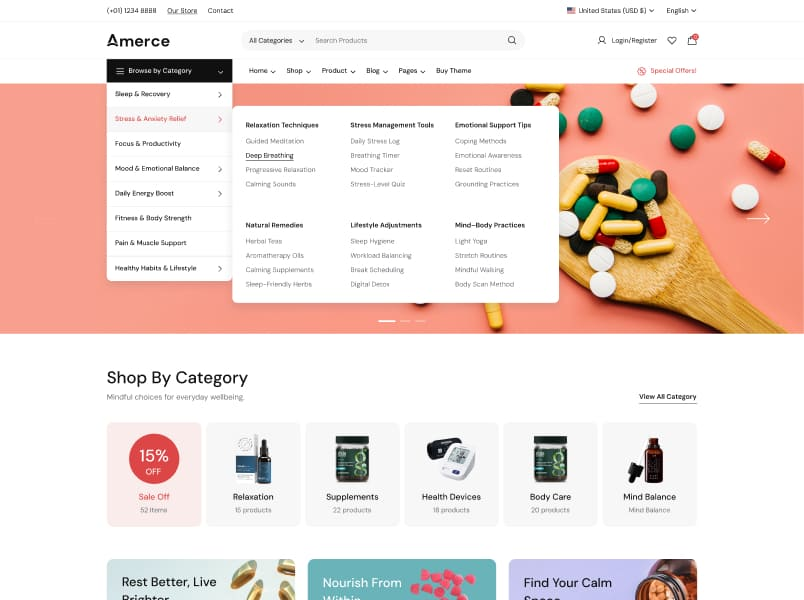](https://amerce.botble.com) **Fashion Store** | [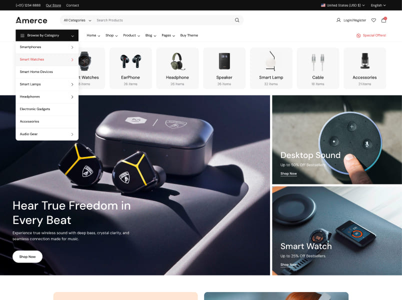](https://amerce-electronics.botble.com) **Electronics Hub** | [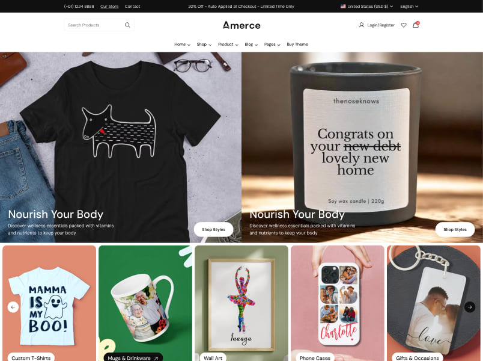](https://amerce-furniture.botble.com) **Furniture Store** |
| [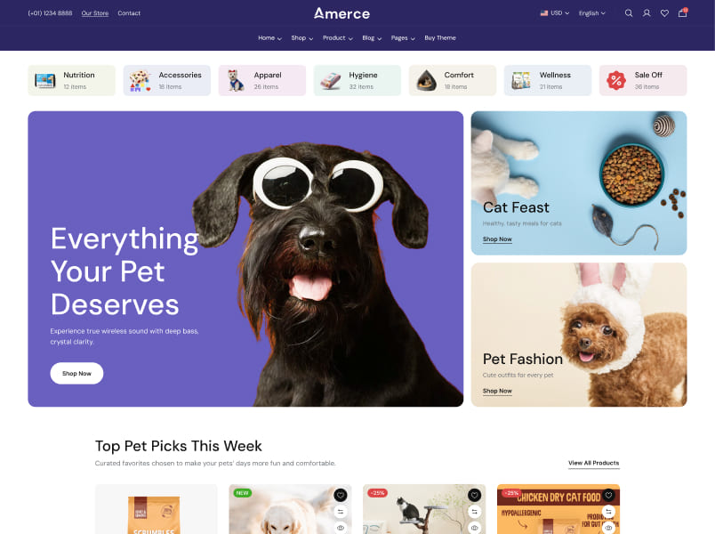](https://amerce-cosmetic.botble.com) **Beauty & Cosmetics** | [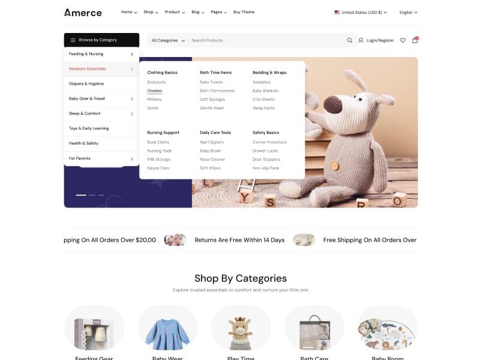](https://amerce-organic.botble.com) **Organic & Grocery** | [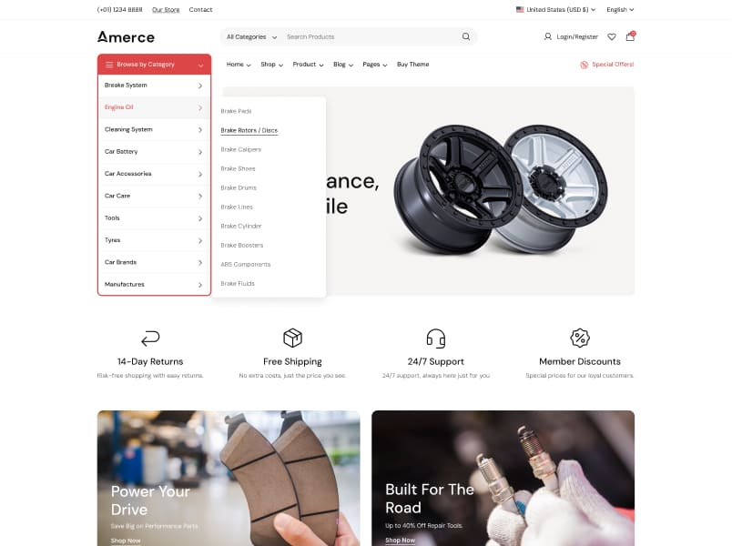](https://amerce-jewelry.botble.com) **Jewelry & Watches** |
| [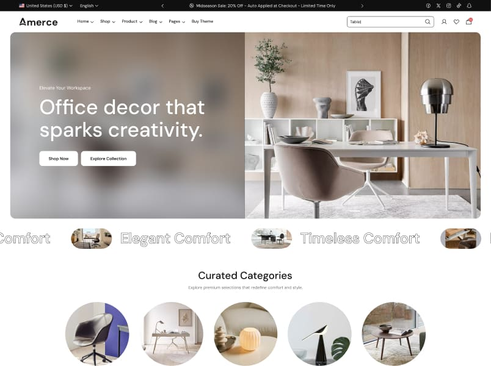](https://amerce-sport.botble.com) **Sports & Fitness** | [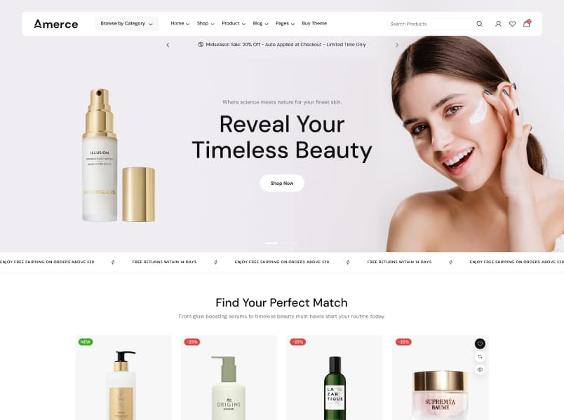](https://amerce-sneaker.botble.com) **Sneaker Shop** | [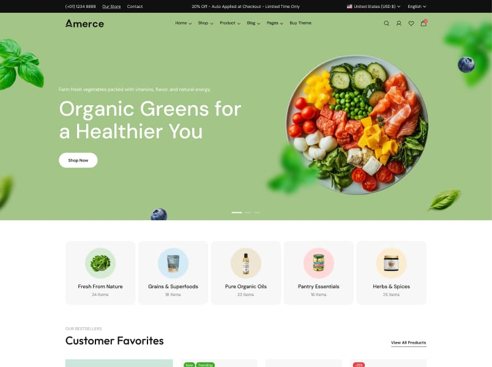](https://amerce-headphone.botble.com) **Audio Gear** |
| [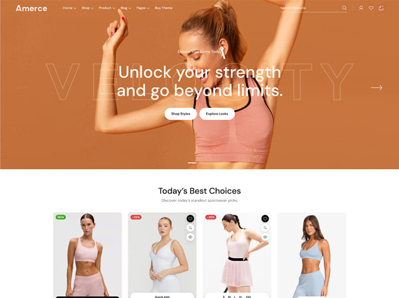](https://amerce-pod.botble.com) **Podcast / Pods** | [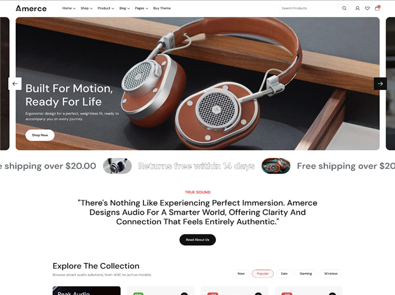](https://amerce-baby.botble.com) **Baby Products** | [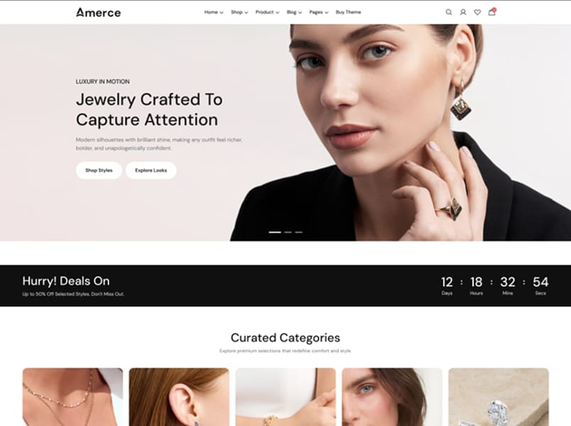](https://amerce-pet-care.botble.com) **Pet Care** |
| [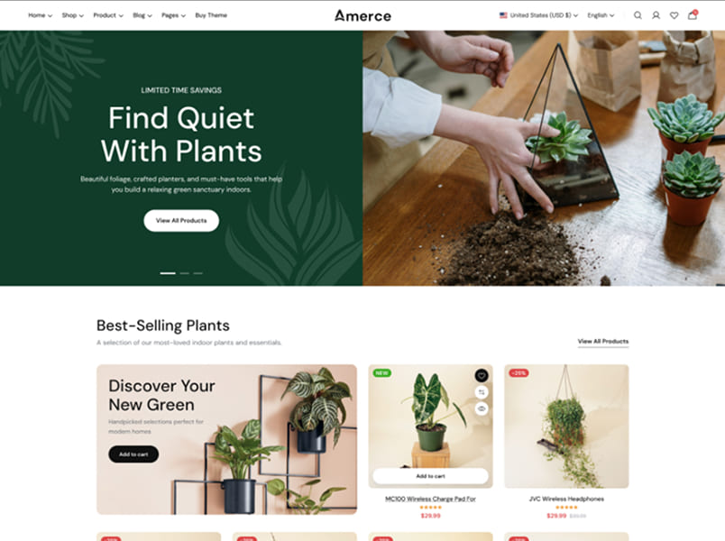](https://amerce-auto.botble.com) **Automotive Parts** | [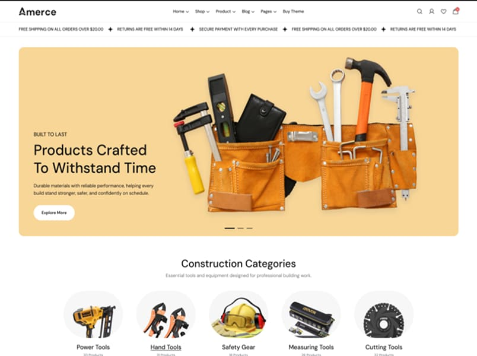](https://amerce-construction.botble.com) **Tools & Construction** | [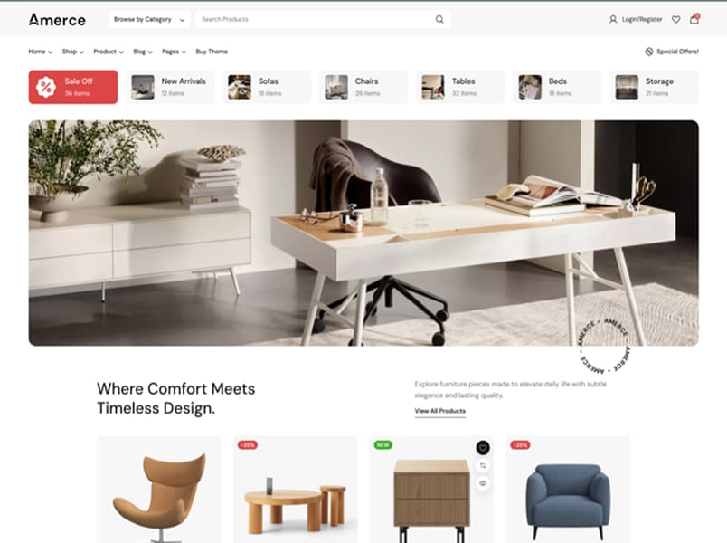](https://amerce-bag-accessories.botble.com) **Bags & Accessories** |
| [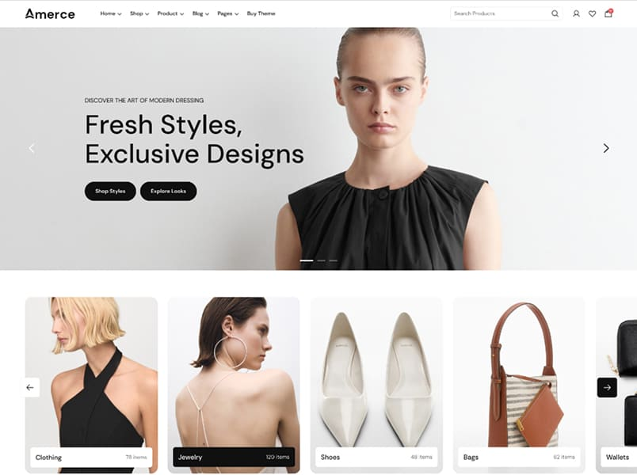](https://amerce-decor.botble.com) **Home Decor** | [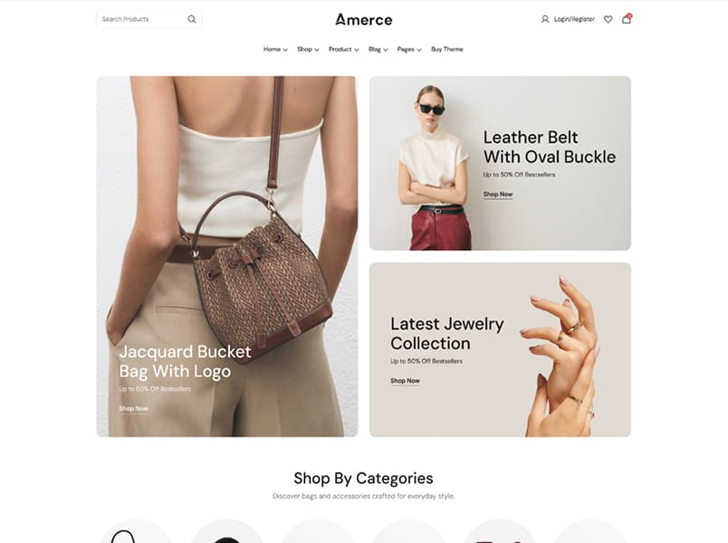](https://amerce-garden.botble.com) **Garden & Outdoor** | [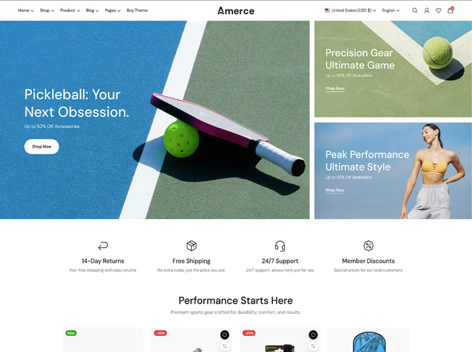](https://amerce-mental.botble.com) **Wellness** |
| [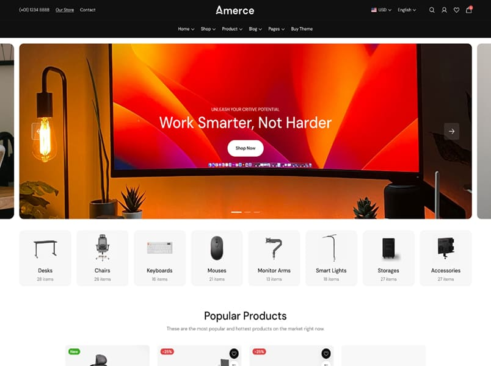](https://amerce-office.botble.com) **Office Equipment** | [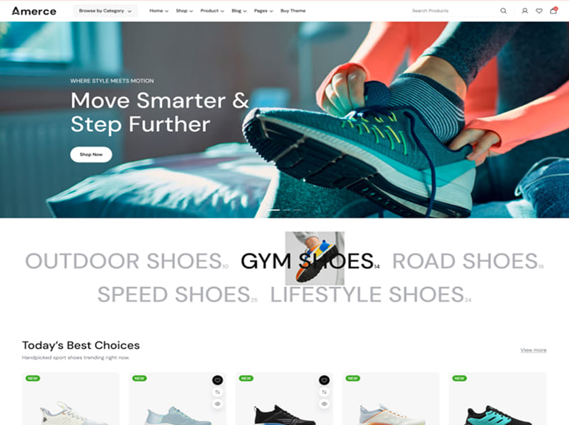](https://amerce-fashion-2.botble.com) **Fashion Modern** | |

Switch presets via the niche seeder — see [Homepage → Switching Between Homepage Presets](./usage-homepage.md#switching-between-homepage-presets).

## Demo

* Homepage: https://amerce.botble.com
* Admin panel: https://amerce.botble.com/admin
* Admin account: `admin` – `12345678` (username & password are autofilled)
* Customer login URL: https://amerce.botble.com/login
* Customer account: `customer@botble.com` – `12345678`

## Botble Team

For more about our team, visit us at https://botble.com.
