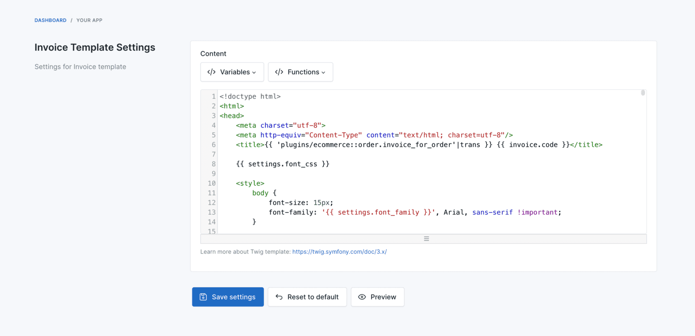

# Invoice Template

For general invoice configuration, branding, and template variables see [Invoices](./usage-invoices.md). This page covers font customization for non-Latin scripts (Bengali, Japanese, Sinhala) when rendering PDF invoices.

## Customize the template

There are two ways to customize the invoice template:

### Customize in the admin panel (recommended)

Go to `Settings` -> `Ecommerce` -> `Invoice Template` to edit the active template directly from the admin UI.



### Customize the template file

Copy `platform/plugins/ecommerce/resources/templates/invoice.tpl` to `storage/app/templates/ecommerce/invoice.tpl` and edit the copy. Amerce loads the storage version when present.

## Bengali font

To render Bengali text in invoices, use the **FreeSerif** font.

- Download `FreeSerif.ttf` from https://github.com/byrongibson/fonts/blob/master/backup/truetype.original/freefont/FreeSerif.ttf.
- Upload `FreeSerif.ttf` to `/public`.
- Copy `platform/plugins/ecommerce/resources/templates/invoice.tpl` to `storage/app/templates/ecommerce/invoice.tpl`.
- Update the CSS:

```blade
<style>
    @font-face {
        font-family: FreeSerif;
        src: url('{{ url('FreeSerif.ttf') }}');
    }

    body {
        font-size: 15px;
        font-family: FreeSerif, Arial, sans-serif !important;
    }
</style>
```

## Japanese font

- **Option 1:** Select font `M Plus Rounded 1c` for the invoice font in `Admin` -> `Ecommerce` -> `Settings`.

- **Option 2:** Customize the invoice template:

```html
<link rel="preconnect" href="https://fonts.googleapis.com">
<link rel="preconnect" href="https://fonts.gstatic.com" crossorigin>
<link href="https://fonts.googleapis.com/css2?family=M+PLUS+Rounded+1c&display=swap" rel="stylesheet">

<style>
    body {
        font-size: 15px;
        font-family: 'M PLUS Rounded 1c', 'DejaVu Sans', Arial, sans-serif !important;
    }

    .bold, strong {
        font-weight: normal;
    }

    .total {
        color: #fb7578;
        font-weight: normal;
    }
</style>
```

- **Option 3:** Use the **CyberCJK** font:

```css
@font-face {
    font-family: CyberCJK;
    src: url("http://eclecticgeek.com/dompdf/fonts/cjk/Cybercjk.ttf") format("truetype");
}

body {
    font-size: 15px;
    font-family: CyberCJK, Arial, sans-serif !important;
}
```

## Sinhala font

- Download font **kaputaunicode** from http://www.kaputa.com/slword/kaputaunicode.htm.
- Upload `kaputaunicode.ttf` to `/public`.
- Copy `platform/plugins/ecommerce/resources/templates/invoice.tpl` to `storage/app/templates/ecommerce/invoice.tpl`.
- Update the CSS:

```blade
<style>
    @font-face {
        font-family: kaputaunicode;
        src: url('{{ url('kaputaunicode.ttf') }}');
    }

    body {
        font-size: 15px;
        font-family: kaputaunicode, Arial, sans-serif !important;
    }
</style>
```

## Related

- [Invoices](./usage-invoices.md) - invoice management, settings, and template variables
- [Currencies](./usage-currencies.md) - currency formatting on invoices
