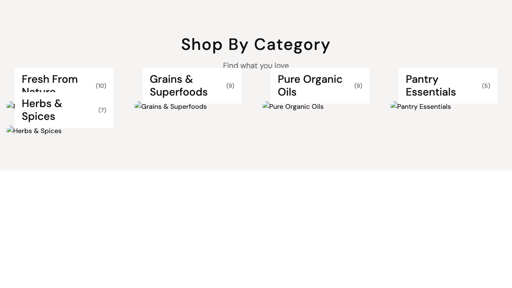
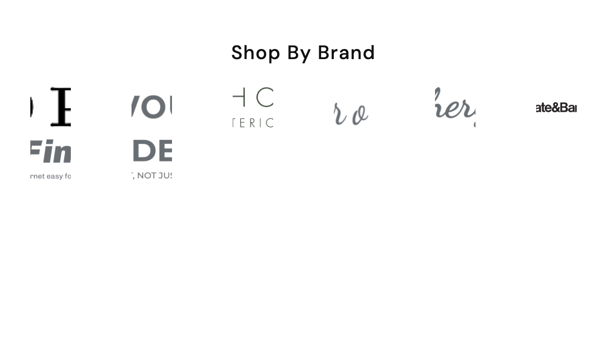
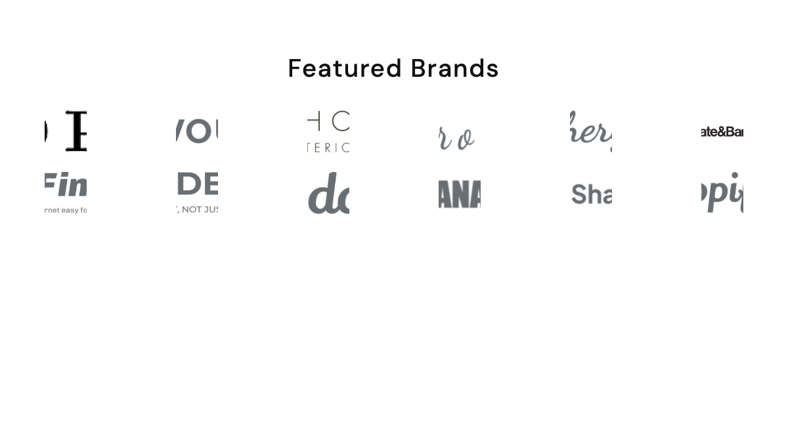

# Shortcodes — Categories, Brands & Vendors

Shortcodes that surface taxonomies (product categories, brands) and marketplace stores. 5 shortcodes in this group.

## `[ecommerce-categories]`

Product categories rendered as grid, slider, or list. Requires the **ecommerce** plugin.

**Styles:** `style-grid`, `style-slider`, `style-list`.

| Field | Default | Description |
|-------|---------|-------------|
| `title` | — | Section heading. |
| `category_ids` | top-level | Pick specific categories (empty = top-level categories only). |
| `items_per_row` | `5` | Grid density. |
| `limit` | `8` | Max categories. |
| `show_count` | `yes` | Show product count badge. |

---

## `[categories-grid]`

Marketing-style categories block with extra layouts (icon cards, slider with CTA card, circular slider). Best for the homepage "Shop by category" section.

**Styles:** `style-grid-4`, `style-grid-5`, `style-grid-6`, `style-slider`, `style-slider-icon`, `style-slider-cta`, `style-slider-circle`, `style-card-vertical`.

| Field | Default | Description |
|-------|---------|-------------|
| `title`, `subtitle` | — | Section heading. |
| `category_ids` | — | Pick categories (multi). |
| `show_count` | `no` | Show product count next to category name. |
| `limit` | `8` | Max categories. |
| `cta_label` | — | Promo card title (only `style-slider-cta`). Leave blank to hide the leading promo card. |
| `cta_count` | — | Promo card count text. |
| `cta_url` | — | Promo card link. |
| `cta_icon` | `icon-SealPercent` | Promo card icon class (icomoon). |
| `card_image_size` | `thumb` | When set to `original` uses the full-size image (e.g. portrait art instead of the square 400×400 crop). |

::: tip
The promo card on `style-slider-cta` appears as the **first** card and uses pipe-separated count overrides on the `style-slider` variant (comma-separated for `style-slider-cta`).
:::

---

## `[ecommerce-brands]`

Brand strip — logos in a row or slider, optionally filtered to a curated subset.

| Field | Default | Description |
|-------|---------|-------------|
| `title` | — | Section heading. |
| `brand_ids` | all | Pick brands (multi). |
| `items_per_row` | `6` | Logos per row. |
| `limit` | `12` | Max brands. |

---

## `[brand-logos]`

Themed brand logos block with optional infinite-marquee layout (theme-managed; does not require Brand records to have additional metadata).

**Styles:** `style-grid`, `style-slider`, `style-infinite`.

| Field | Default | Description |
|-------|---------|-------------|
| `title` | — | Section heading. |
| `brand_ids` | — | Pick brands (multi). |
| `items_per_row` | `6` | Logos per row. |

::: tip
The home-bag-accessories preset uses an unofficial `syle-3` (typo, kept verbatim from the HTML template) for its brand marquee strip — preserve the typo in `modifier_class` if you replicate that layout.
:::

---

## `[ecommerce-vendors]` *(marketplace only)*

Display marketplace stores in a grid or slider. Auto-disabled when the **marketplace** plugin is inactive.

**Styles:** `style-grid`, `style-slider`.

| Field | Default | Description |
|-------|---------|-------------|
| `title`, `subtitle` | — | Section heading. |
| `vendor_ids` | all published | Pick stores (multi). |
| `limit` | `12` | Max stores. |
| `items_per_row` | `4` | Grid density. |

See [Marketplace Setup](./usage-marketplace-setup.md) for managing stores.

---

## See also

- [Hero & Banners](./shortcodes-hero-banners.md)
- [Products](./shortcodes-products.md)
- [Lookbook & Visual](./shortcodes-lookbook-visual.md)
