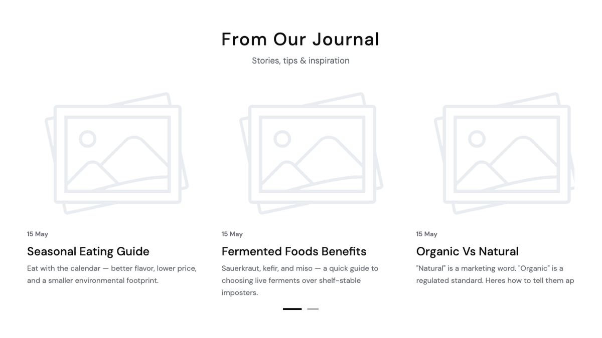
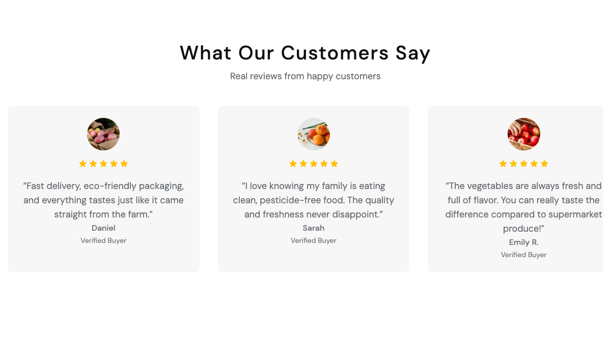
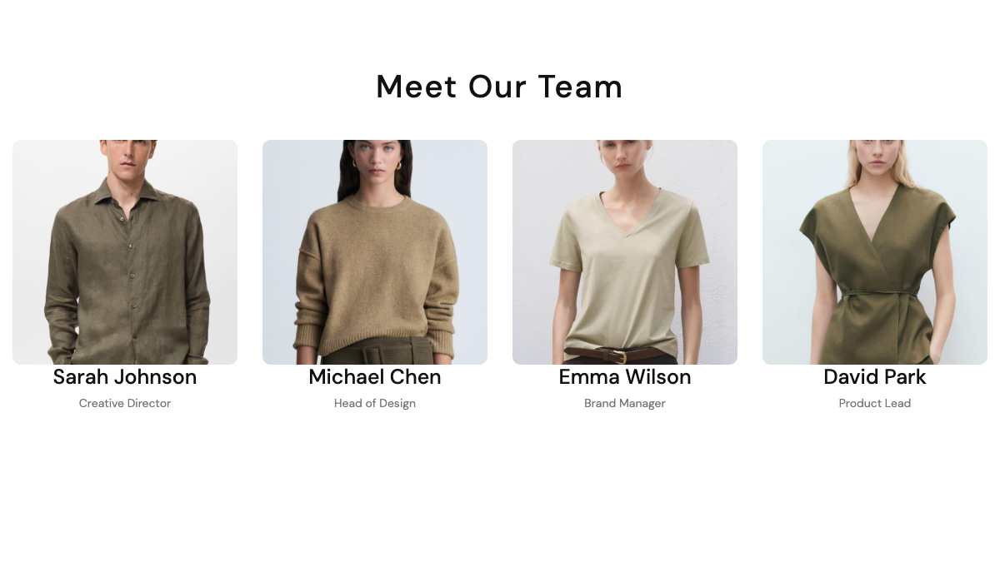
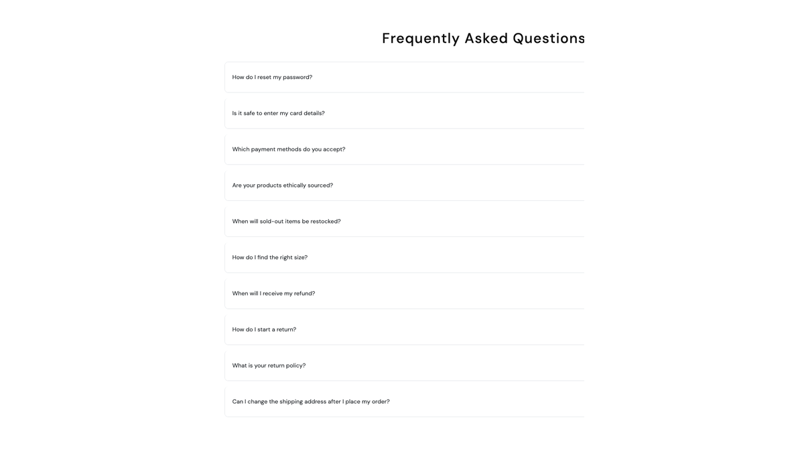

# Shortcodes — Content

Editorial blocks for blog posts, testimonials, team, FAQs, and long-form policy pages. 8 shortcodes in this group.

## `[blog-posts]`

Latest blog posts in grid, slider, or list layout. Requires the **blog** plugin.



**Styles:** `style-grid`, `style-slider`, `style-list`.

| Field | Default | Description |
|-------|---------|-------------|
| `title` | — | Section heading. |
| `category_ids` | — | Filter to specific blog categories (multi). |
| `limit` | `6` | Max posts. |
| `show_excerpt` | `yes` | Show post excerpt. |
| `show_meta` | `yes` | Show date and author. |
| `data_preview` | `3` | Slider items per view (style-slider only). |

::: warning
The `[blog-posts]` shortcode is double-registered — the blog plugin's renderer wins. The active partial is `views/templates/posts.blade.php`, not the theme's `partials/shortcodes/blog-posts/index.blade.php` (which is dead code).
:::

---

## `[testimonials]`

Customer testimonials slider with avatar, name, role, quote, and rating.



**Styles:** `style-v1` (default), `style-v2` (cards), `style-thumbs` (with thumbs), `style-v3-product` (with product), `style-image-card` (image card), `style-organic-verified` (organic verified badge).

| Field | Description |
|-------|-------------|
| `title`, `subtitle` | Section heading. |
| `items` | Repeater: `avatar`, `name`, `role`, `content`, `rating` (1-5). The `style-v3-product` variant additionally uses `product_image`, `product_name`, `product_price`, `product_url`. |
| `autoplay` | `yes` / `no` — auto-cycle slides. |

---

## `[about-testimonials]`

A 2-up testimonial swiper with image-left + content layout. Tailored for About pages.

| Field | Default | Description |
|-------|---------|-------------|
| `heading` | — | Section heading. |
| `subtitle` | — | Section subtitle. |
| `verified_label` | `Verified Buyer` | Badge label rendered next to the name. |
| `items` | — | Repeater: `image`, `name`, `text` (quote). |

---

## `[team-members]`

Team member cards — photo, role, bio, and socials.



**Styles:** `style-grid`, `style-slider`.

| Field | Description |
|-------|-------------|
| `title` | Section heading. |
| `members` | Repeater: `photo`, `name`, `role`, `bio`, `social_links` (JSON map of icon class → URL). |

`social_links` format:

```json
{"icon-FacebookLogo": "https://facebook.com/handle", "icon-XLogo": "https://x.com/handle"}
```

---

## `[about-team]`

Team members swiper variant tailored for About pages — social icons reveal on hover.

| Field | Description |
|-------|-------------|
| `heading`, `subtitle` | Section heading. |
| `items` | Repeater: `image`, `name`, `role`, `social_links` (JSON, same format as `team-members`). |

---

## `[faq-list]`

FAQ in accordion or tabbed layout. Requires the **faq** plugin.



**Styles:** `style-accordion`, `style-tabs`.

| Field | Default | Description |
|-------|---------|-------------|
| `title` | — | Section heading. |
| `faq_category_id` | all | Restrict to one FAQ category (empty = all). |
| `limit` | `10` | Max questions. |

---

## `[faq-page]`

Full FAQ page layout with sidebar nav grouping questions by category, plus an optional promo banner. Drop this on a dedicated FAQ page.

| Field | Default | Description |
|-------|---------|-------------|
| `items` | — | Repeater: `category` (group heading), `category_id` (anchor slug), `question`, `answer` (HTML allowed). |
| `categories_label` | `Categories` | Sidebar group heading. |
| `sidebar_image` | — | Promo banner image. |
| `sidebar_title`, `sidebar_subtitle` | — | Promo banner copy. |
| `sidebar_cta` | — | Promo button label. |
| `sidebar_url` | — | Promo button URL. |

---

## `[term-content]`

`section-term-user` wrapper with a list of term items. Used for Privacy, Terms, Returns, Shipping policy pages.

| Field | Description |
|-------|-------------|
| `items` | Repeater: `title` (heading), `body` (HTML). |

```html
[term-content][/term-content]
```

---

## See also

- [Lookbook & Visual](./shortcodes-lookbook-visual.md)
- [Marketing & Trust](./shortcodes-marketing.md)
- [FAQs](./plugin-faq.md)
