# Shortcodes — Hero & Banners

Hero, banner, and parallax shortcodes used at the top of homepages and as promotional sections throughout the site. 14 shortcodes in this group.

::: tip
Open the [UI Block editor](./usage-ui-block.md) on any page and click an empty slot to insert one of these blocks. Each shortcode exposes its options as form fields — title, image, button, style preset, etc.
:::

## `[hero-slideshow]`

Full-width slider with text overlay and CTA buttons. Used as the top hero on most homepages.

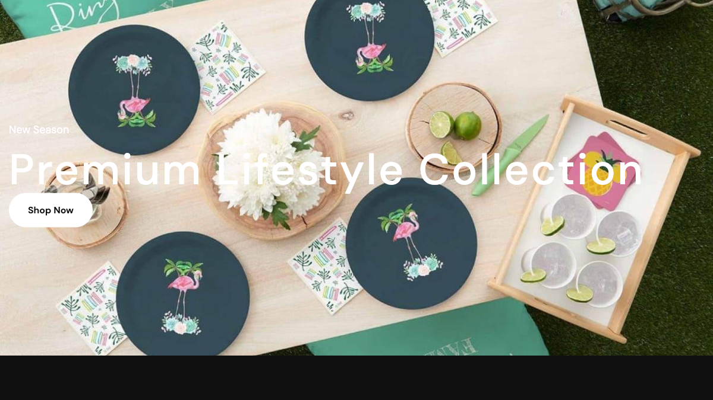

**Styles:** `style-default`, `style-fashion`, `style-furniture-parallax`, `style-organic`.

| Field | Type | Default | Description |
|-------|------|---------|-------------|
| `style` | UI selector | `style-default` | Layout preset. |
| `slides` | Repeater | — | Each slide: image, subtitle, title, button text, button URL, alignment (left/center/right). |
| `autoplay` | Yes/No | `yes` | Cycle slides automatically. |
| `interval` | Number (ms) | `3000` | Time between slides. |
| `show_arrows` | Yes/No | `yes` | Show prev/next arrows. |
| `show_dots` | Yes/No | `no` | Show pagination dots. |

```html
[hero-slideshow style="style-fashion" autoplay="yes" interval="5000"][/hero-slideshow]
```

---

## `[hero-grid-asymmetric]`

Composite hero combining one large hero card with two stacked small cards in a 1+2 asymmetric grid (sport/sneaker presets).

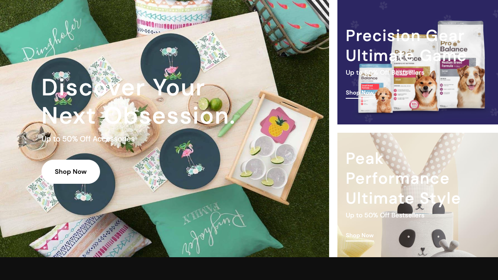

| Field | Default | Description |
|-------|---------|-------------|
| `hero_image` | — | Main hero card image. |
| `hero_title` | — | Heading (supports `<br>`). |
| `hero_desc` | — | Description paragraph. |
| `hero_button_text` | `Shop Now` | Hero CTA label. |
| `hero_button_url` | `/products` | Hero CTA link. |
| `card_1_image`, `card_2_image` | — | Stacked card images. |
| `card_N_title` | — | Card title (supports `<br>`). |
| `card_N_desc` | — | Card description. |
| `card_N_button_text` | `Shop Now` | Card CTA label. |
| `card_N_button_url` | `/products` | Card CTA link. |

---

## `[page-banner]`

Reusable page title banner with breadcrumb, heading, and optional subtitle. Used at the top of inner pages (About, Contact, FAQ, Privacy…).

| Field | Default | Description |
|-------|---------|-------------|
| `heading` | — | Page title. |
| `subtitle` | — | Subtitle (HTML allowed). |
| `home_label` | `Home` | Breadcrumb root label. |

```html
[page-banner heading="About Us" subtitle="The story behind the brand"][/page-banner]
```

---

## `[parallax-banner]`

Banner section with parallax background and overlayed content. Optional looping marquee ribbon underneath.

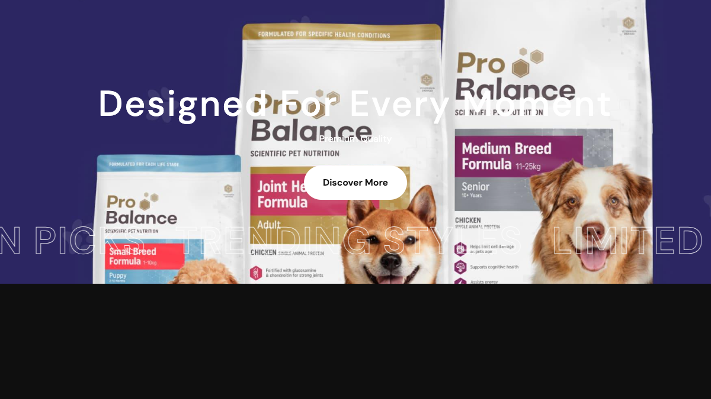

**Styles:** `style-1` (full width), `style-2` (constrained).

| Field | Default | Description |
|-------|---------|-------------|
| `image` | — | Background image. |
| `heading` | — | Heading. |
| `subheading` | — | Subheading. |
| `button_text`, `button_url` | — | CTA. |
| `height` | `480` | Banner height in px. |
| `text_alignment` | `center` | `left`, `center`, `right`. |
| `marquee_text` | `NEW SEASON PICKS, …` | Comma-separated phrases that loop below the banner (style-1 only). Leave empty to hide. |

---

## `[banner-image-text]`

Promotional banner combining a background image with heading, subheading, and CTA. The most-used banner block — appears across every preset.

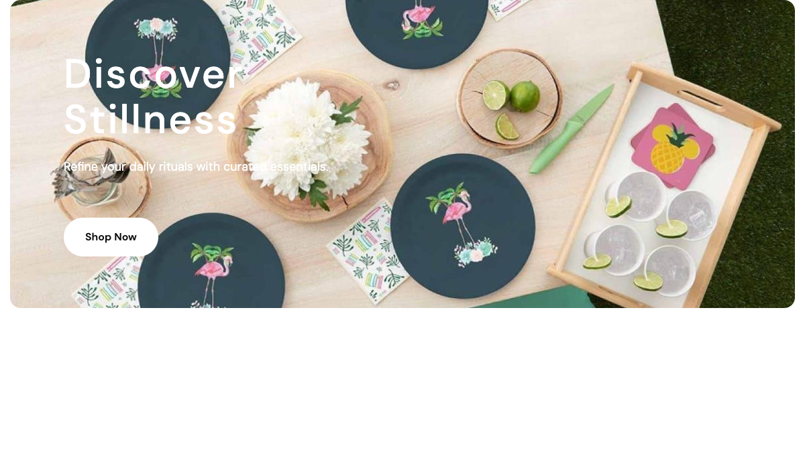

**Styles:** `style-1` (full bleed), `style-2` (text left), `style-3` (text right).

| Field | Description |
|-------|-------------|
| `style` | Layout preset. |
| `image` | Banner image. |
| `heading`, `subheading` | Copy. |
| `button_text`, `button_url` | CTA. |
| `overlay_color`, `text_color` | Override default overlay and text color (hex). |

---

## `[banner-duo]`

Two square banner cards side-by-side with bottom-left text overlay.

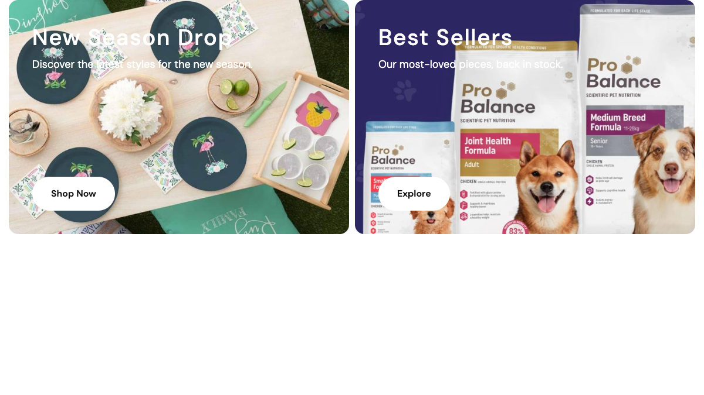

| Field | Description |
|-------|-------------|
| `image_1`, `image_2` | Card images. |
| `title_1`, `title_2` | Card titles. |
| `subtitle_1`, `subtitle_2` | Card subtitles. |
| `button_text_1`, `button_text_2` | CTA labels. |
| `button_url_1`, `button_url_2` | CTA URLs. |

---

## `[banner-duo-bottom]`

Two cards side-by-side with text **below** the image and per-card background/text color (sneaker preset §4).

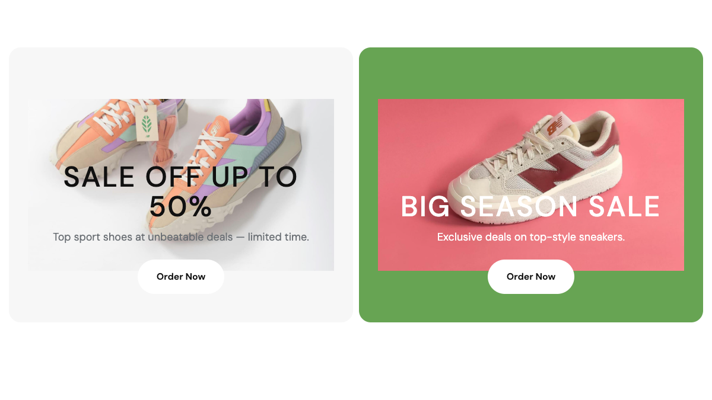

| Field | Default | Description |
|-------|---------|-------------|
| `image_N`, `title_N`, `desc_N` | — | Card image / title / description. |
| `button_text_N` | `Order Now` | CTA label per card. |
| `button_url_N` | `/products` | CTA URL per card. |
| `bg_class_N` | — | Background utility class, e.g. `bg-main`, `bg-primary`. |
| `text_class_N` | — | Text color class, e.g. `text-white`. |

---

## `[banner-collection]`

Promotional collection banner with optional badge and CTA. Often used to highlight a category landing page.

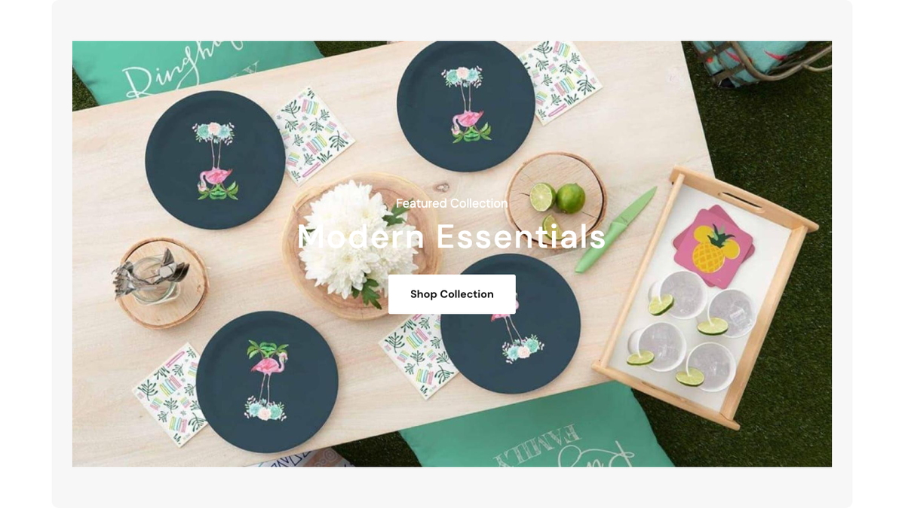

**Styles:** `style-1`, `style-2`.

| Field | Description |
|-------|-------------|
| `image` | Banner image. |
| `heading`, `subheading` | Copy. |
| `button_text`, `button_url` | CTA. |
| `badge_text` | Corner ribbon text (e.g. `NEW`, `-30%`). |
| `badge_color` | Badge background color (hex). |

---

## `[banner-countdown]`

Promotional banner with image, heading and a live countdown timer.

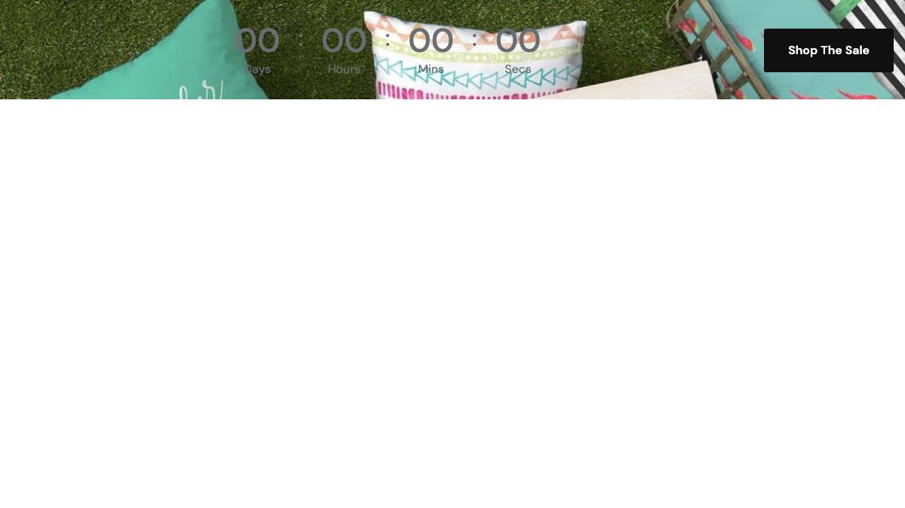

**Styles:** `style-1`, `style-2`, `style-3`, `style-4`. Style-1 additionally supports background/layout modifiers.

| Field | Default | Description |
|-------|---------|-------------|
| `background_image` | — | Banner background. |
| `heading`, `subheading` | — | Copy. |
| `target_date` | — | `YYYY-MM-DD HH:MM` — countdown end. |
| `button_text` | `Shop Now` | CTA label. |
| `button_url` | — | CTA URL. |
| `target_url_label` | — | Caption beside countdown. |
| `background_class` | — | `bg-primary` / `bg-dark` (style-1 only). |
| `style_modifier` | — | `style-2` / `style-3` / `style-4` modifier (style-1 only). |
| `container_class` | `container` | `container`, `container-2` (wide), `container-full`. |
| `show_image` | — | `yes` to render background image (style-1 + `style-4` modifier). |

---

## `[countdown-banner-quad]`

Countdown card on the **left** + four `banner-image-text` cards in a 1+2+2 grid (organic preset §4).

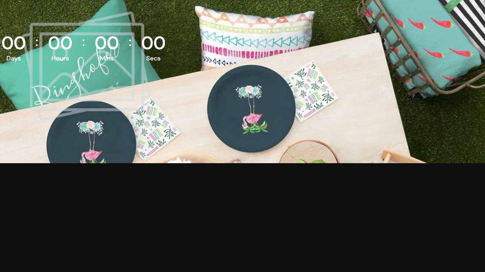

| Field | Description |
|-------|-------------|
| `countdown_image` | Countdown background image. |
| `countdown_heading`, `countdown_subheading` | Countdown copy. |
| `target_date` | `Y-m-d H:i` — countdown end. |
| `countdown_button_text`, `countdown_button_url` | Countdown CTA. |
| `banner_N_image` *(1–4)* | Banner card image. |
| `banner_N_overline` | Red overline label. |
| `banner_N_title` | Banner title. |
| `banner_N_button_text`, `banner_N_button_url` | Banner CTA. |

---

## `[banner-products-composite]`

Two-column layout: hero banner LEFT + product grid RIGHT (Weekly Top Highlights demo).

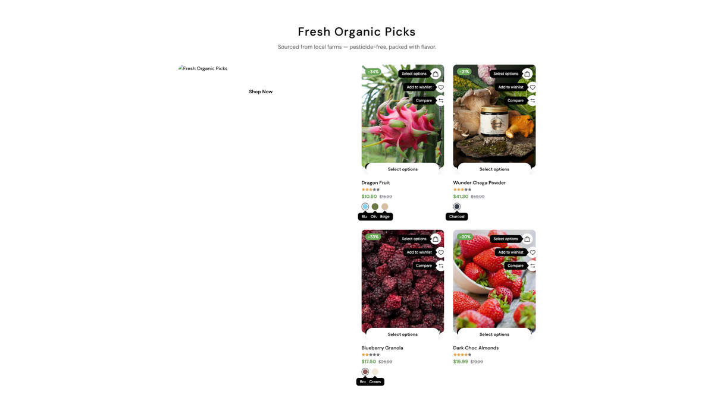

**Styles:** `style-fashion` (banner col-6 + 2×2 grid), `style-organic` (banner col-4 + 3×2 grid + View All CTA).

| Field | Default | Description |
|-------|---------|-------------|
| `style` | `style-fashion` | Variant. |
| `title`, `subtitle` | — | Section heading. |
| `image` | — | Banner image. |
| `overline`, `heading` | — | Banner overline + heading (style-fashion). |
| `banner_subtitle`, `banner_heading` | — | Banner subtitle + heading (style-organic). |
| `button_text`, `button_url` | `Shop Now` / `/products` | Banner CTA (style-fashion). |
| `banner_button_text`, `banner_button_url` | `Shop Now` / `/products` | Banner CTA (style-organic). |
| `view_all_text`, `view_all_url` | `View All Products` / `/products` | View-all CTA (style-organic). |
| `source` | `featured` | `latest`, `featured`, `best-seller`. |
| `limit` | `4` | Number of products. |

---

## `[banner-thumbs-product]`

Hero banner with a product thumbnails strip below it. Useful for "shop the look" sections.

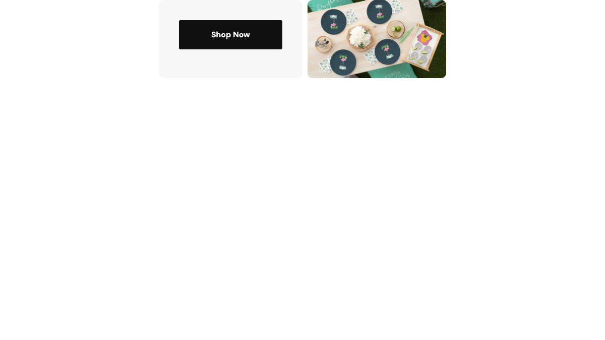

**Styles:** `style-1` (default), `style-thumbs-grid` (thumbs grid).

| Field | Description |
|-------|-------------|
| `main_image` | Hero image. |
| `heading`, `subheading` | Copy. |
| `button_text`, `button_url` | CTA. |
| `product_ids` | Comma-separated product IDs (multi-select). |
| `thumb_1` – `thumb_4` | Manual thumb images (style-thumbs-grid only). |

---

## `[banner-step-feature]`

Full-bleed background + heading + 6 benefit pills on the LEFT + 2 product cards on the RIGHT (sneaker preset §6).

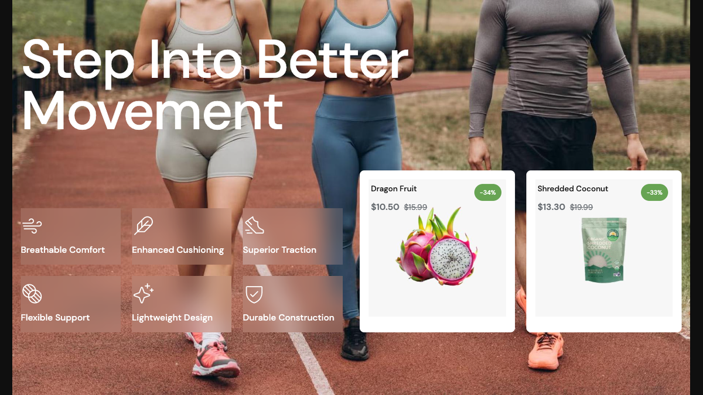

| Field | Description |
|-------|-------------|
| `image` | Background image. |
| `heading` | Heading (supports `<br>`). |
| `benefit_N_icon` *(1–6)* | Icon class (e.g. `icon-Truck`). |
| `benefit_N_name` *(1–6)* | Benefit label. |
| `product_id_1`, `product_id_2` | Featured product IDs. |

---

## `[banner-contact-form]`

Two-column section with a promotional banner LEFT and the site's contact form RIGHT. Drop into a Contact page.

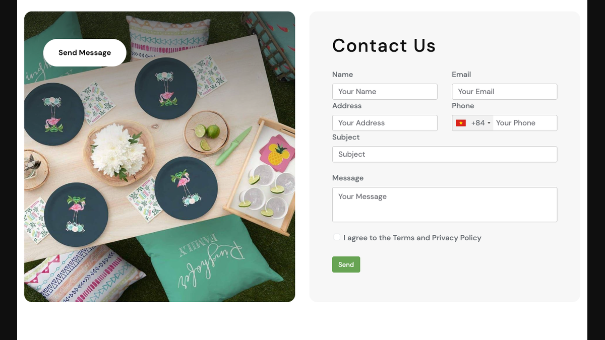

| Field | Description |
|-------|-------------|
| `image` | Banner image. |
| `title`, `subtitle` | Banner copy. |
| `button_text`, `button_url` | Banner CTA. |
| `contact_title`, `contact_subtitle` | Headings shown above the form. |

::: tip
The form posts to the standard contact endpoint — configure recipient emails under **Admin → Settings → Email → Contact form**.
:::

---

## See also

- [Products shortcodes](./shortcodes-products.md)
- [Categories, brands & vendors](./shortcodes-categories-brands.md)
- [UI Block overview](./usage-ui-block.md)
