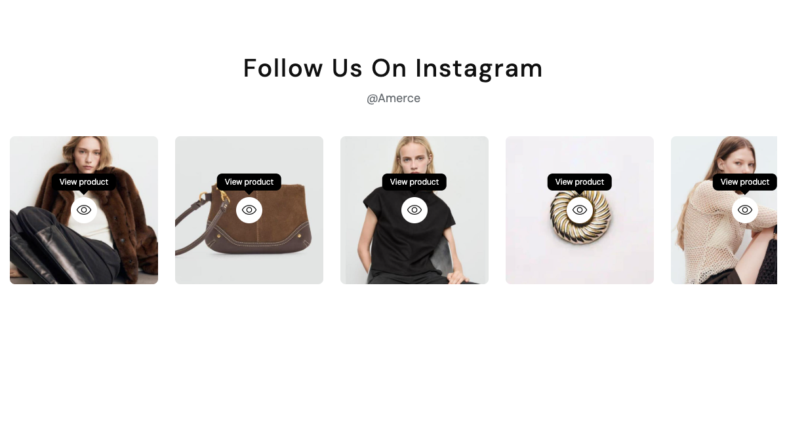
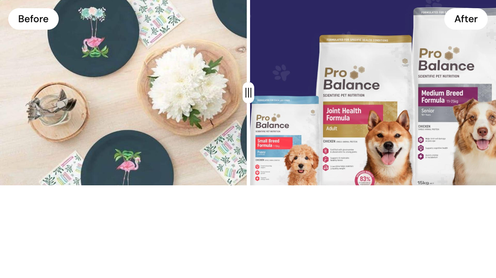
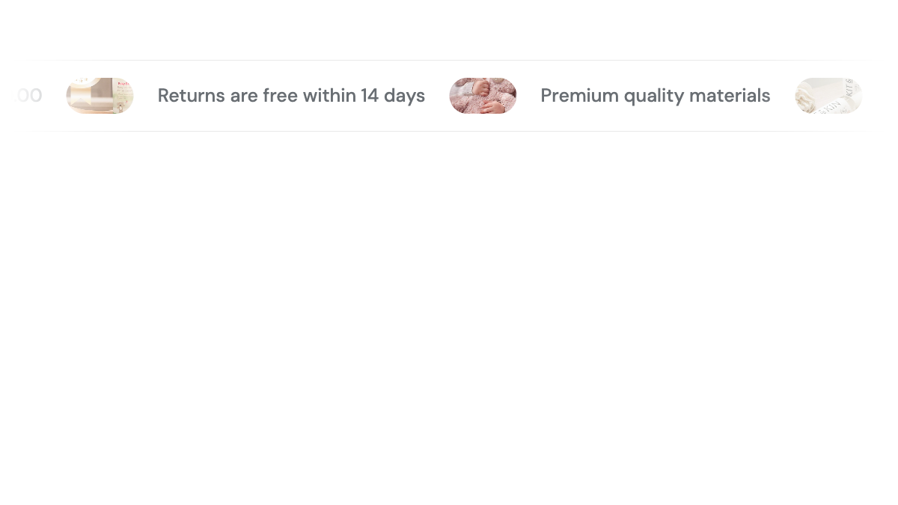
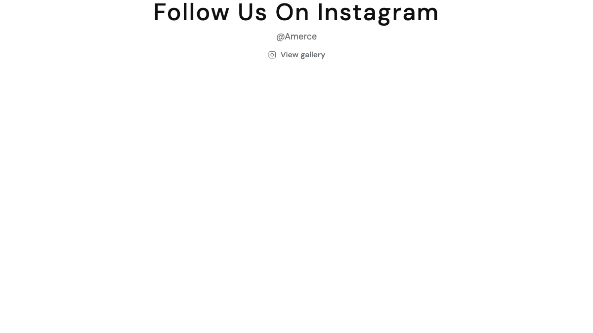

# Shortcodes — Lookbook & Visual

Visual storytelling blocks — lookbooks with shoppable hotspots, image galleries, accordions, before/after comparisons, marquees, and Instagram-style feeds. 6 shortcodes in this group.

## `[lookbook-hotspot]`

Image (or image pair) with shoppable hotspots — each hotspot links to a product.

**Styles:** `style-v1` (single image), `style-v2` (image + product list — pet-care preset layout), `style-v3` (two images), `style-v4-carousel` (carousel + banner), `style-bundle-carousel-left` (bundle: carousel LEFT + banner RIGHT).

| Field | Description |
|-------|-------------|
| `image` | Primary lookbook image. |
| `image_2` | Second image (only `style-v3`). |
| `hotspots` | Repeater: `x_percent`, `y_percent`, `product_id`, `column` (1 or 2 — only `style-v3`). |

::: warning
`style-v2` hard-codes the 2-column banner+products split + `section-lookbook-hover` wrapper from the pet-care preset. For other "2-up banner + swiper" demos build a dedicated style file rather than reusing v2.
:::

---

## `[image-gallery]`

Image gallery slider with hover-to-view link. Used for "Shop Instagram" / inspiration boards.

| Field | Description |
|-------|-------------|
| `title`, `subtitle` | Section heading. |
| `items` | Repeater: `image`, `link` URL. |

---

## `[image-accordion]`

Side-by-side banner image with an accordion FAQ list. Common on About / Help landing pages.

| Field | Description |
|-------|-------------|
| `image` | Banner image. |
| `heading` | Section heading. |
| `items` | Repeater: `title` (question), `body` (answer, HTML allowed). |

---

## `[before-after-image]`

Interactive image comparison slider with a draggable handle (cosmetic, skincare, retouching demos).

| Field | Default | Description |
|-------|---------|-------------|
| `before_image` | — | Left/top image. |
| `after_image` | — | Right/bottom image. |
| `heading`, `subheading` | — | Copy. |
| `before_label` | `Before` | Overlay label on the "before" image. |
| `after_label` | `After` | Overlay label on the "after" image. |
| `orientation` | `horizontal` | `horizontal` or `vertical`. |
| `slider_color` | `#ffffff` | Drag handle color. |
| `slider_position_percent` | `50` | Initial split position (0–100). |

Powered by the bundled `image-compare-viewer` vendor (no external dependency).

---

## `[infinity-marquee]`

Continuous horizontal slider with captions and circular images interspersed between phrases. Backed by the bundled `infinityslide.js`.

| Field | Default | Description |
|-------|---------|-------------|
| `background_class` | `bg-main-2` | `bg-main-2` (soft), `bg-main`, or empty (transparent). |
| `clone_count` | `3` | Loop multiplier — higher = longer loop for short captions. |
| `items` | — | Repeater: `heading`, `image`, `link` URL. |

::: tip
The jewelry preset uses a `text-v02` variant — `bg-main-5` strip + `h5 fw-medium` text + `icon-Star2` separator + `container-full flat-spacing` wrap.
:::

---

## `[instagram-feed]`

Instagram-style feed sourced from a published **Gallery** record (Botble Gallery plugin). Images link to the gallery detail page.

**Styles:** `style-grid`, `style-carousel`.

| Field | Default | Description |
|-------|---------|-------------|
| `gallery_id` | — | Pick a published gallery. Required. |
| `heading` | gallery name | Override heading. |
| `subheading` | gallery description | Override subheading. |
| `limit` | `12` | Max images (0 = all). |
| `columns` | `6` | Columns (2–8, grid only). |
| `gap` | `8` | Gap between images in px. |
| `show_overlay` | `yes` | Show overlay icon on hover. |

---

## See also

- [Hero & Banners](./shortcodes-hero-banners.md)
- [Content](./shortcodes-content.md)
- [Marketing & Trust](./shortcodes-marketing.md)
