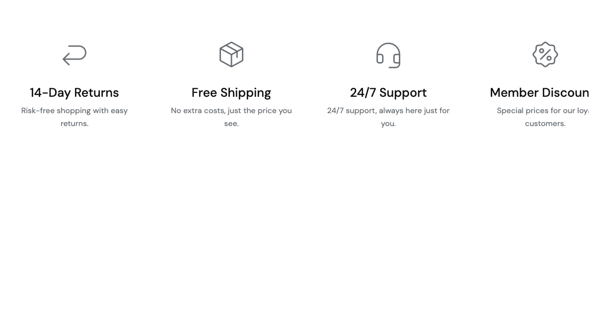
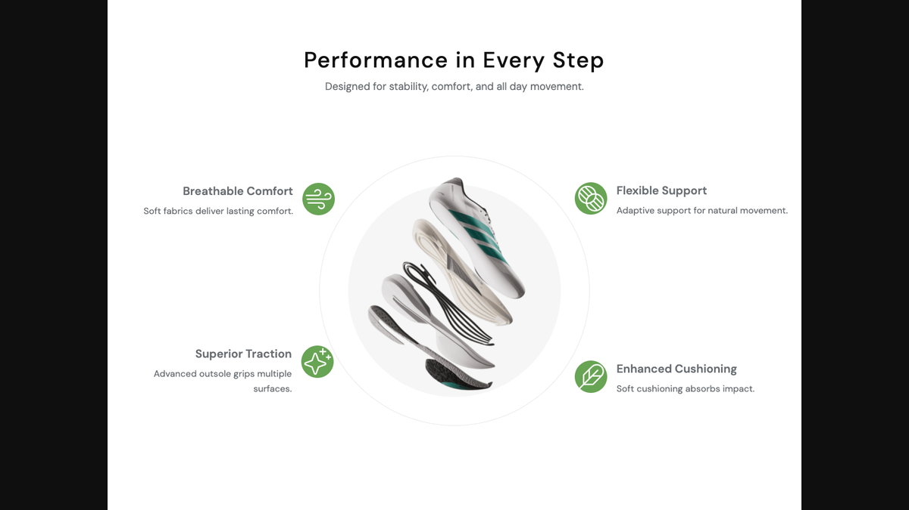
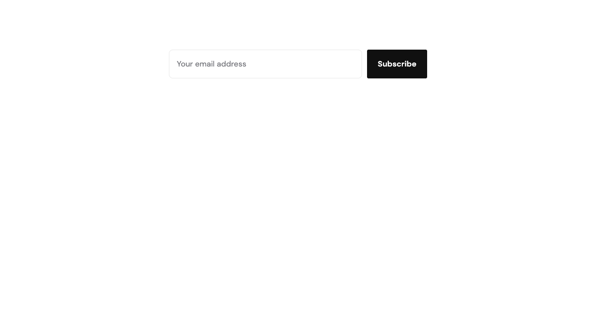

# Shortcodes — Marketing & Trust

Conversion-oriented blocks: trust badges, feature callouts, animated stats, and the newsletter CTA. 4 shortcodes in this group.

## `[site-features]`

Trust badges row (free shipping, secure payment, returns, support). Often placed directly under the hero or in the footer area.

**Styles:** `style-1` (4-icon bar), `style-2` (3-column with background), `style-3` (icons only), `style-flat-swiper` (flat 4-up swiper).

| Field | Description |
|-------|-------------|
| `items` | Repeater: `icon_class` (e.g. `icon-Truck`), `title`, `description`. |

Default icon classes shipped with the theme include `icon-Truck`, `icon-Shield`, `icon-ArrowUUpLeft`, `icon-Headphones`, `icon-CreditCard`, `icon-Globe`.

---

## `[feature-callout-quad]`

Central product image surrounded by 4 feature callouts arranged in a 2×2 grid (sneaker preset §7).

| Field | Description |
|-------|-------------|
| `title` | Section heading. |
| `subtitle` | Section subtitle (supports ` `). |
| `image` | Central image (e.g. an exploded product view). |
| `feature_N_icon` *(1–4)* | Icon class for each callout (e.g. `icon-Wind`). |
| `feature_N_name` *(1–4)* | Callout name. |
| `feature_N_desc` *(1–4)* | Callout description. |

---

## `[stats-counter]`

Hero image, heading, description, and a swipeable row of animated count-up stats.

| Field | Description |
|-------|-------------|
| `hero_image` | Hero image. |
| `heading` | Heading. |
| `description` | Description paragraph. |
| `items` | Repeater per stat: `value` (static fallback), `animate_to` (target number — count-up runs when present), `suffix` (e.g. `k`, `+`), `label`, `desc` (textarea). |

Leave `animate_to` empty for static numbers (e.g. years in business, certifications).

---

## `[newsletter-cta]`

Newsletter signup section with optional banner image. Drops into the homepage or footer.

**Styles:** `style-default`, `style-banner`.

| Field | Default | Description |
|-------|---------|-------------|
| `heading` | — | Heading. |
| `subheading` | — | Subheading. |
| `image` | — | Banner image (style-banner). |
| `submit_button_text` | `Subscribe` | Submit button label. |
| `mailchimp_list_id` | — | Optional Mailchimp list ID — falls back to the theme's built-in newsletter handler when empty. |
| `background_color` | — | Section background color (hex). |

See [Newsletter](./usage-newsletter.md) for configuring the underlying handler.

---

## See also

- [Content](./shortcodes-content.md)
- [Lookbook & Visual](./shortcodes-lookbook-visual.md)
- [Simple Slider override](./shortcodes-simple-slider.md)
