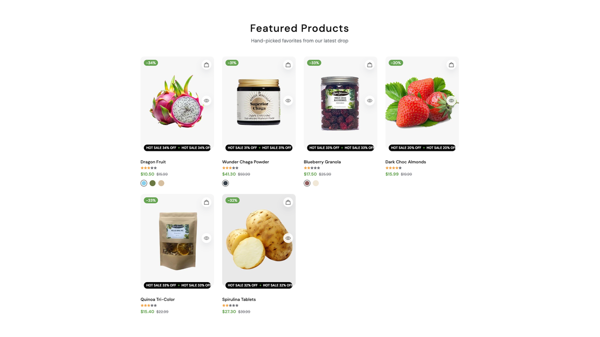
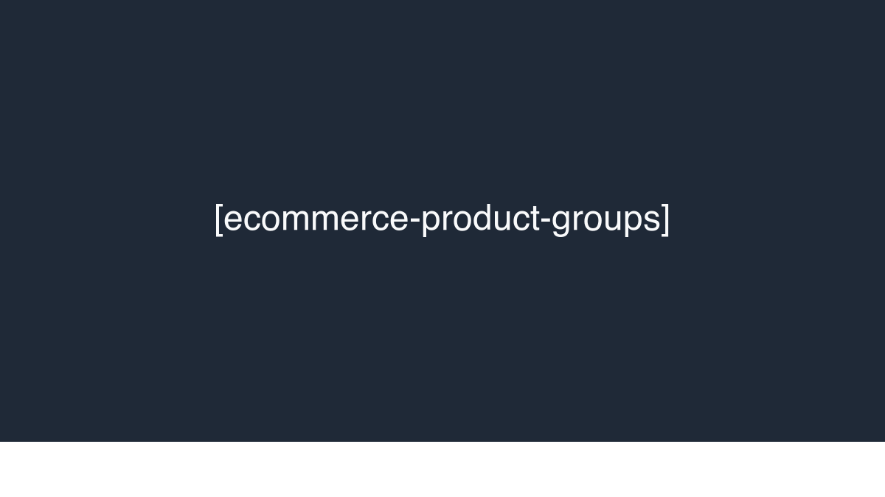
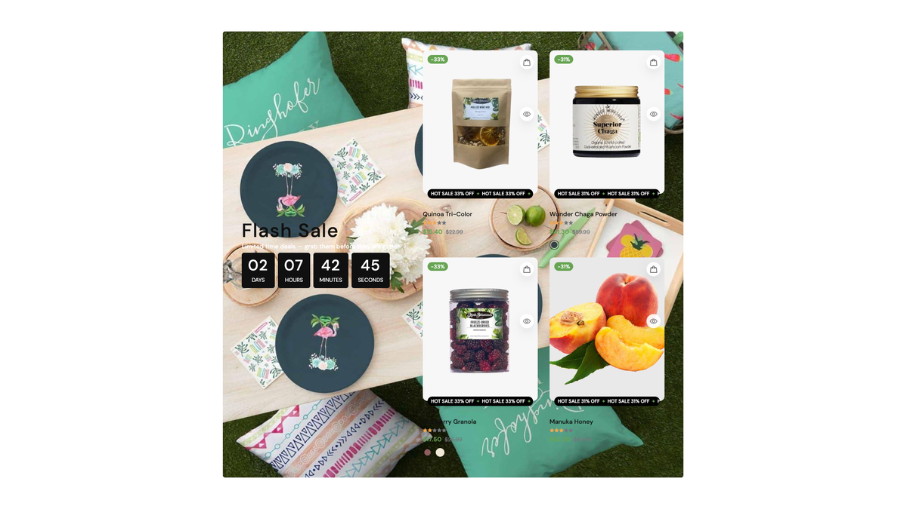
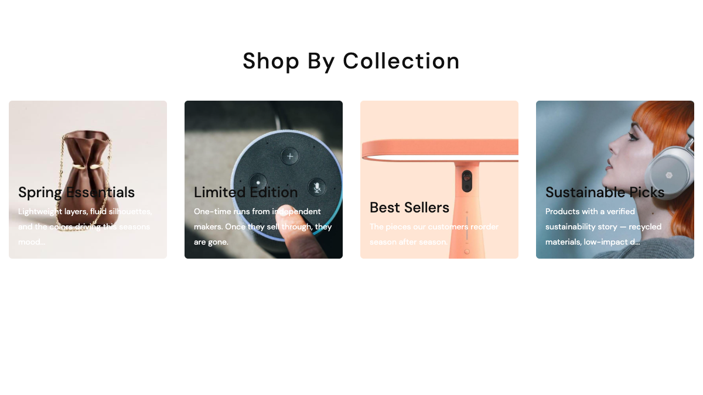
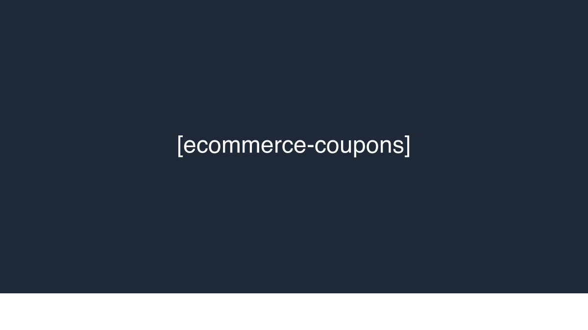
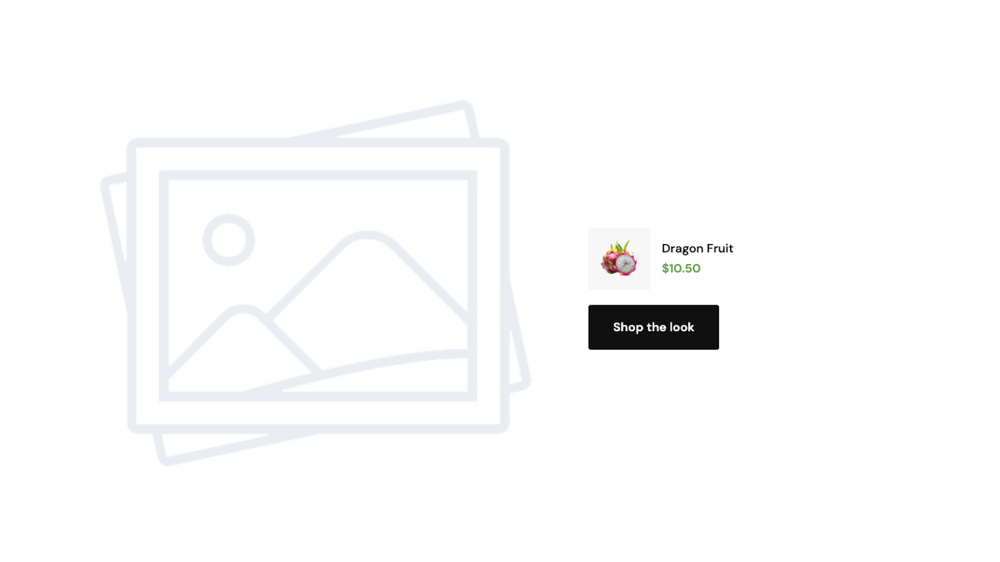
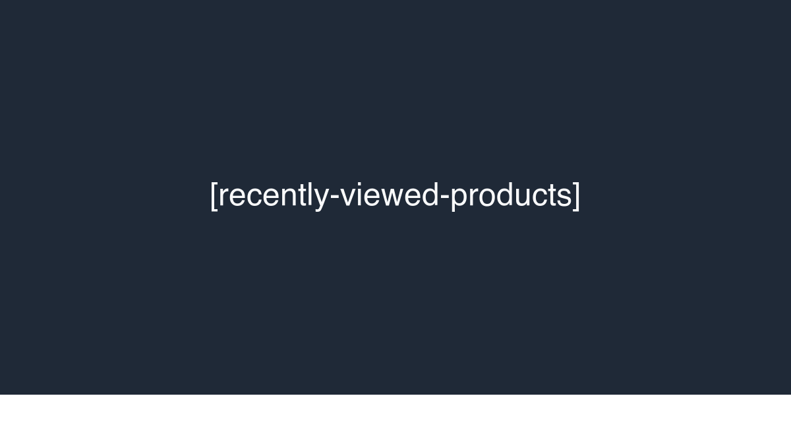
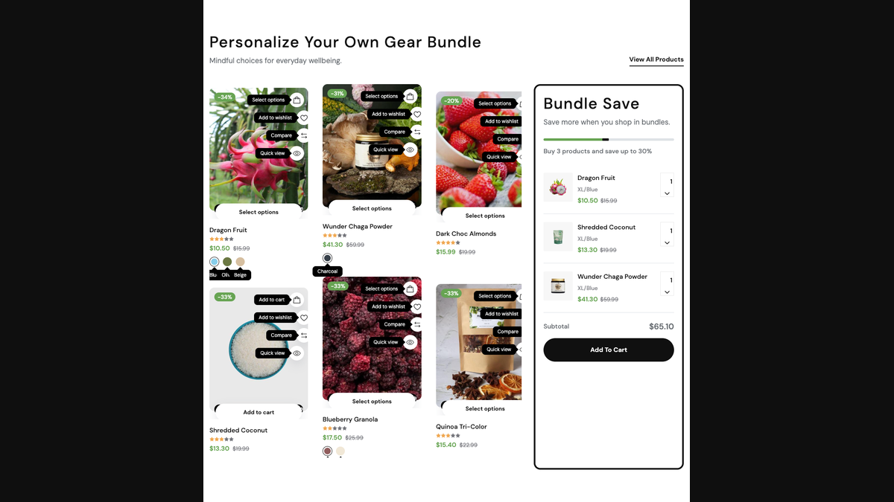

# Shortcodes — Products

Shortcodes that pull products from the ecommerce catalog. 9 shortcodes in this group. All require the **ecommerce** plugin to be active.

## `[ecommerce-products]`

The main product listing block — grid, slider, list, or featured layout sourced from latest / best-seller / featured / on-sale / manual selection.



**Styles:** `style-grid`, `style-slider`, `style-list`, `style-featured`. The `style-tabs` and `style-auto-featured-tabs` variants render a tabbed switcher (see "Tabs mode" below).

| Field | Default | Description |
|-------|---------|-------------|
| `style` | `style-grid` | Layout preset. |
| `title`, `subtitle` | — | Section heading. |
| `source` | `latest` | `latest`, `best-seller`, `featured`, `sale`, `manual`. |
| `category_ids` | — | Filter by categories (multi). |
| `brand_ids` | — | Filter by brands (multi). |
| `product_ids` | — | Specific products (used when `source="manual"`). |
| `limit` | `12` | Max products. |
| `items_per_row` | `4` | Grid density. |
| `show_view_all` | `no` | Render a "View all" link below the block. |
| `view_all_url` | — | "View all" target. |

### Tabs mode

When `style` is `style-tabs` or `style-auto-featured-tabs`, the following pipe-separated lists drive the tab strip — one entry per tab:

| Field | Example | Description |
|-------|---------|-------------|
| `tab_labels` | `Trending\|New In\|Best Sellers` | Tab labels. |
| `tab_categories` | `1,2\|3\|` | Category IDs (or slugs / names) per tab, comma-separated within a tab. |
| `tab_sources` | `featured\|latest\|best-seller` | Source mode per tab. |
| `tab_icons` | `img/a.png\|img/b.png` | Icon image per tab (used by `tab_nav_style=v4` vertical nav). |

Tab 0 is server-rendered; the rest lazy-load via the `public.ajax.ecommerce-products-tab` route.

```html
[ecommerce-products style="style-grid" source="featured" limit="8" items_per_row="4"][/ecommerce-products]
```

---

## `[ecommerce-product-groups]`

Tabbed product groups — each tab pulls from its own category set. Useful for "Shop by category" sections.



**Styles:** `style-tabs`, `style-columns`, `style-bundle`.

| Field | Description |
|-------|-------------|
| `title` | Section heading. |
| `groups` | Repeater — each entry: `tab_label`, `category_ids` (multi), `limit` (default 8). |

---

## `[ecommerce-flash-sale]`

Active flash sale block with countdown timer and discounted products.



**Styles:** `style-1` (banner with grid), `style-2` (slider).

| Field | Default | Description |
|-------|---------|-------------|
| `flash_sale_id` | — | Pick from active **Admin → Flash Sales**. Required — block returns empty without it. |
| `title`, `subtitle` | — | Section heading. |
| `show_countdown` | `yes` | Render countdown timer. |
| `background_image` | — | Banner background (style-1 only). |

See [Flash Sales](./usage-flash-sales.md) for managing the discount records.

---

## `[ecommerce-collections]`

Display product collections as banner cards.



**Styles:** `style-default`, `style-banner-grid` (1+2 banner grid).

| Field | Default | Description |
|-------|---------|-------------|
| `title` | — | Section heading. |
| `collection_ids` | — | Pick collections (multi). |
| `items_per_row` | `4` | Card density. |
| `limit` | `4` | Max collections. |

---

## `[ecommerce-coupons]`

Display active discount coupons as redeemable cards. Useful at the top of category pages or the checkout-pre page.



| Field | Default | Description |
|-------|---------|-------------|
| `title` | — | Section heading. |
| `limit` | `4` | Max coupons. |
| `featured_only` | `no` | When `yes`, only coupons flagged "Display at checkout" appear. |

See [Discounts & Coupons](./usage-discounts-coupons.md) for managing the underlying records.

---

## `[tab-product-showcase]`

Heading + numbered tab list LEFT + tab-pane image with a product overlay card RIGHT (sport preset §5).


| Field | Default | Description |
|-------|---------|-------------|
| `title`, `subtitle` | — | Section heading. |
| `view_all_url` | `/products` | View More link. |
| `view_all_text` | `View More` | View More label. |
| `tab_N_label` *(1–4)* | — | Tab label. |
| `tab_N_image` *(1–4)* | — | Tab pane image. |
| `tab_N_product_id` *(1–4)* | — | Product to overlay on the pane. |

---

## `[product-feature-zoom]`

Zoom-on-hover product showcase with optional clickable hotspots.



**Styles:** `style-1` (default), `style-2-detail` (vertical thumbs + zoom + full product info — used by organic preset).

| Field | Description |
|-------|-------------|
| `image` | Showcase image. |
| `product_id` | Linked product (also drives info pane in `style-2-detail`). |
| `heading`, `subheading` | Copy. |
| `hotspots` | Repeater: x (%), y (%), label. |

The `style-2-detail` variant additionally honors: `wrapper_style`, `container_class`, `badge_text`, `show_thumb_slider`, `show_buy_it_now`, `show_action_boxes`.

---

## `[recently-viewed-products]`

Show products the visitor has recently viewed. Driven by per-user cookies/session — the block renders empty for first-time visitors.



| Field | Default | Description |
|-------|---------|-------------|
| `title` | `Recently viewed` | Section heading. |
| `limit` | `10` | Max products. |

---

## `[gear-bundle]`

Two-column section: a paired product slider (products shown in pairs of 2) LEFT + a sticky "bundle save" widget RIGHT with progress bar, pre-filled bundle list, subtotal, and CTA. (Electronics preset §6.)



| Field | Default | Description |
|-------|---------|-------------|
| `title`, `subtitle` | — | Section heading. |
| `view_all_url`, `view_all_text` | — | View-all link. |
| `product_ids` | — | Products in the LEFT slider (paired in twos). |
| `bundle_caption` | `Buy 3 products and save up to 30%` | Widget caption. |
| `bundle_progress` | `50` | Progress bar % (0–100). |
| `bundle_product_ids` | — | 3 products shown in the bundle widget. |
| `bundle_button_text` | `Add To Cart` | Bundle CTA. |
| `bundle_button_url` | — | Bundle CTA URL. |

---

## See also

- [Hero & Banners](./shortcodes-hero-banners.md)
- [Categories, brands & vendors](./shortcodes-categories-brands.md)
- [Flash Sales](./usage-flash-sales.md), [Discounts & Coupons](./usage-discounts-coupons.md)
