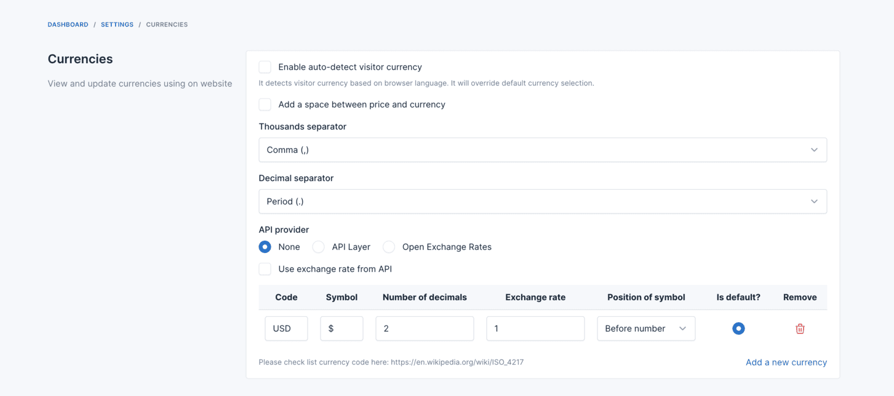
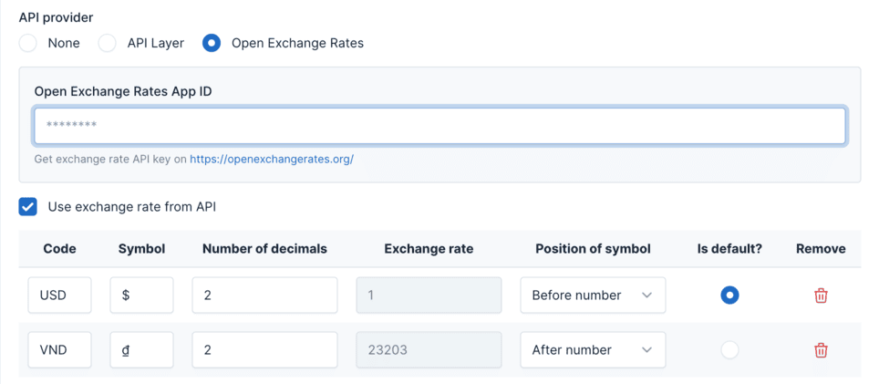

# Currencies

Currencies in the Ecommerce plugin allows you to manage the currencies used in your online store.
You can set up exchange rates for different currencies, enabling customers to view prices in their preferred
currency.

## Currency Settings

To change currency settings go to `Settings` -> `Ecommerce` -> `Currencies`.

## Currency Exchange Rates

### Automatically Updating Exchange Rates

Without the **Use exchange rate from API** feature, you need to research the exchange rate yourself and
manually update it in the currency settings.

We provide two options for automatically updating the exchange rate:

* **[API Layer](https://apilayer.com)**
* **[Open Exchange Rates](https://openexchangerates.org)**

In the **API provider** field, select the API provider you want to use and enter their API key.

### Manually Updating Exchange Rates

If you prefer to manually update the exchange rate, select `None` in the **API provider** field and disable the **Use
exchange rate from API** feature.

::: warning
For the default currency, the exchange rate must be 1.
:::

## Auto-detect Visitor Currency

The built-in **Auto-detect visitor currency** option in `Settings` -> `Ecommerce` -> `Currencies` is a lightweight
fallback that tries to pick a currency based on the visitor's browser settings.

### How it works

It does **NOT** use the visitor's real IP address or geolocation. Instead, it reads the browser's
`Accept-Language` HTTP header (e.g. `en-US`, `hi-IN`, `fr-FR`), extracts the country code, and maps it to a
currency via an internal country-to-currency table (US → USD, FR → EUR, IN → INR, etc.).

The logic lives in `platform/plugins/ecommerce/src/Supports/CurrencySupport.php` inside the
`detectedCurrencyCode()` method.

### Priority order

When resolving the currency for each request, the system uses this priority:

1. **Session currency** (set when the visitor manually clicks the currency switcher) — highest priority
2. **Auto-detect from Accept-Language** (only if enabled and no session currency exists)
3. **Default currency** (fallback if nothing matches)

This means manual switching always overrides auto-detect. Once a visitor selects a currency, their session
takes priority on all subsequent pages.

### Limitations

The built-in auto-detect is a rough fallback and is often inaccurate:

* Most Indian users browse with English (`en-US`) set as their browser language, so the system detects
  **USD** instead of INR.
* Users with VPNs, multi-language browsers, or custom locales get unpredictable results.
* It does not reflect the visitor's actual country, only their browser language preference.

### Recommended: FOB Geo Data Detector

For reliable geo-based detection, use the free
[**FOB Geo Data Detector**](https://marketplace.botble.com/products/FriendsOfBotble/fob-geo-data-detector)
plugin from the marketplace. It detects the visitor's real country from their IP address and automatically
sets the correct currency and language.

**Setup steps:**

1. Go to `Admin` -> `Plugins` -> `Add new plugin`, search for **FOB Geo Data Detector**, then install and
   activate it.
2. In `Settings` -> `Ecommerce` -> `Currencies`, disable **Auto-detect visitor currency** (the built-in
   option).
3. Configure the FOB plugin in its settings page and map your target countries to currencies.
4. Clear cache at `Platform administration` -> `Cache management` and test in a fresh incognito window.

::: tip
If you are using a CDN or host-level cache (Cloudflare, Hostinger hPanel Cache Manager, LiteSpeed Cache,
etc.), make sure to purge those caches as well — they run outside the CMS and can serve stale pages with
the wrong currency.
:::
