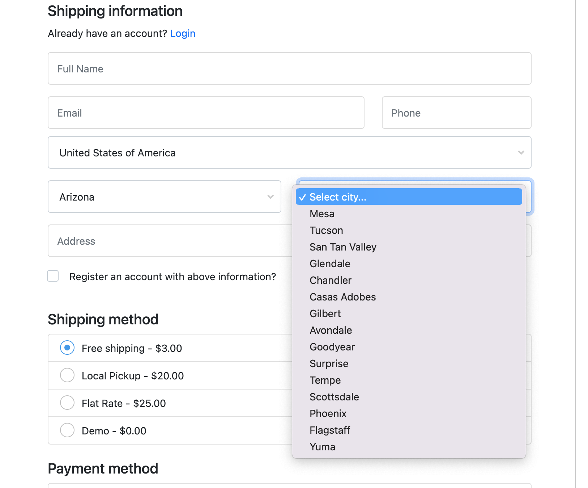
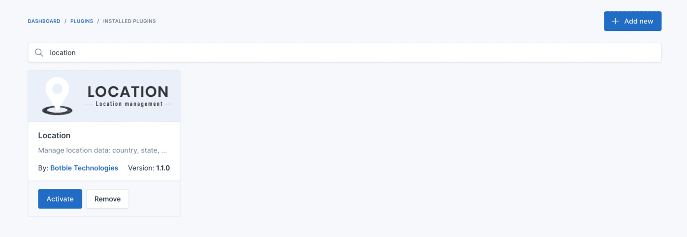
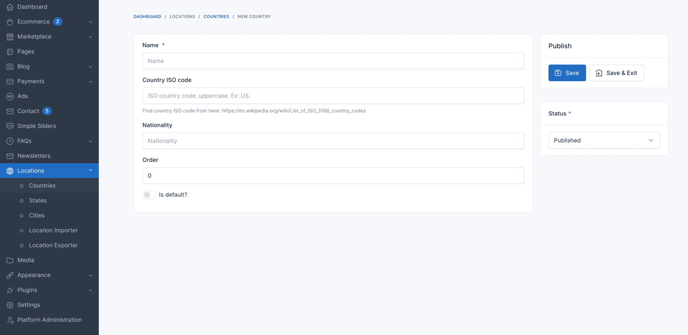
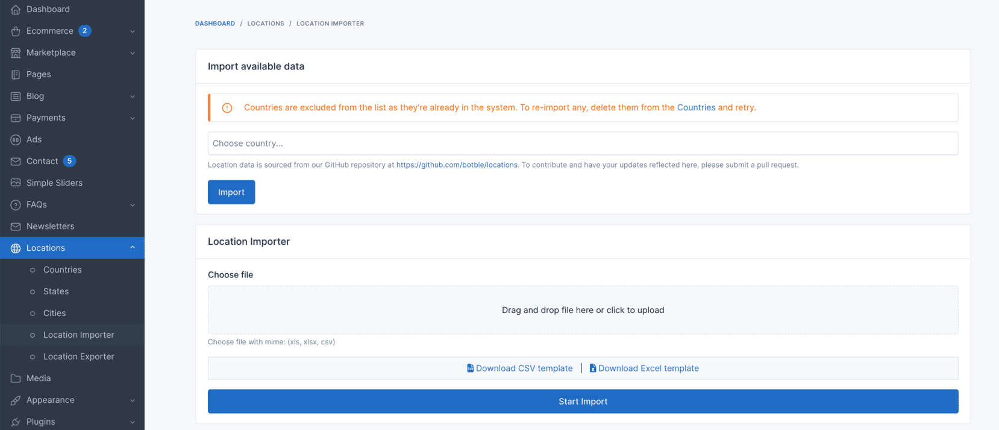
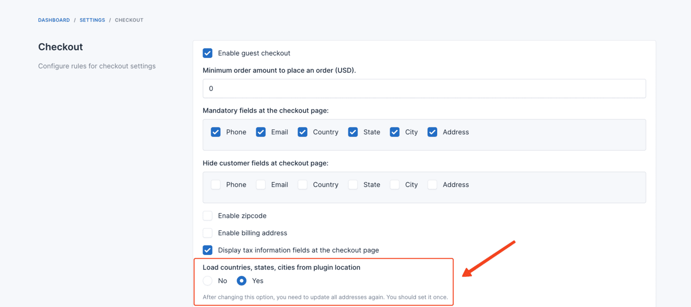

# Location

The Location plugin converts the **City** and **State** fields on the checkout page into structured dropdown lists, replacing free-text inputs with curated country/state/city data.

## Activate the plugin

In the admin panel, go to `Plugins` -> `Installed`, find the **Location** plugin, and click **Activate**.

## Add countries, states, and cities

Add locations manually from `Admin` -> `Locations`.

Or import them in bulk from a CSV file.

## Enable location in the checkout page

In the admin panel, go to `Settings` -> `Ecommerce` -> `Checkout` and enable **Load countries, states, cities from plugin location?**.

