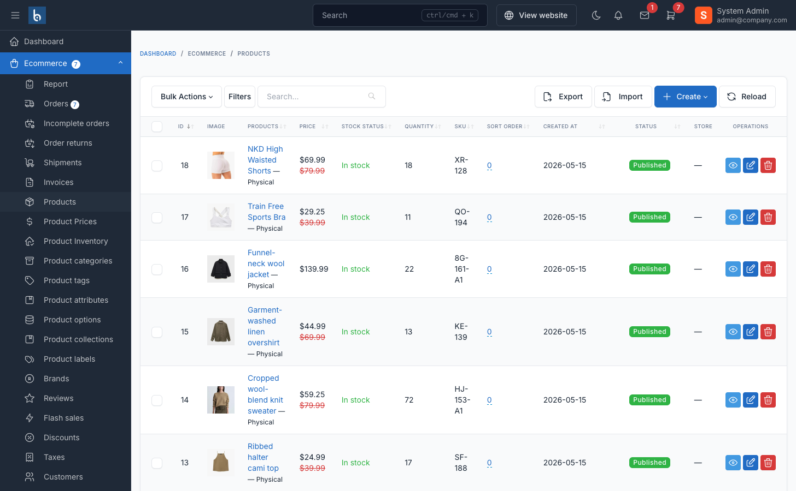

# Product Variations

Product variations allow you to offer the same product in different configurations (size, color, material, etc.). Each variation can have its own price, SKU, stock level, and images.

## Overview

The variation system consists of:

1. **Attribute Sets** - Groups of attributes (e.g., "Size", "Color")
2. **Attributes** - Individual values (e.g., "Small", "Red")
3. **Variations** - Specific combinations (e.g., "Red T-Shirt - Small")
4. **Per-Variation Data** - Each variation has unique pricing, inventory, and images

## Creating Attribute Sets

Before adding variations, create reusable attribute sets.

Navigate to `Ecommerce` -> `Attributes` in the admin panel.

1. Click **Create**
2. Enter attribute set details:
   - **Title** - Name of the attribute (e.g., "Size", "Color")
   - **Slug** - Auto-generated URL-friendly identifier
   - **Status** - Published/Draft
   - **Display Layout** - How attributes display on product pages
   - **Order** - Display priority
3. Configure options:
   - **Is searchable** - Allow filtering by this attribute
   - **Is comparable** - Include in product comparison
   - **Use in product listing** - Show in category/search filters
   - **Use image from variation** - Display variation images for this attribute
4. Click **Save**

## Adding Attribute Values

After creating an attribute set, add specific values:

1. Open the attribute set
2. Scroll to **Attributes** section
3. Click **Add new attribute**
4. Fill in details:
   - **Title** - Value name (e.g., "Small", "Red")
   - **Slug** - Auto-generated
   - **Color** - Color code for visual swatches (optional)
   - **Image** - Image for this attribute (optional)
   - **Order** - Display order
5. Repeat for all values
6. Click **Save**

::: tip
For color attributes, use hex codes (e.g., `#FF0000` for red) to display color swatches instead of text.
:::

## Assigning Attributes to Products

1. Navigate to `Ecommerce` -> `Products`
2. Open or create a product
3. Scroll to **Attributes** section
4. Select attribute sets you want to use (e.g., Size, Color)
5. Click **Save**

This product can now have variations based on these attributes.

## Creating Product Variations

After assigning attribute sets:

1. Stay on the product edit page
2. Scroll to **Variations** section
3. Click **Add new variation**
4. Select attribute combination (e.g., Color: Red, Size: Small)
5. Configure variation-specific settings:

### Variation Settings

| Setting | Description |
|---------|-------------|
| **SKU** | Unique identifier for this variation |
| **Price** | Base price (inherits from parent if empty) |
| **Sale Price** | Discounted price (optional) |
| **Quantity** | Stock level for this variation |
| **With storehouse management** | Enable/disable stock tracking |
| **Stock Status** | In stock / Out of stock |
| **Image** | Main image for this variation |
| **Images Gallery** | Additional images |
| **Weight, Length, Width, Height** | Shipping dimensions |
| **Cost per item** | Your cost (for profit tracking) |
| **Barcode** | Barcode/EAN for inventory |
| **Is default** | Set as the default selected variation |

6. Click **Save variation**
7. Repeat for all combinations

::: tip
Use the **Generate all variations** button to automatically create variations for all attribute combinations. You can then edit individual variations.
:::

## Auto-Generating SKUs

When creating variations, enable **Auto-generate SKU** to create SKUs automatically:

Format: `{parent_sku}-{attribute1_slug}-{attribute2_slug}`

Example: `TSHIRT-RED-SMALL`

## Variation Images

Each variation can have its own images:

1. **Individual variation images** - Upload images per variation
2. **Attribute-based images** - Enable "Use image from variation" in attribute set settings, then the system displays the appropriate variation image when that attribute is selected

## Managing Variation Inventory

### Per-Variation Stock

Each variation tracks its own inventory:

- **Enable storehouse management** for the variation
- Set **Quantity** for each variation
- System automatically updates stock on orders
- Configure **Allow checkout when out of stock** per variation

### Default Variation

Mark one variation as **Default** to:
- Display by default on product pages
- Use its price/image as the main product price/image
- Provide a starting point for customer selection

## Bulk Operations

### Export Variations

Navigate to `Ecommerce` -> `Products` -> `Export`:

1. Select export format (CSV/Excel)
2. Export includes both products and variations
3. Variations have `import_type` = `variation`

### Import Variations

Navigate to `Ecommerce` -> `Products` -> `Import`:

1. Download the template
2. Fill in product rows (`import_type` = `product`)
3. Fill in variation rows (`import_type` = `variation`)
4. Variation rows must have:
   - `name` or `slug` matching parent product
   - `product_attributes` in format `AttributeSet:Value` (e.g., `Size:Small,Color:Red`)
   - `sku` and other variation-specific data
5. Upload and import

::: warning
Variations must reference an existing parent product. Import parent products first, then variations.
:::

## Attribute Set Categories

You can limit which attribute sets are available for specific product categories:

1. Navigate to `Ecommerce` -> `Attributes`
2. Open an attribute set
3. Scroll to **Categories** section
4. Select categories where this attribute applies
5. Click **Save**

When editing products in those categories, only relevant attribute sets appear.

## Troubleshooting

### Variations not displaying on frontend

1. **Check attribute set status** - Must be "Published"
2. **Verify attributes assigned** - Product must have attribute sets selected
3. **Check variation status** - Variations inherit parent product status
4. **Clear cache** - Run `php artisan cache:clear`

### "Generate all variations" button not working

1. **Verify attribute sets** - Product must have at least one attribute set assigned
2. **Check for existing variations** - Button only generates missing combinations
3. **Attribute values required** - Attribute sets need at least one attribute value

### Images not showing for variations

1. **Upload variation images** - Each variation needs its own images
2. **Check "Use image from variation"** - Enable in attribute set if using attribute-based images
3. **Set default variation** - Ensure one variation is marked as default

## Best Practices

1. **Plan attribute structure** - Create all attribute sets before adding products
2. **Use consistent naming** - Keep attribute names uniform across products
3. **Set default variations** - Always mark one variation as default
4. **Optimize images** - Use appropriate image sizes for each variation
5. **Auto-generate SKUs** - Use consistent SKU patterns for easier inventory management
6. **Test before bulk import** - Import a few test variations before bulk operations
7. **Monitor stock levels** - Enable storehouse management for accurate inventory tracking
