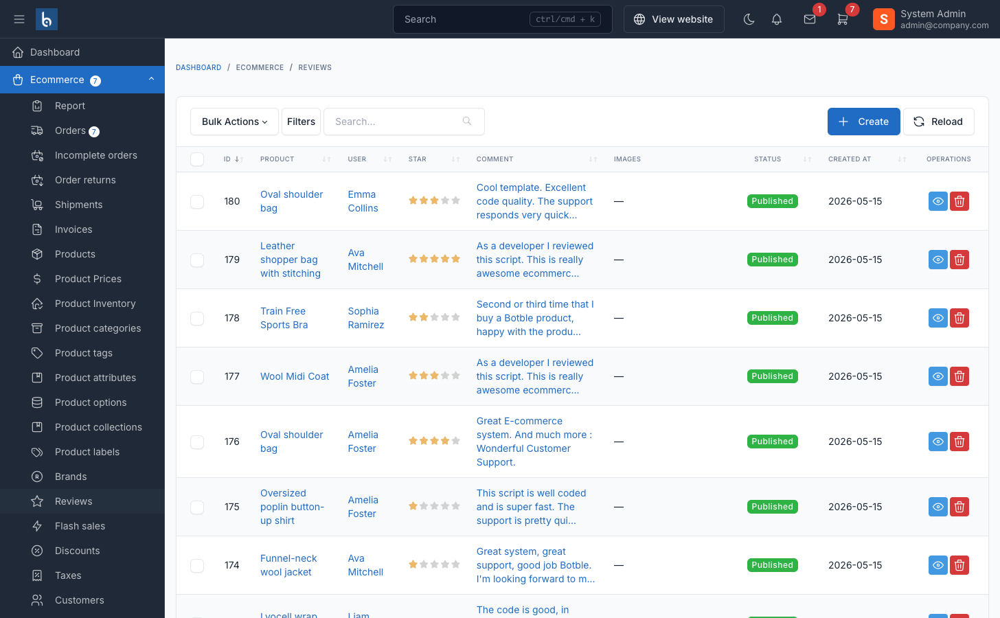

# Product Reviews

The product review system allows customers to rate and review products, helping build trust and provide valuable feedback for your ecommerce store.

## Overview

When enabled, the review system:

1. **Collects customer feedback** - Customers can rate products with 1-5 stars and write detailed reviews
2. **Supports image uploads** - Customers can attach photos to their reviews
3. **Moderates content** - Reviews can be approved manually or published automatically
4. **Enables replies** - Store admins and vendors can respond to customer reviews
5. **Displays ratings** - Star ratings and review counts appear on product pages

## Enable Product Reviews

Navigate to `Ecommerce` -> `Settings` -> `Product Reviews` in the admin panel.

Toggle **Enable review** to activate the feature.

## Configuration Options

### Basic Settings

| Setting | Description |
|---------|-------------|
| **Enable review** | Master switch to turn the review system on/off |
| **Only allow customers who purchased to review** | Restrict reviews to verified purchasers only |
| **Review need to be approved** | Manually approve reviews before they appear publicly |
| **Show customer full name** | Display full names or mask them (e.g., "John D***") |
| **Hide rating when no reviews** | Don't show star rating if product has no reviews yet |

### Image Upload Settings

When **Allow customer upload image in review** is enabled:

| Setting | Default | Description |
|---------|---------|-------------|
| **Max file size** | 2 MB | Maximum size per image (1-1024 MB) |
| **Max file number** | 6 | Maximum number of images per review (1-100) |
| **Display uploaded images list** | ON | Show customer review images in a gallery |

::: tip
Review images help build trust. Consider allowing at least 3-6 images per review to let customers showcase products from different angles.
:::

## Managing Reviews in Admin

### View All Reviews

Navigate to `Ecommerce` -> `Reviews` to see all submitted reviews.

The table shows:
- Customer name and email
- Product reviewed
- Star rating
- Review status (Published/Pending)
- Date submitted

### View Review Details

Click on a review to see:

- Full review text
- Attached images (if any)
- Customer information
- Product details
- Review statistics for the product

### Approve or Reject Reviews

On the review detail page:

1. **To approve a pending review** - Click the **Publish** button
2. **To hide a published review** - Click the **Unpublish** button
3. **To delete a review** - Click the **Delete** button

::: warning
Deleting a review is permanent and will update the product's average rating automatically.
:::

### Reply to Reviews

Admins with the `reviews.reply` permission can reply to customer reviews:

1. Open the review detail page
2. Scroll to the **Reply to review** section
3. Enter your response
4. Click **Reply** to publish

**Reply editing:**
- Click **Edit** to modify an existing reply
- Click **Delete** to remove a reply
- Changes are saved immediately

::: tip
Responding to reviews (especially negative ones) shows customers you care about their feedback and can improve brand reputation.
:::

## Customer Experience

### Submitting a Review

Customers can review products from:
- Product detail pages (click "Write a review" or similar button)
- Their order history (for purchased products)

**Review form includes:**
- Star rating (1-5 stars, required)
- Review text (optional)
- Image uploads (if enabled)

### Review Submission Behavior

| Scenario | Behavior |
|----------|----------|
| Review approval disabled | Review appears immediately |
| Review approval enabled | Review enters pending status until admin approves |
| Verified purchaser only | Customer must have completed order containing the product |
| Guest customers | Cannot submit reviews (login required) |
| Duplicate reviews | Customers can only review each product once |

### Editing Reviews

Customers can delete their own reviews from:
- The product page (if they're logged in)
- Their customer dashboard (if theme supports it)

::: warning
Customers cannot edit submitted reviews - they must delete and resubmit. Consider this when designing your review flow.
:::

## Review Display on Product Pages

### Star Rating

Products display:
- Average star rating (1.0 to 5.0)
- Total number of reviews
- Rating breakdown by stars (e.g., "4 stars: 15 reviews")

### Review List

Reviews are shown with:
- Customer name (full or masked based on settings)
- Customer avatar
- Star rating
- Review date
- Review text
- Attached images
- Admin/vendor reply (if any)

### Filtering & Sorting

Customers can filter reviews by:
- Star rating (show only 1-star, 2-star, etc.)
- Search keyword

Sort options:
- **Newest** - Most recent first (default)
- **Oldest** - Oldest first
- **Highest rating** - 5-star reviews first
- **Lowest rating** - 1-star reviews first

## Vendor Reply System

If the marketplace plugin is active, vendors can reply to reviews on their own products:

**Requirements:**
- Customer must be a verified vendor
- Vendor must own the product being reviewed
- Only one reply per review

**How vendors reply:**
1. Log in to vendor dashboard
2. Navigate to product reviews
3. Click reply button on a review
4. Enter reply message
5. Submit reply

Vendor replies display with:
- Store name/logo
- Reply text
- Timestamp

::: tip
Vendor replies appear alongside admin replies, showing the store logo/name to distinguish them.
:::

## Review Statistics & Analytics

The system automatically tracks:

- **Reviews count** - Total number of published reviews per product
- **Average rating** - Calculated from all published reviews
- **Rating distribution** - Breakdown by star level (1-5 stars)

These statistics are cached and updated automatically when:
- A new review is published
- A review is approved/unpublished
- A review is deleted
- A review's star rating is changed

## Creating Reviews Manually (Admin)

Admins can create reviews on behalf of customers:

1. Navigate to `Ecommerce` -> `Reviews`
2. Click **Create**
3. Select or enter customer information:
   - **Choose customer** - Select from existing customer database
   - **Or enter guest details** - Provide name and email manually
4. Select the product to review
5. Set star rating (1-5)
6. Enter review text
7. Click **Save**

::: warning
You cannot create a review if the customer has already reviewed that product. Each customer can only review a product once.
:::

## Frequently Asked Questions

### Can customers review the same product twice?

No. Each customer can only submit one review per product. They must delete their existing review to submit a new one.

### Do reviews count variants separately?

No. Reviews are associated with the parent product, not individual variants. A customer who buys the "Red, Size L" variant reviews the main product.

### What happens to reviews when a product is deleted?

Reviews are automatically deleted when their associated product is deleted.

### Can I export customer reviews?

Reviews are stored in the `ec_reviews` database table. You can export them using database tools or create a custom exporter.

### How do I hide all reviews for a product?

You must manually unpublish or delete each review. There's no bulk "hide all reviews" option per product.

### Do review images have size/format restrictions?

Yes. Images must be:
- Under the configured max file size (default: 2 MB)
- Valid image formats (JPG, PNG, GIF, WebP)
- Within the max file number limit (default: 6 images)

## Best Practices

1. **Use verified purchaser mode** - Enable "Only allow customers who purchased to review" for authentic feedback

2. **Moderate initially** - Enable review approval when launching to prevent spam, then disable if quality is good

3. **Respond to reviews** - Reply to both positive and negative reviews to show engagement

4. **Encourage photo reviews** - Reviews with images are more trustworthy and detailed

5. **Don't delete negative reviews** - Respond professionally instead; deleting looks suspicious

6. **Monitor review quality** - Check for fake, spam, or inappropriate reviews regularly

7. **Mask customer names** - Consider privacy by showing partial names (e.g., "John D***") instead of full names
