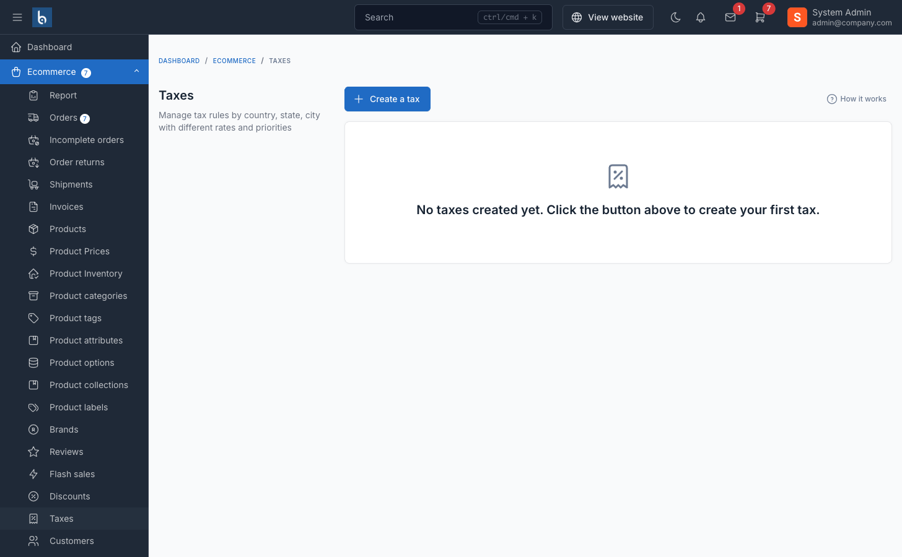
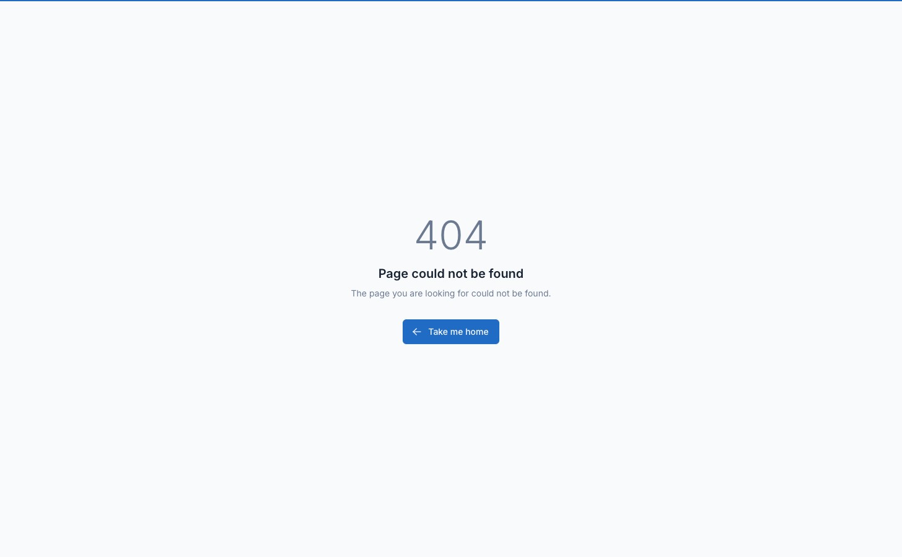

# Tax Configuration

The tax system provides flexible location-based tax calculation with support for multiple tax rates, tax classes, and regional tax rules.

## Overview

Tax features include:

- **Tax classes** - Group products by tax category (standard, reduced, zero-rated)
- **Location-based rates** - Different rates by country, state, city, or ZIP code
- **Priority system** - Control which tax rate applies when multiple match
- **Tax display options** - Show prices with or without tax
- **Checkout tax fields** - Optional company/VAT number fields
- **Per-product tax** - Assign different tax classes to products

## Enable Tax System

Navigate to `Ecommerce` -> `Settings` -> `Tax`.

Toggle **Enable tax** to activate tax calculation.

::: tip
Once enabled, you'll see a link to **Go to Taxes** to manage tax classes and rates.
:::

## Tax Configuration Options

After enabling tax, configure these settings:

### Display Product Price Including Taxes

**When ON:**
- Product prices shown include tax
- Cart/checkout shows "including tax" label
- Tax is **backed out** from displayed price for calculation

**When OFF:**
- Product prices shown exclude tax
- Tax is **added** to price at checkout
- More common in US/Canada

Example: Product price $100, 10% tax
- Including taxes: Shows $100 (price is $90.91 + $9.09 tax)
- Excluding taxes: Shows $100 + $10 tax = $110 total

### Display Company Invoice Information Fields at Checkout

**When ON:**
- Checkout page shows additional fields:
  - Company name
  - Company address
  - Company tax code / VAT number
- Useful for B2B stores or EU VAT compliance

**When OFF:**
- Only standard customer fields shown
- Simpler checkout for B2C stores

### Display Checkout Tax Information

**When ON:**
- Shows tax breakdown in checkout summary
- Example: "Tax (10%): $10.00"

**When OFF:**
- Hides detailed tax info
- Only shows final total

### Display Item Tax at Checkout

**When ON:**
- Shows tax amount per item in cart
- Example: "Widget: $100 + $10 tax"

**When OFF:**
- Shows only subtotal and total tax
- Cleaner checkout display

### Display Tax Description

**When ON:**
- Shows tax rate name/description (e.g., "VAT 20%")

**When OFF:**
- Shows only "Tax" label

## Creating Tax Classes

Navigate to `Ecommerce` -> `Taxes` -> `Tax Classes` -> `Create`.

### Tax Class Fields

- **Title** - Name of tax class (e.g., "Standard Rate", "Reduced Rate", "Zero Rate")
- **Percentage** - Default tax rate (e.g., `20` for 20%)
- **Priority** - Order of application when multiple taxes match (lower = higher priority)
- **Status** - Published or Draft

::: tip
Use descriptive titles like "Standard VAT (20%)" or "Reduced Rate (5%)" for clarity.
:::

### Common Tax Classes

| Tax Class | Percentage | Use Case |
|-----------|-----------|----------|
| Standard Rate | 20% | Most products (EU VAT standard) |
| Reduced Rate | 5% | Food, books, children's items |
| Zero Rate | 0% | Exports, certain essentials |
| Luxury Rate | 25% | High-value items (some countries) |

### Setting Default Tax Rate

Navigate to `Ecommerce` -> `Settings` -> `Tax`.

After creating tax classes, select a **Default tax rate** from the dropdown.

This tax applies to products without a specific tax class assigned.

## Creating Tax Rules

Tax rules define location-based tax rates. One tax class can have multiple rules for different locations.

Navigate to `Ecommerce` -> `Taxes` -> `Tax Rules` -> `Create`.

### Tax Rule Fields

- **Tax class** - Select which tax class this rule belongs to
- **Country** - Select country (or "All" for global)
- **State** - Select state/province (or "All")
- **City** - Optional city name
- **ZIP code** - Optional ZIP/postal code
- **Percentage** - Tax rate override for this location (overrides tax class default)
- **Priority** - Rule priority when multiple rules match (lower = higher priority)
- **Status** - Enable or disable this rule

### Tax Rule Priority

When multiple rules match a customer's location, the system uses:

1. **Most specific rule wins** - City > State > Country > Global
2. **Priority field** - Lower number = higher priority if specificity is equal
3. **First matching rule** - If priority is equal

Example priority order:
1. ZIP code match (highest priority)
2. City match
3. State match
4. Country match
5. "All" global rule (lowest priority)

### Example Tax Rules

**US Sales Tax Example:**

Tax Class: Standard Rate (0%)

Rules:
- Country: United States, State: California, Percentage: 7.25%
- Country: United States, State: Texas, Percentage: 6.25%
- Country: United States, State: New York, Percentage: 4%

**EU VAT Example:**

Tax Class: Standard VAT (20%)

Rules:
- Country: United Kingdom, Percentage: 20%
- Country: Germany, Percentage: 19%
- Country: France, Percentage: 20%
- Country: Spain, Percentage: 21%

**City-Specific Tax:**

Tax Class: Local Tax (5%)

Rules:
- Country: USA, State: Colorado, City: Denver, Percentage: 8.81%
- Country: USA, State: Colorado, Percentage: 2.9% (state base rate)

## Product Tax Classes

Products can be assigned a tax classification that determines how tax is applied:

| Tax Class | Description |
|-----------|-------------|
| **Standard** | Default rate applies (most products) |
| **Reduced** | Lower tax rate (food, books, essentials) |
| **Zero Rated** | 0% tax but still in the tax system (exports) |
| **Exempt** | Excluded from tax calculation entirely |

### Assigning Tax Class to Products

Navigate to `Products` -> `Create` or `Edit` -> **Pricing** section.

1. Select **Tax class** from dropdown (Standard, Reduced, Zero Rated, Exempt)
2. Select applicable **Taxes** via checkboxes (e.g., VAT 10%, Import Tax 15%)
3. Check **Price includes tax** if the entered price already has tax included

If no tax class is selected, the default tax rate applies.

::: tip
Use bulk actions to assign tax classes to multiple products at once from the products table.
:::

### Price Includes Tax (Per Product)

Each product has a **Price includes tax** checkbox:

**When checked:**
- The entered price already includes tax
- System back-calculates the base price
- Example: Price $110 with 10% tax → Base price $100, tax $10

**When unchecked:**
- The entered price is the base price
- Tax is added on top at checkout
- Example: Price $100 with 10% tax → Total $110

## Customer Tax Classes

Customers can be classified for different tax treatment:

| Customer Class | Description |
|----------------|-------------|
| **Regular** | Standard tax rates apply (default for all customers) |
| **Business** | May qualify for different rates or reverse charge |
| **Tax Exempt** | No tax charged (e.g., government, non-profit) |
| **Reseller** | Tax exemption for resale purchases |

Configure customer tax class at `Customers` -> `Edit Customer` -> **Tax Class** dropdown.

Customers can also enter their **Tax ID** (VAT/GST number) which is stored encrypted for compliance.

::: tip
The system checks customer tax class during checkout. Tax-exempt customers see zero tax automatically.
:::

## How Tax is Calculated

### At Checkout

1. System detects customer location from:
   - Billing address (primary)
   - Shipping address (fallback)
   - Default country (if no address)

2. For each item:
   - Get product's tax class (or default)
   - Find matching tax rule for customer location
   - Apply tax percentage to item price

3. Calculate totals:
   - Subtotal (before tax)
   - Tax amount (per item or total)
   - Shipping (may be taxed based on settings)
   - Grand total

### Tax on Discounts

Taxes are calculated **after** discounts are applied:

Example: Product $100, 10% discount, 10% tax
1. Original price: $100
2. After discount: $90
3. Tax (10% of $90): $9
4. Total: $99

### Tax on Shipping

Shipping can be taxed based on:
- **Shipping origin** location
- **Destination** location
- Custom rules per shipping method

Configure in `Ecommerce` -> `Settings` -> `Shipping`.

## Tax Display Examples

### Example 1: US Store (Tax Excluded)

Settings:
- Display product price including taxes: OFF
- Display checkout tax information: ON

Customer sees:
- Product page: $100
- Cart: $100 + Tax $10 = $110
- Checkout: "Tax (10%): $10.00"

### Example 2: EU Store (Tax Included)

Settings:
- Display product price including taxes: ON
- Display checkout tax information: ON

Customer sees:
- Product page: $120 (includes $20 tax)
- Cart: $120 (Tax included: $20)
- Checkout: "Total inc. VAT (20%): $120"

### Example 3: B2B Store with VAT

Settings:
- Display company invoice fields: ON
- Display item tax at checkout: ON

Customer sees:
- Checkout: Company name, VAT number fields
- Cart: Each item shows "Price: $100 + Tax: $10"
- If VAT number valid: Tax may be zero (reverse charge)

## Managing Taxes

### Editing Tax Classes

Navigate to `Ecommerce` -> `Taxes` -> `Tax Classes`.

Click **Edit** on any tax class to modify:
- Title
- Percentage (affects products without specific rules)
- Priority
- Status

::: warning
Changing tax percentage affects all products using that tax class immediately.
:::

### Editing Tax Rules

Navigate to `Ecommerce` -> `Taxes` -> `Tax Rules`.

Click **Edit** to modify location rules or rates.

Changes apply to all future orders immediately.

### Deleting Taxes

**Deleting a tax class:**
- Removes all associated rules
- Detaches from all products
- Products revert to default tax rate
- Does NOT affect past orders

**Deleting a tax rule:**
- Only affects that specific location rule
- Other rules for same tax class remain active
- Does NOT affect past orders

## Common Tax Scenarios

### Scenario 1: US Multi-State Sales Tax

Setup:
1. Create tax class: "Standard Sales Tax" (0% default)
2. Create rules for each state with nexus
3. Set "Display including taxes" to OFF

### Scenario 2: EU VAT with Reverse Charge

Setup:
1. Create tax class: "Standard VAT" (20%)
2. Create rules for each EU country
3. Enable "Display company invoice fields"
4. Use custom hook to check VAT number and apply reverse charge

### Scenario 3: Canada GST + PST

Setup:
1. Create tax class: "GST" (5%)
2. Create tax class: "PST" (varies by province)
3. Create rules for each province
4. Both taxes apply separately to same items

### Scenario 4: No Tax (Export Store)

Setup:
1. Create tax class: "Zero Rate" (0%)
2. Assign to all products
3. Or don't enable tax system at all

## Tax in the Marketplace (Vendor Panel)

Vendors in the marketplace can manage their tax information through the vendor dashboard.

### Vendor Tax Information

Vendors can update their tax details at: `Vendor Dashboard` -> `Settings` -> `Tax Information`

| Field | Description |
|-------|-------------|
| **Business Name** | Legal business name for tax purposes |
| **Tax ID** | VAT/GST/Tax ID number |
| **Tax Address** | Business address for tax registration |

### How Tax Works for Vendors

1. **Tax rules are set by the admin** - Vendors cannot create or modify tax rates
2. **Products inherit tax settings** - When vendors create products, they assign the tax classes configured by admin
3. **Tax calculated at checkout** - The system uses the customer's location and product tax class to determine the rate
4. **Vendor tax location** - Admin can set the vendor's tax country and state in the store settings, which may affect tax calculations (e.g., for seller-based tax jurisdictions)

### Admin Configuration for Vendor Tax

Navigate to `Marketplace` -> `Stores` -> `Edit Store`:

- **Tax ID** - Vendor's tax registration number
- **Tax Country** - Country of vendor's tax registration
- **Tax State** - State of vendor's tax registration

::: tip
Vendor tax location data is used by the tax engine when calculating taxes for seller-based jurisdictions (e.g., US origin-based sales tax states).
:::

## Tax Reports

To view tax collected:

Navigate to `Ecommerce` -> `Reports` -> `Tax`.

Reports show:
- Total tax collected by period
- Tax breakdown by rate
- Tax by location
- Tax by product

Export to CSV for accounting software integration.

::: tip
The **Tax Collection Summary Card** widget on the dashboard shows quick tax stats.
:::

## Troubleshooting

### Tax not calculating at checkout

1. **Tax system enabled?** - Check `Settings` -> `Tax`
2. **Tax rule exists?** - Create rule matching customer location
3. **Tax class assigned?** - Product needs tax class or default rate set
4. **Customer location?** - Verify billing/shipping address is complete

### Wrong tax rate applied

1. **Check tax rules** - Verify location match is correct
2. **Check priority** - Lower priority may be overriding
3. **Check specificity** - More specific rule (city) overrides general (country)

### Tax showing when it shouldn't

1. **Check default tax rate** - May be applying to products without specific class
2. **Check "All" rules** - Global rules apply to all locations
3. **Verify product tax class** - May have wrong class assigned

### Prices look wrong

1. **Check "Display including taxes"** setting
2. **Verify tax percentage** - Decimal vs percentage (20 = 20%, not 0.20)
3. **Check discount interaction** - Tax calculates after discount

## Best Practices

1. **Use descriptive names** - "VAT 20% (UK)" better than "Tax 1"

2. **Set default rate** - Ensures all products are taxed even without assignment

3. **Test with customer accounts** - Verify rates apply correctly by location

4. **Keep rules organized** - Use priority field to control complex scenarios

5. **Document your setup** - Note which products use which tax class

6. **Regular audits** - Review rates quarterly to ensure compliance

7. **Consider nexus rules** - Only charge tax where legally required

8. **Use zero rate explicitly** - Don't leave products without tax class if they should be zero

## Frequently Asked Questions

### Can I charge multiple taxes on one product (e.g., GST + PST)?

Yes, create multiple tax classes and assign both to the product. The system calculates each separately.

### Do I need to charge tax on shipping?

Depends on local laws. Configure in `Settings` -> `Shipping` to tax shipping fees.

### How do I handle tax-exempt customers?

Create a "Tax Exempt" customer group or use custom code to check customer tax status and override rate.

### Can I have different tax rates for different product types?

Yes, create multiple tax classes (e.g., "Food Tax", "Clothing Tax") and assign to products.

### What if customer enters wrong location?

Tax calculates based on entered address. If customer corrects address at checkout, tax recalculates automatically.

### Do discounts affect tax?

Yes, tax is calculated on discounted price, not original price.

### Can I exclude certain products from tax?

Yes, assign them to a "Zero Rate" tax class with 0% rate.

### How do I export tax data for accounting?

Use `Ecommerce` -> `Reports` -> `Tax` and export to CSV.

### What's the difference between tax class and tax rule?

- **Tax class** - Category of tax (e.g., "Standard VAT")
- **Tax rule** - Location-specific rate for that class (e.g., "20% in UK")

### Can I set tax based on customer's country but not state?

Yes, create rules with Country set but State = "All". This applies to all states in that country.

### Can vendors set their own tax rates?

No. Tax classes and tax rules are managed by the admin only. Vendors can assign tax classes to their products but cannot create new tax rates. This ensures tax compliance across the entire marketplace.

### What is the difference between product tax class and tax checkboxes?

- **Tax class** (Standard, Reduced, Zero Rated, Exempt) - Controls how the product is treated in the tax system
- **Tax checkboxes** (e.g., VAT 10%, Import Tax 15%) - Assigns specific tax rates to the product

Both work together: the tax class determines eligibility, and the selected taxes define the applicable rates.

### How does "Price includes tax" work?

When enabled on a product, the system treats the entered price as tax-inclusive. At checkout, it back-calculates the base price and shows the tax breakdown. This is common for EU stores where prices must display with VAT included.
