# Theme Options

Theme Options let you customize Amerce without touching code — colors, typography, layouts, header & footer styles, ecommerce behaviour. Access it in admin at **Appearance → Theme Options**.


::: tip For developers
The full tech stack, file map, SCSS architecture, and "how to extend Theme Options from a plugin" recipe live in **[Theme Customization (Developer Guide)](./developer-theme-customization.md)**.
:::

The panel is grouped into six subsections plus the standalone **Font Picker** tab.

| # | Section | Icon | Purpose |
|---|---------|------|---------|
| 1 | **General** | settings | Default light/dark/system mode |
| 2 | **Header** | layout-navbar | 14 header styles, topbar, sticky, transparent overlay, special-offer banner |
| 3 | **Colors** | palette | Brand colors, link, border, success/danger |
| 4 | **Footer** | layout-bottombar | 4 footer styles, container width, contact, socials, payment icons, marquee |
| 5 | **Ecommerce** *(visible only when ecommerce plugin is active)* | shopping-cart | Card style, hover effect, shop layout, gallery layout, quick-view, mini-cart, compare |
| 6 | **Miscellaneous** | tools | Preloader, scroll-to-top, sidebar, **homepage body class** (preset switcher) |

## General

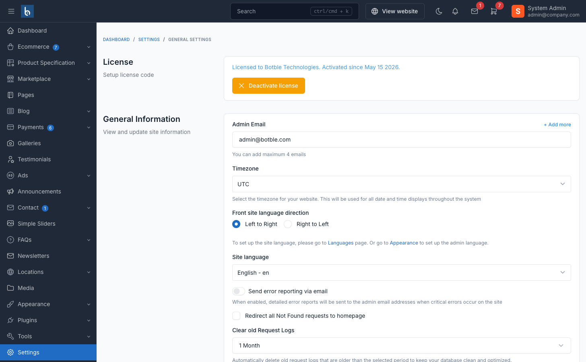

| Field | Type | Default | Notes |
|---|---|---|---|
| Default theme mode | radio | `light` | `light` / `dark` / `system` — flips `[data-bs-theme]` on `<html>`. Per-user override saved in `localStorage`. |

### Preloader

Toggle the page-load spinner in the **Miscellaneous** subsection (`preloader_enabled`).


## Header

14 layouts. Each `header_style` value maps to a Blade partial under `partials/header/styles/style-<n>.blade.php`.

| Field | Type | Default | Notes |
|---|---|---|---|
| Header style | UI selector | `style-1` | 14 layouts (see screenshots below) |
| Show top bar | on/off | true | Toggles the slim announcement bar above the header. |
| Top bar slides | textarea | — | One slide text per line. Empty = no slides. |
| Transparent on homepage | on/off | false | Adds `header-transparent` body class on `/` only. Pair with styles 3/13/14. |
| Sticky header | on/off | true | JS-driven sticky behavior (`script.js`). |
| Bottom offer text / URL / target | text | — | Optional CTA strip below the main bar (specific styles only). |
| Special offers text / URL | text | "Special Offers!" / — | Pill rendered by header style-10. |
| Top bar background / text | color | `#010F1C` / `#FFFFFF` | Top bar palette. |
| Main bar background / text | color | `#FFFFFF` / `#1E1E1E` | Main bar palette. |

### Header style previews

#### Header Style 1
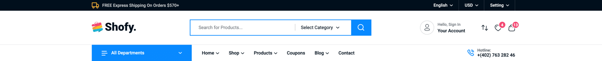

#### Header Style 2
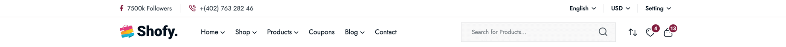

#### Header Style 3
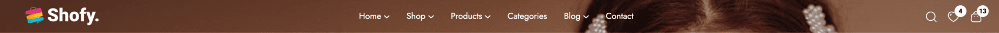

#### Header Style 4
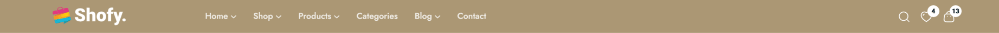

#### Header Style 5
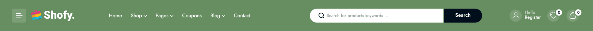

Styles 6–14 cover modern minimal (light/dark), category dropdown, mega menu, classic with inline search, furniture boutique, jewelry boutique, and transparent overlay variants — preview each in the Theme Options selector.

### Logo extras

Under the core **Logo** subsection (not Header):

- **Logo (dark mode)** — image swapped in when `[data-bs-theme="dark"]` is active.
- **Logo text** — fallback wordmark when no logo image is uploaded.

## Colors

CSS custom properties emitted by `Theme::renderCssVariables()` at runtime. Override-friendly — they win over `_variables.scss` defaults.

| Field | Default | CSS var |
|---|---|---|
| Primary | `#DC4646` | `--primary` |
| Secondary | `#70857A` | `--secondary` |
| Heading | `#101010` | `--heading` |
| Body text | `#696E73` | `--text-2` |
| Link / Link hover | `#DC4646` / `#C93A0B` | `--link`, `--link-hover` |
| Border | `#E9E9E9` | `--line` |
| Success / Danger | `#3DAB25` / `#F03E3E` | `--success`, `--critical` |

## Footer

4 layouts (`style-1` light, `style-2` dark, `style-3` dark variant, `style-4` stacked). Each maps to `partials/footer/styles/style-<n>.blade.php`.

| Field | Type | Default | Notes |
|---|---|---|---|
| Footer style | UI selector | `style-1` | 4 layouts. |
| Footer container width | radio | `container-full` | `container` (1440px), `container-2` (1320px), `container-full` (1800px). |
| Payment icons | text | — | Comma-separated **storage paths** uploaded via Media (e.g. `payment/visa.png,payment/master-card.png`). |
| Company / Customer / Newsletter column titles | text | — | Fall back to `COMPANY` / `CUSTOMER` / `NEWSLETTER`. |
| Newsletter description | text | — | Helper text under the newsletter input. |
| Marquee text *(style-2 only)* | text | — | Marquee strip rendered only by Footer Style 2. |
| Address / Map URL / Email / Phone | text | — | Contact block. Map URL auto-derived from address if empty. |
| Facebook / Twitter / Instagram / TikTok / Snapchat URL | text | — | Empty value hides the icon. |

::: info Footer menus
Footer columns 1–3 (Shop, Help, Company) are managed under **Appearance → Menus** at locations `footer-1`, `footer-2`, `footer-3`. The Theme Options field set above only controls headings, contact rows, and socials.
:::

## Ecommerce

Visible only when the ecommerce plugin is active.

### Product card

| Field | Type | Default | Notes |
|---|---|---|---|
| Product card style | UI selector | `style-1` | 5 variants: Standard, Slide-up, Image overlay, 3D flip, Icon spread. |
| Card hover effect | UI selector | `hover-01` | 6 hover effects on the product image. |
| Show color swatches on product card | on/off | false | Surfaces variant color swatches under price. Requires attribute sets with `display_layout='visual'` and `is_use_in_product_listing=1`. |

#### Product item display style previews

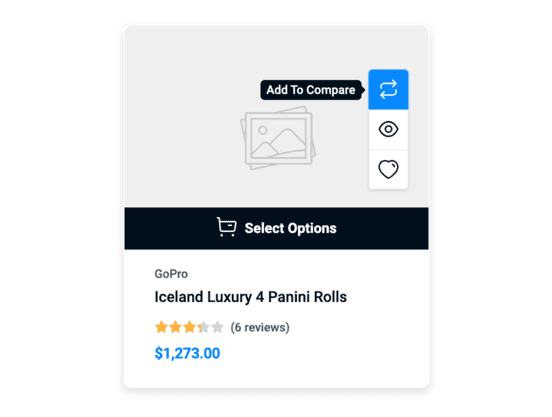
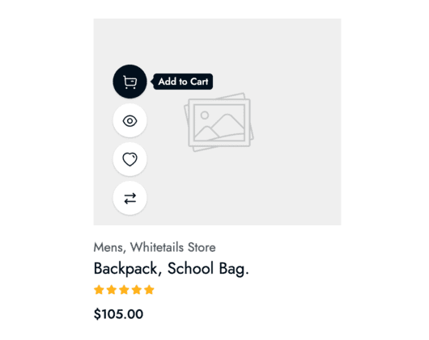
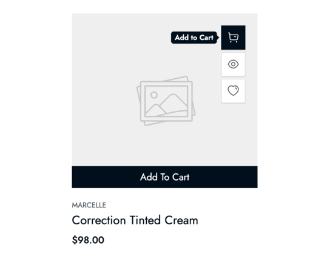
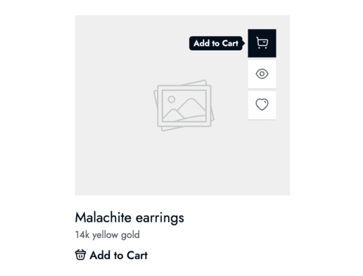
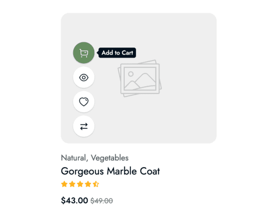

### Shop archive

| Field | Type | Default | Notes |
|---|---|---|---|
| Shop page layout | radio | `default` | Default / Left sidebar / Right sidebar / Full width / Sub-collection swiper. |
| Product item layout | radio | `grid` | Grid or list. Visitors can override per-request with `?layout=grid|list`. |
| Products per page | number | 12 | Products per page on shop archive. |
| Filter position | radio | `sidebar` | Sidebar / Drawer / Dropdown / Hidden. |
| Pagination style | radio | `numbered` | Numbered / Load more / Infinite scroll. |
| Products per row (desktop / tablet / mobile) | radio | 4 / 3 / 2 | Responsive column counts on the shop grid. |

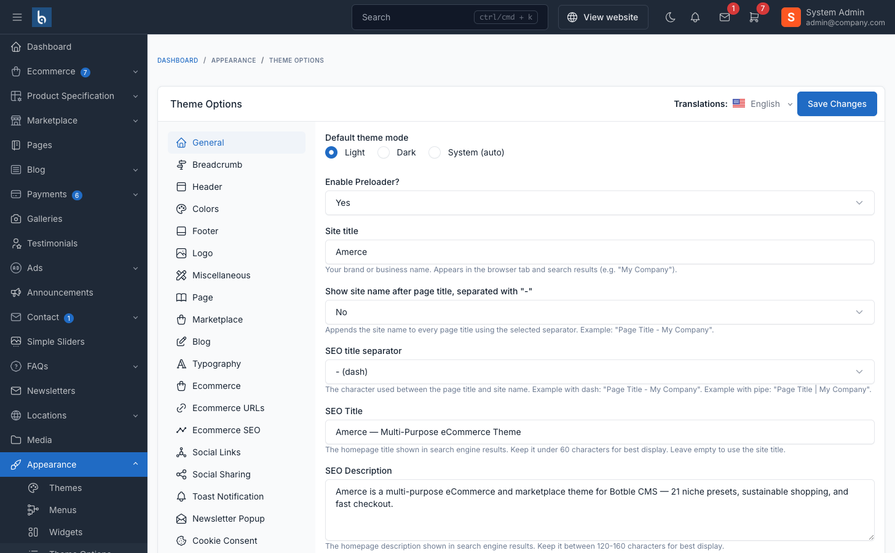

#### Listing layouts

Left sidebar / right sidebar / no sidebar:

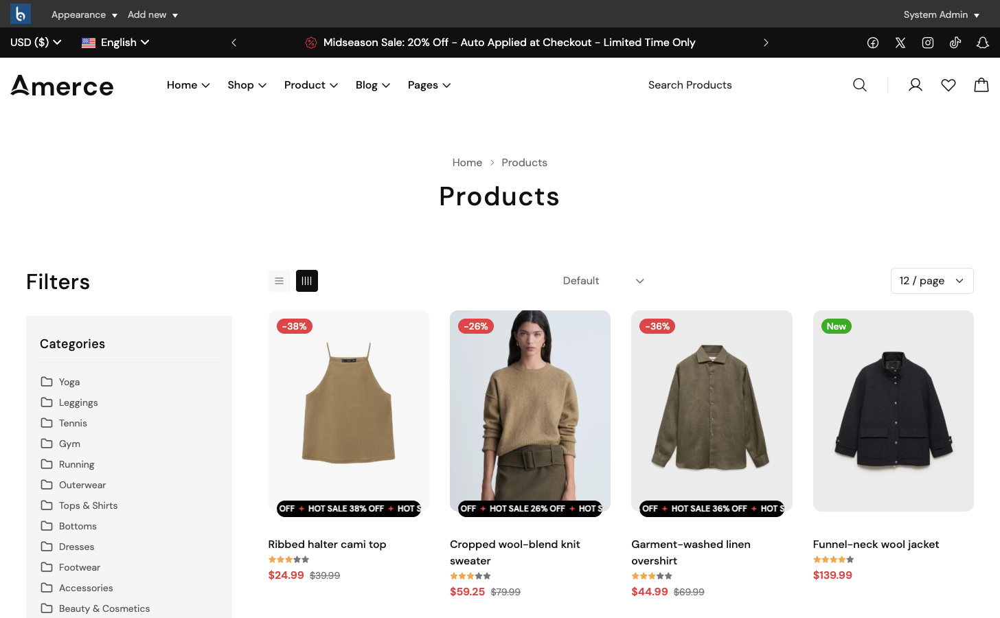
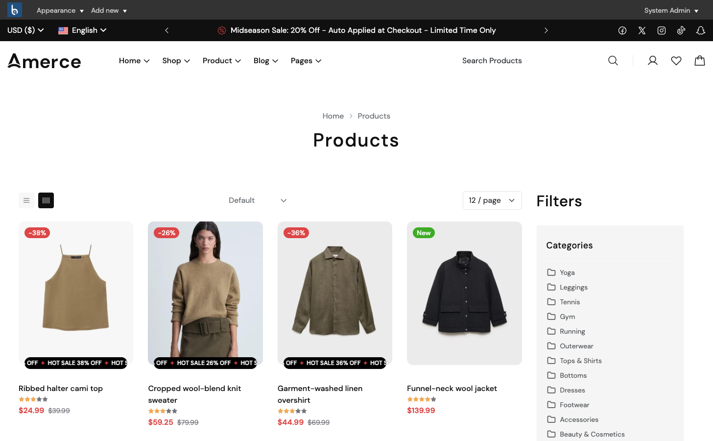


### Product detail page

| Field | Type | Default | Notes |
|---|---|---|---|
| Product gallery layout | radio | `default` | 6 layouts: Default / Right Thumbnail / Bottom Thumbnail / Grid / Grid 2 / Stacked. Per-product override via `Product::$gallery_layout`. |
| Product description style | radio | `tabs` | Tabs or accordion on PDP. |
| Enable Quick View | on/off | true | Renders the "eye" action button + AJAX modal. |
| Enable Quick Shop | on/off | true | "Select options" button for variable products. |
| Enable Product Size Guide | on/off | true | Show the size-guide CTA on PDP. |

### Cart, mini-cart, compare

| Field | Type | Default | Notes |
|---|---|---|---|
| Free-shipping threshold | number | 100 | Mini-cart progress bar threshold. Set 0 to hide the row. |
| Compare max items | number | 4 | Hard cap on the compare drawer (min 2, max 6). |


## Miscellaneous

| Field | Type | Default | Notes |
|---|---|---|---|
| Show preloader | on/off | true | Initial page-load spinner. |
| Scroll-to-top | on/off | true | Floating ↑ button. |
| Page sidebar (default template) | on/off | false | Render the blog sidebar on Default-template Pages. |
| Homepage body class | text | — | **Master preset switcher.** Adds the value (e.g. `home-fashion`) as a CSS class on `<body>` on `/`. Drives demo SCSS overrides + per-preset shortcode styles. |

### Switching presets

Amerce ships with **20 niche-ready homepage presets**. Change `homepage_body_class` to any of:

```
home-fashion, home-electronics, home-furniture, home-cosmetic, home-organic,
home-jewelry, home-sport, home-sneaker, home-headphone, home-pod,
home-baby, home-pet-care, home-auto, home-construction, home-bag-accessories,
home-decor, home-garden, home-mental, home-office-equipment, home-fashion-2
```

Each preset comes with its own demo data seeder — see **[Installation](./installation-web-interface.md)** for the seeding command.

## Social Links

Configure social URLs in **Footer** (above) — the same values feed:

- The footer social icon row
- The **Site Information** widget — see **[Widgets](./usage-widgets.md#12-footer-primary-sidebar)**
- The **Contact Form** shortcode


::: tip Empty fields hide the icon
A blank `facebook_url` (etc.) hides that icon entirely. No fallback URL is used.
:::

## Font Picker

Path: **Appearance → Theme Options → Font Picker** (separate tab beside Theme Options).

Five typography "roles" are registered with sensible defaults:

| Role | Default font | Where used |
|---|---|---|
| Primary (Body) | DM Sans | Body text |
| Heading | DM Sans | h1–h6 |
| Secondary | Urbanist | Accent text, small UI |
| Display | Red Hat Display | Hero headings, landing |
| Accent | Outfit | Buttons, eyebrow text |

Default font sizes (`h1` 60px through `body` 16px) are also registered. Override any of them in the picker — changes write CSS variables consumed by `_typography.scss`.

::: info Adding a Google Font
Use the picker's *"Add Google Font"* selector. The font is fetched from Google's CDN and applied immediately — no rebuild needed.
:::

## Related

- **[Theme Customization (Developer Guide)](./developer-theme-customization.md)** — tech stack, SCSS architecture, extending Theme Options from a plugin
- **[Custom CSS/JS](./usage-custom-css-js.md)** — inline overrides without editing source files
- **[Multi-language](./usage-multi-language.md)** — translating UI strings
- **[Menus](./usage-menu.md)** — header & footer menu locations
- **[Widgets](./usage-widgets.md)** — sidebars and widget placement
