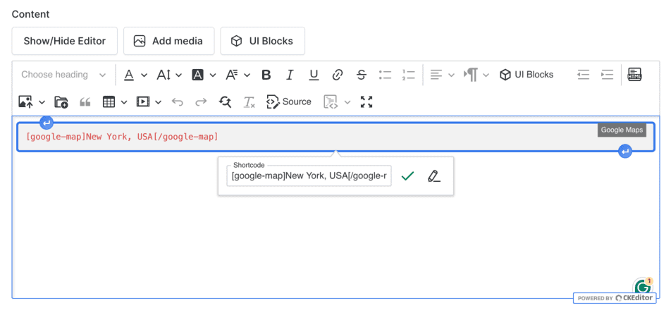
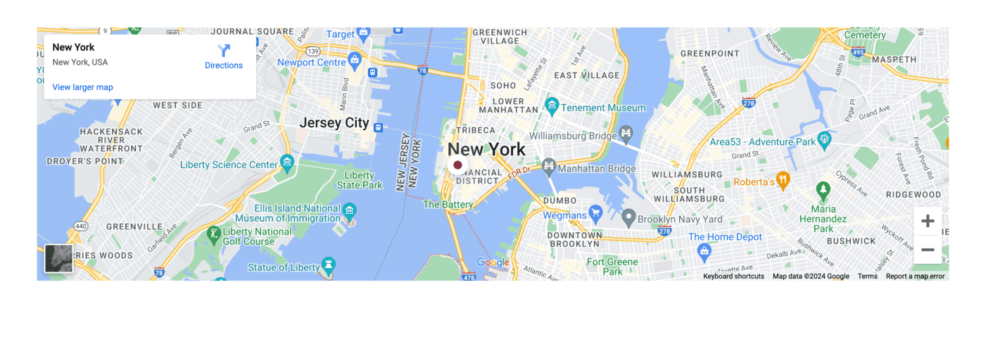

# UI Block (Shortcode)

UI Blocks, also known as Shortcodes, are small pieces of code that allow you to add predefined elements to your website.
They are used to enhance the functionality of your website without the need to write custom code.

## Usage

To use a shortcode, simply add the shortcode to the content of a page or post.

For example, to add a Google Map to a page, use the following shortcode:

```html
[google-map]New York, USA[/google-map]
```



The above shortcode will add a **Google Map** to the page with the location set to `New York, USA`.

Go to the frontend of your website to see the result:



::: tip
Most Amerce homepages are pre-built with shortcodes via the UI Block editor. To customize a homepage, edit the page in **Admin → Pages → Homepage** and use the visual UI Block editor to add, remove, or reorder shortcodes.
:::

## Available Shortcodes

Amerce ships with **46 shortcodes**, grouped below. Each shortcode supports several presets/styles — explore the **Style** dropdown inside the UI Block editor to preview variants used across the 21 niche demos.

### Hero & Banners

Hero, banner, and parallax shortcodes used at the top of homepages.

| Shortcode | Description |
|-----------|-------------|
| `[hero-slideshow]` | Full-width hero slideshow with multiple slides and call-to-action. |
| `[hero-grid-asymmetric]` | Asymmetric hero grid layout (banner + thumbnails). |
| `[page-banner]` | Static hero banner for inner pages. |
| `[parallax-banner]` | Banner with parallax scroll effect. |
| `[banner-image-text]` | Image + text banner block. |
| `[banner-duo]` | Two-banner side-by-side row. |
| `[banner-duo-bottom]` | Two-banner row anchored to the bottom of the section. |
| `[banner-collection]` | Collection-style banner pointing to a product category. |
| `[banner-countdown]` | Banner with countdown timer (sale, launch). |
| `[countdown-banner-quad]` | Four-up countdown banner grid. |
| `[banner-products-composite]` | Composite banner combining banner art with product cards. |
| `[banner-thumbs-product]` | Banner with thumbnail product navigation. |
| `[banner-step-feature]` | Multi-step feature banner (process / "how it works"). |
| `[banner-contact-form]` | Banner with embedded contact form. |

### Products

Shortcodes that pull from the ecommerce catalog.

| Shortcode | Description |
|-----------|-------------|
| `[ecommerce-products]` | Product list/grid with filters (latest, featured, bestseller). |
| `[ecommerce-product-groups]` | Tabbed/grouped product blocks. |
| `[ecommerce-flash-sale]` | Active flash sale section with countdown. |
| `[ecommerce-collections]` | Curated product collections. |
| `[ecommerce-coupons]` | Coupons / promo codes block. |
| `[tab-product-showcase]` | Tabbed product showcase. |
| `[product-feature-zoom]` | Single product spotlight with zoom-on-hover. |
| `[recently-viewed-products]` | Customer's recently viewed products. |
| `[gear-bundle]` | Bundle / "shop the look" block (used by Sport, Sneaker presets). |

### Categories, Brands & Vendors

| Shortcode | Description |
|-----------|-------------|
| `[ecommerce-categories]` | Category grid/slider. |
| `[categories-grid]` | Marketing-style categories grid with banner art. |
| `[ecommerce-brands]` | Brand grid/slider. |
| `[brand-logos]` | Brand logo strip. |
| `[ecommerce-vendors]` | Marketplace vendor list (multivendor only). |

### Lookbook & Visual

| Shortcode | Description |
|-----------|-------------|
| `[lookbook-hotspot]` | Lookbook with product hotspots on the image. |
| `[image-gallery]` | Image gallery / Instagram-style grid. |
| `[image-accordion]` | Horizontal image accordion (hover to expand). |
| `[before-after-image]` | Before/after image comparison slider. |
| `[infinity-marquee]` | Auto-scrolling marquee text or images. |
| `[instagram-feed]` | Instagram feed gallery. |

### Content

| Shortcode | Description |
|-----------|-------------|
| `[blog-posts]` | Latest blog posts. |
| `[testimonials]` | Customer testimonials block. |
| `[about-testimonials]` | Testimonials variant tailored for About pages. |
| `[team-members]` | Team member cards. |
| `[about-team]` | Team block variant for About pages. |
| `[faq-list]` | FAQ accordion list. |
| `[faq-page]` | Full FAQ page layout (categorized). |
| `[term-content]` | Render content from a taxonomy term (category/tag description). |

### Marketing & Trust

| Shortcode | Description |
|-----------|-------------|
| `[site-features]` | Trust badges row (free shipping, returns, support). |
| `[feature-callout-quad]` | Four-column feature callout block. |
| `[stats-counter]` | Animated stat counters. |
| `[newsletter-cta]` | Newsletter subscription call-to-action. |

## Customizing Shortcodes

Each shortcode exposes options through the UI Block form — title, subtitle, source category, item count, style preset, etc.

1. Open **Admin → Pages → [Your Page]**.
2. Switch the content editor to **UI Block** mode.
3. Drag a shortcode from the sidebar onto the canvas.
4. Click the block to open its option panel and configure.
5. Save the page and refresh the frontend.

## Adding a Custom Shortcode

If the bundled shortcodes don't cover your need, you can register a custom one in your child theme. See [Plugin Development → Shortcodes](/cms/shortcode) for the full guide.

```php
use Botble\Shortcode\Compilers\Shortcode;
use Botble\Shortcode\Facades\Shortcode as ShortcodeFacade;

ShortcodeFacade::register('my-custom-block', 'My Custom Block', 'Description', function (Shortcode $shortcode) {
    return view('theme.amerce::shortcodes.my-custom-block', compact('shortcode'))->render();
});
```

::: tip
Place custom shortcode views under `platform/themes/amerce/views/shortcodes/` and register them in `platform/themes/amerce/functions/shortcodes.php`.
:::
