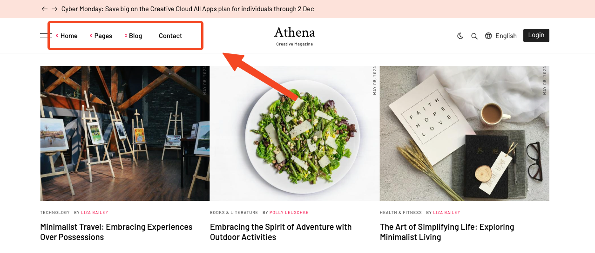

# Menu

Menus are a crucial element for website navigation, allowing visitors to explore your Blog with ease. You can
manage your menus from the `Appearance` -> `Menus` in the admin panel.

## Adding a New Menu:

To add a new menu, click on `Create` button. Enter a name for the menu and click on `Save` button.

### Adding Menu Items

In the menu edit page, you can add menu items by clicking on the items on the left side and then clicking
on `Add to menu` button.

### Available Menu Items:

Here are the available menu items that you can add to the menu:

* Custom Links: Create links directing users to external websites or specific sections within your website.
* Pages: Add existing pages from your website to the menu.
* Post Categories: Display categories of blog posts for navigation.
* Post Tags: Allow navigation by individual tags associated with blog posts.

## Setting a Menu Location:

To set a menu as the primary menu, enable the `Main Navigation` checkbox in the **Display location** section.

