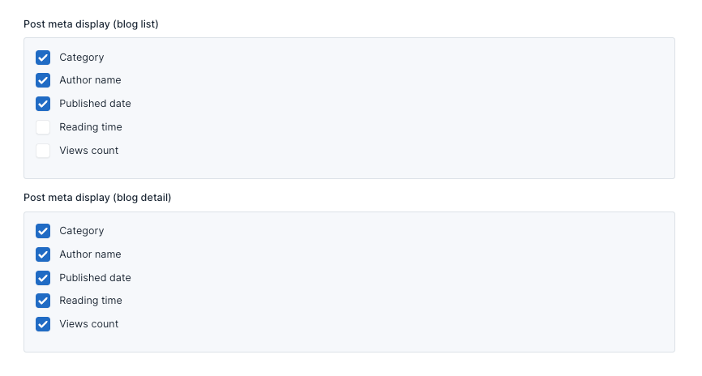

# Theme Options

Theme options are a great way to customize your theme. You can change the color, typography, layout, and more.

To access the theme options, go to `Appearance` -> `Theme Options` in your admin panel.

## General

The **General** tab allows you to configure fundamental settings that shape your website's identity and basic operation.

This section typically includes options for setting your site name, description, and other essential details.

### Preloader

The preloader is a small animation that appears while your website is loading. You can enable or disable it in the *General* tab.

Demo preloader version `default`:

Version `simplify`:

### Lazy load images

Lazy Loading defers the loading of an image that is not needed on the page immediately. An image, not visible to the user when the page loads, is loaded later when the user scrolls and the image actually becomes visible. If the user never scrolls, an image that is not visible to the user never gets loaded.
You can enable or disable it in the *General* tab.

## Styles

The **Styles** tab within the theme options empowers you to personalize the visual identity of your website.

### Header

There are 3 header templates, you can choose the appropriate header template for your website.

### Breadcrumb

Style breadcrumb at here apply all page has breadcrumb, except for custom pages with their own breadcrumb style.

## Page

You can specify pages to use as homepage and galleries page at here.

## Social Links

Social links are a great way to connect with your audience. You can add your social media links in the **Social Links**
tab.

Then, these links can be used in **[Social Links]()** widget.

**Social links Widget** used in:

**Menu Sidebar:**

## Blog

In here, there are various options to configure your website that related to Blog features. You can set the number of
posts, categories, tags per page, display style or even post item display style, and more.

### Blog list style

There are 3 styles you can choose to display the blog list.

### Post meta display

Because each post item display position varies for optimal UI, we offer 3 options for the 3 post meta display positions.

#### Post meta blog list

Are posts displayed on the home and have a large space page or blog list.

#### Post meta blog detail

### Blog post description style

This is the post description that appears when selecting the style `drop-cap`.

### Blog Layout

There are 4 layouts, and you can choose the layout that suits your needs

More information:

`homepage`: full-width and no breadcrumb.

`default`: container and have breadcrumb.

`left-sidebar`: Same as default but with additional sidebar on the left.

`right-sidebar`: Same as default but with additional sidebar on the right.