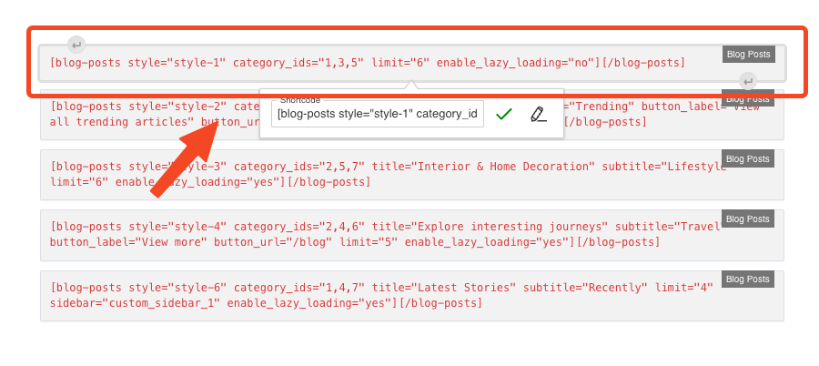
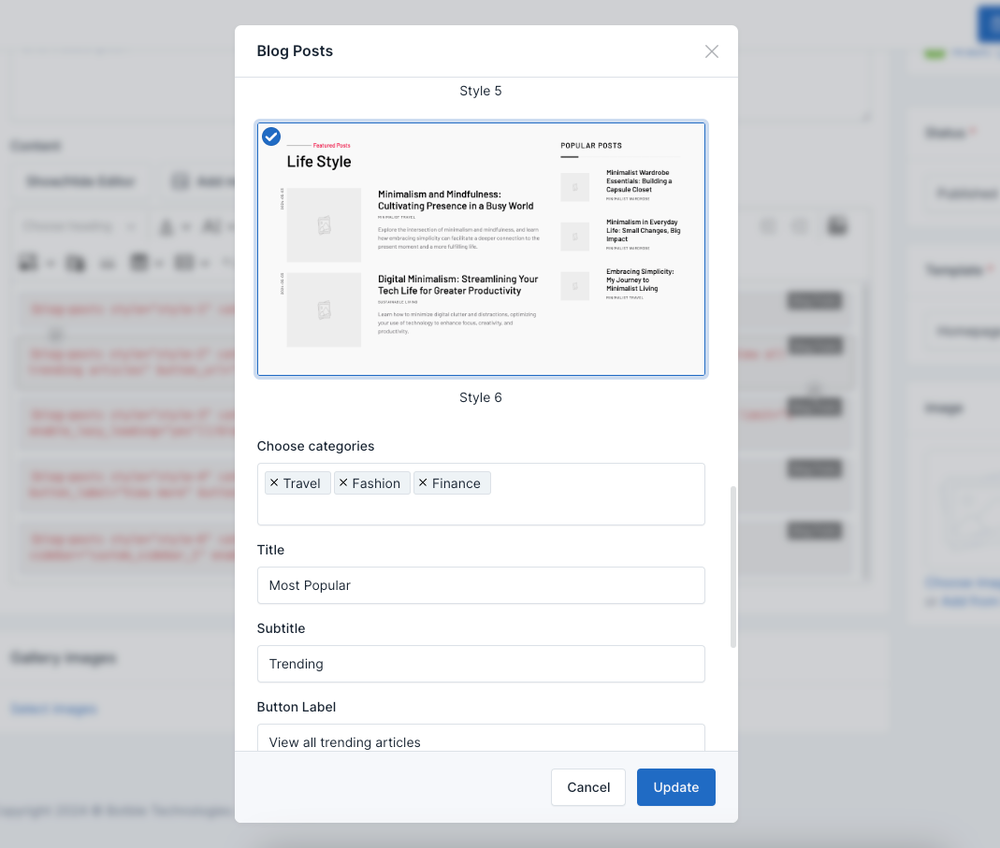
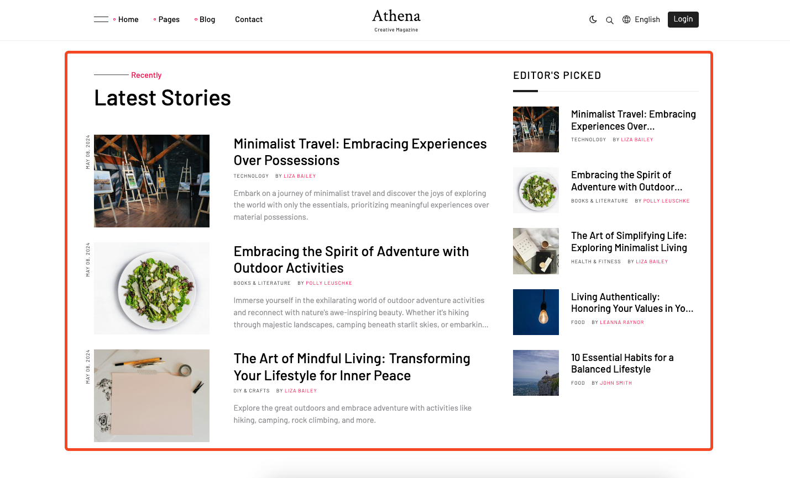

# UI Block (Shortcode)

UI Blocks, also known as Shortcodes, are small pieces of code that allow you to add predefined elements to your website.
They are used to enhance the functionality of your website without the need to write custom code.

## Usage

To use a shortcode, simply add the shortcode to the content of a page or post.

For example, to add a Blog posts to a page, use the following shortcode:

```html
[blog-posts style="style-1" category_ids="1,3,5" limit="6" enable_lazy_loading="no"][/blog-posts]
```





You can set attributes:

`style`: There are seven style display

`title`: Title section

`category_ids`: Choose categories 

`limit`: Number display posts 

`button_label`: Button label

`button_url`: Button URL

The above shortcode will add a **Blog posts**.

Go to the frontend of your website to see the result:



There are many more shortcodes but the setup is similar.
