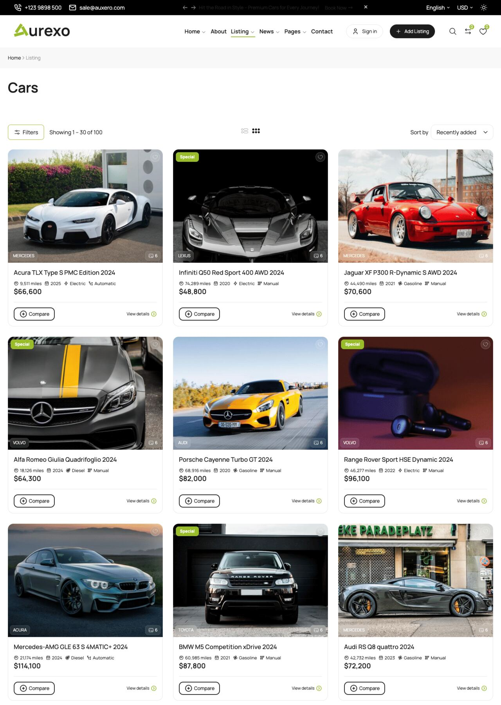
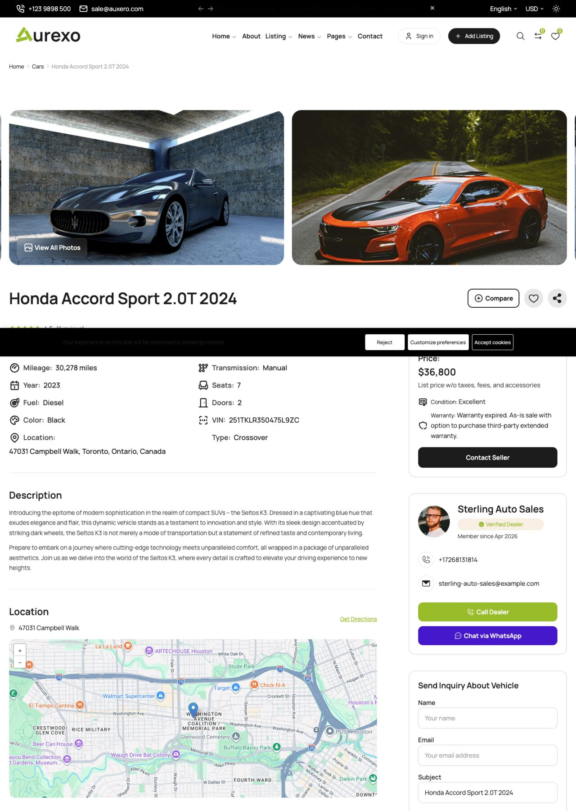

# Car Management

Auxero provides a full vehicle inventory system. Navigate to `Admin Panel` -> `Car Manager` to access all car-related settings.

## Listing Page

The car listing page lets visitors filter, sort, and browse vehicles. Auxero includes 6 listing layouts (sidebar left/right, off-canvas filter, top filter, top map, half map).

## Detail Page

Each vehicle has a dedicated detail page with gallery, specs, pricing calendar, booking form, reviews, and vendor info. 6 detail styles are available.

## Adding a New Car

Go to `Admin Panel` -> `Car Manager` -> `Cars` -> `Add New`.

### Basic Information

| Field | Description |
|---|---|
| Name | Display name of the vehicle |
| Description | Short summary shown in listing cards |
| Content | Full description (supports rich text) |
| Rental rate | Base price per day for rentals |
| Sale price | Listing price when the car is marked **For sale** |
| Status | `Published`, `Draft`, or `Pending` |

### Vehicle Specifications

| Field | Options |
|---|---|
| Make | Select from managed makes (e.g. Toyota, BMW) |
| Type | SUV, Sedan, Truck, etc. |
| Category | Economy, Luxury, Sport, etc. |
| Year | Model year |
| Seats | Number of passengers |
| Doors | Number of doors |
| Fuel Type | Petrol, Diesel, Electric, Hybrid |
| Transmission | Automatic, Manual |
| Mileage | Odometer reading or "Unlimited" |
| Horsepower | Engine power (hp) |
| Drive Type | FWD, RWD, AWD, 4WD |
| Cylinders | Number of engine cylinders |

### Images

Upload the primary image and a gallery. The first gallery image is used as the cover if no primary image is set.

::: tip
Recommended image size: 1200 x 800 pixels (3:2 ratio). Use WebP for smaller file sizes.
:::

### Location

Assign a country, state, and city to the vehicle. This is used in map view and search filters.

### Colors

Set exterior and interior colors. These appear in the car detail page and can be used as search filters.

### Amenities

Select the amenities available with the vehicle (e.g. GPS, Bluetooth, Child Seat). Manage the amenity list under `Car Manager` -> `Amenities`.

### Availability

| Option | Description |
|---|---|
| Available | Car is visible and bookable |
| Unavailable | Hidden from search results |
| Sold | Shown as sold, not bookable |

### Featured & Popular

- **Featured**: Highlights the car in featured sections on the homepage.
- **Popular**: Marks the car as popular for sorting and display purposes.

### SEO Settings

Each car has its own SEO tab. Set a custom meta title, description, and Open Graph image for better search visibility.

---

## Managing Makes

Go to `Admin Panel` -> `Car Manager` -> `Makes`.

Create and organize car brands (Toyota, BMW, Ford, etc.). Each make can have a logo image.

## Managing Types

Go to `Admin Panel` -> `Car Manager` -> `Types`.

Types group cars by body style: SUV, Sedan, Convertible, Van, Truck, etc. Types appear in the homepage filter bar.

## Managing Categories

Go to `Admin Panel` -> `Car Manager` -> `Categories`.

Categories group cars by tier or purpose: Economy, Standard, Luxury, Sport. Categories support parent/child hierarchy.

## Managing Amenities

Go to `Admin Panel` -> `Car Manager` -> `Amenities`.

Add amenities like GPS, Bluetooth, Heated Seats, etc. Each amenity can have an icon. Amenities are selected per vehicle when creating or editing a car.

::: warning
Deleting an amenity removes it from all vehicles that currently have it assigned.
:::
