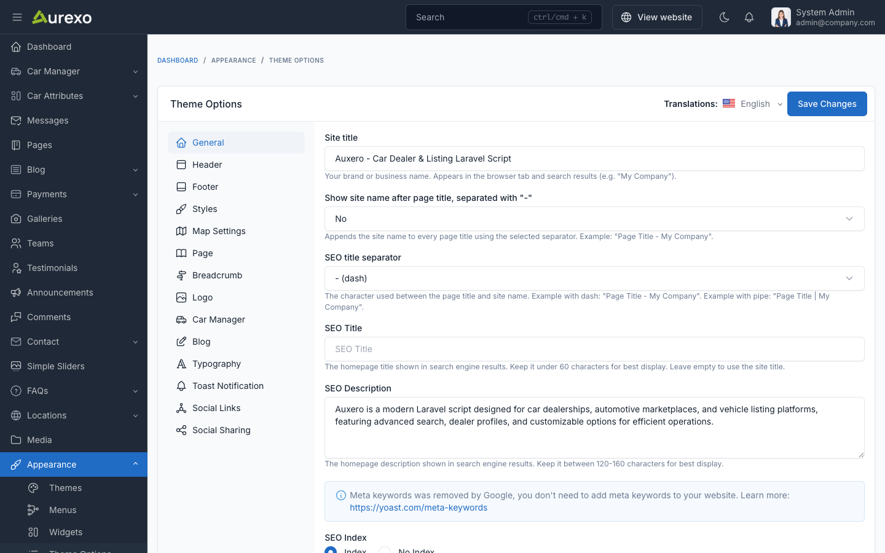

# Theme Options

Theme options are a great way to customize your theme. You can change the color, typography, layout, and more.

To access the theme options, go to `Appearance` -> `Theme Options` in your admin panel.

## General

The **General** tab allows you to configure fundamental settings that shape your website's identity and basic operation.

This section typically includes options for setting your site name, description, and other essential details.

## Logo

The **Logo** section allows you to configure your site's branding:

- **Logo**: The main site logo displayed in the header.
- **Logo Dark**: Alternative logo for dark mode.
- **Favicon**: The small icon displayed in browser tabs.
- **Logo Height**: Control the height of the logo in the header.

## Header

The **Header** tab allows you to customize the header appearance:

- **Display Header Top**: Show or hide the top bar above the main header.
- **Header Top Text Color**: Color of text in the top bar.
- **Header Top Background Color**: Background color of the top bar.
- **Header Transparent**: When enabled, the header will have a transparent background and float on top of the page content.
- **Sticky Header**: When enabled, the header will remain fixed at the top when scrolling.

## Footer

The **Footer** tab allows you to customize the footer appearance:

- **Background Color**: Footer background color.
- **Border Color**: Footer border color.
- **Heading Color**: Color of headings in the footer.
- **Text Color**: Color of text in the footer.
- **Background Image**: Optional background image for the footer.

## Styles

The **Styles** tab allows you to customize the overall color scheme:

- **Default Theme Color Mode**: Choose between `light` and `dark` mode as default.
- **Hide Theme Mode Switcher**: Show or hide the light/dark mode toggle.
- **Primary Color**: Main brand color (default: `#86a21b`).
- **Primary Color Hover**: Hover state of primary color (default: `#6e8516`).
- **Secondary Color**: Secondary brand color (default: `#1a1a2e`).
- **Heading Color**: Color for headings (default: `#050b20`).
- **Text Color**: Color for body text (default: `#64666c`).

## Blog

The **Blog** tab allows you to configure blog listing and detail pages:

- **Post List Meta Display**: Choose which meta information to show (reading time, views count, published date, author).
- **Post List Page Title**: Custom title for the blog listing page.
- **Post List Page Description**: Custom description for the blog listing page.
- **Post Style**: Choose between `list` and `grid` layout.
- **Grid Items Per Row**: Number of posts per row in grid layout (1, 2, or 3).
- **Post Detail Style**: Choose between `style-1` and `style-2` for single post pages.
- **Post Detail Meta Display**: Choose which meta information to show on detail pages.

## Breadcrumb

The **Breadcrumb** tab allows you to customize the breadcrumb navigation:

- **Background Color**: Breadcrumb section background color.
- **Text Color**: Breadcrumb text color.
- **Background Image**: Optional background image for the breadcrumb section.
- **Height**: Height of the breadcrumb section (in pixels).
- **Simple Breadcrumb**: Enable for a minimal breadcrumb style.

## Car Manager

The **Car Manager** tab provides options specific to car listings:

- **Car Detail Style**: Choose from 6 different car detail page layouts with visual previews.
- **Car Listing Layout**: Choose the default listing layout:
    - `default` - Standard grid layout
    - `sidebar-left` - Listing with left sidebar filters
    - `sidebar-right` - Listing with right sidebar filters
    - `top-map` - Map displayed above listings
    - `half-map` - Split view with map on one side
    - `top-filter` - Filter bar above listings
- **Car Listing Style**: Default view mode (`grid` or `list`).
- **Car Listing Columns**: Number of columns in grid view (2, 3, or 4).
- **Car Card Style**: Choose from 3 card display styles with visual previews.

## Page

The **Page** tab allows you to configure page-specific settings:

- **Error Page Image**: Custom image for the 404 error page.

## Map Settings

The **Map Settings** tab allows you to configure the map display for car listings:

- **Map Tile Layer**: Leaflet tile layer URL for map rendering.
- **Map Center Latitude**: Default map center latitude (default: `40.7128`).
- **Map Center Longitude**: Default map center longitude (default: `-74.0060`).
- **Map Max Zoom**: Maximum zoom level for maps (default: `18`).
