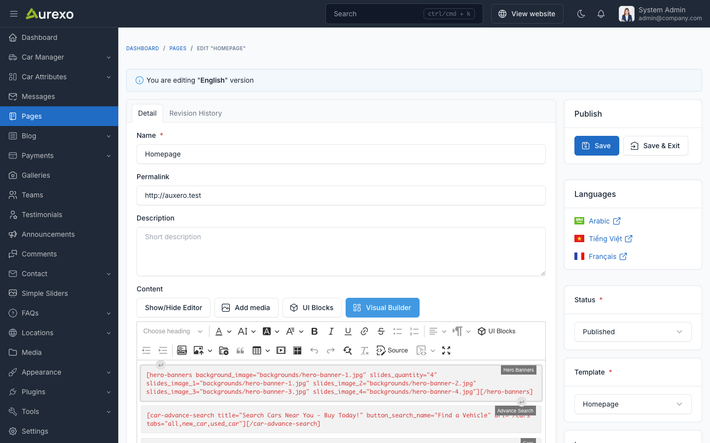
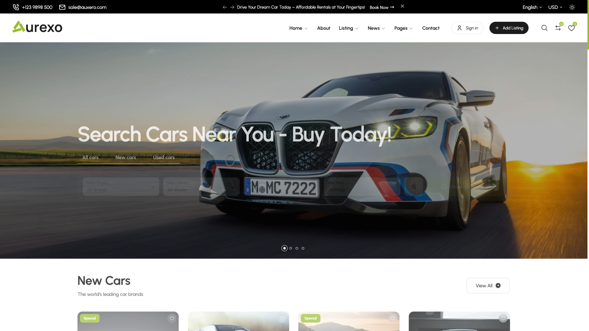

# UI Block (Shortcode)

UI Blocks, also known as Shortcodes, are small pieces of code that allow you to add predefined elements to your website.
They are used to enhance the functionality of your website without the need to write custom code.

## Usage

To use a shortcode, simply add the shortcode to the content of a page or post.

For example, to add a Hero Banner to a page, use the following shortcode:

```html
[hero-banners title="Looking for a vehicle? You're in the perfect spot." subtitle="Find Your Perfect Car" background_image="backgrounds/hero-banner.png"][/hero-banners]
```

You can set attributes: `title`, `subtitle`, `background_image`, and more attributes depending on the shortcode.



The above shortcode will add a **Hero Banner** section to the page.

Go to the frontend of your website to see the result:



There are many more shortcodes available. The setup is similar for all shortcodes.

## Available Shortcodes

Auxero provides **38 shortcodes** organized by category. Each shortcode supports multiple style variants and configurable attributes through the admin panel.

### Car Manager Shortcodes

| Shortcode | Description | Style Variants |
|-----------|-------------|----------------|
| `cars` | Display car listings with different styles | 3 (latest, featured, popular) |
| `car-list` | Car listing page with advanced filtering and pagination | 6 layout options |
| `car-advance-search` | Advanced search form with tabs (all, new, used cars) | 1 |
| `check-car-availability` | Car availability checking form | 1 |
| `car-services` | Display car services | 1 |
| `car-loan-form` | Car loan calculator form | 3 |
| `cars-by-locations` | Cars grouped by geographical locations | 1 |
| `brands` | Car brands/makes display | 4 |
| `car-dealers` | Car dealer listings | 2 |
| `car-types` | Car types display | 3 |

#### Cars

Display a list of cars with filtering options.

**Attributes:**
- `style` - Display style: `style-latest`, `style-feature`, `style-popular`
- `title` - Section title
- `subtitle` - Section subtitle
- `limit` - Number of cars to display
- `category_ids` - Filter by category IDs
- `number_rows` - Number of rows
- `filter_types` - Filter types to show
- `button_label` - Button text
- `button_url` - Button link

#### Car List

Full car listing page with advanced filtering and pagination.

**Attributes:**
- `title` - Page title
- `subtitle` - Page subtitle
- `enable_filter` - Enable/disable filter sidebar
- `default_layout` - Default layout view
- `layout_col` - Number of columns
- `cars_per_page` - Items per page
- `layout_style` - Layout style: `default`, `sidebar-left`, `sidebar-right`, `top-map`, `half-map`, `top-filter`
- `card_style` - Card display style: `style-1`, `style-2`, `style-3`

#### Car Advance Search

Advanced search form with tab support.

**Attributes:**
- `title` - Search form title
- `url` - Search results URL
- `tabs` - Available tabs: `all`, `new_car`, `used_car`
- `default_tab` - Default active tab
- `background_color` - Background color
- `top`, `bottom`, `left`, `right` - Position offset (px)

### Content Shortcodes

| Shortcode | Description | Style Variants |
|-----------|-------------|----------------|
| `hero-banners` | Hero banner section with slider | 1 |
| `banner` | Simple banner | 1 |
| `simple-banners` | Two-column banner layout | 1 |
| `promotion-block` | Promotion block display | 1 |
| `call-to-action` | Call-to-action section | 1 |
| `intro-video` | Video introduction section | 2 |
| `featured-block` | Featured content block | 2 |
| `why-us` | Why Us / Benefits section | 1 |
| `trusted-expertise` | Trusted expertise section | 1 |
| `about-us-information` | About Us with statistics | 1 |
| `site-statistics` | Site statistics counters | 2 |
| `content-columns` | Two-column content layout | 1 |
| `content-images` | Image gallery layout | 1 |
| `pricing` | Pricing tables with monthly/yearly toggle | 1 |
| `install-apps` | Mobile app download CTA | 3 |
| `rental-invitations` | Rental invitation action cards | 1 |
| `sell-your-car` | Sell your car section with steps | 1 |
| `financing` | Financing section with features | 1 |
| `branch-locations` | Branch/office locations with tabs | 1 |

### Blog Shortcodes

| Shortcode | Description | Style Variants |
|-----------|-------------|----------------|
| `blog-posts` | Blog posts display | 3 |

### Plugin-Dependent Shortcodes

These shortcodes require their respective plugins to be activated:

| Shortcode | Description | Required Plugin | Style Variants |
|-----------|-------------|-----------------|----------------|
| `team` | Team members display | Team | 2 |
| `testimonials` | Customer testimonials | Testimonial | 4 |
| `faqs` | FAQ accordion | FAQ | 1 |
| `faq-categories` | FAQ categories listing | FAQ | 1 |
| `contact-form` | Contact form with map | Contact | 1 |
| `simple-slider` | Image slider | Simple Slider | 8 |
