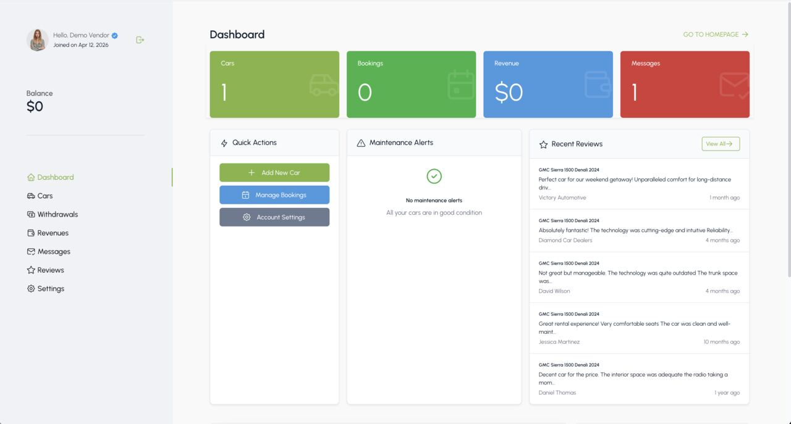

# Vendor System

Auxero supports a multi-vendor marketplace where car dealers can register, list vehicles, manage bookings, and withdraw earnings.

## Enabling the Vendor System

Go to `Admin Panel` -> `Car Manager` -> `Settings` -> `General` and enable **Enable multi-vendor**.

Related settings:

| Setting | Description |
|---|---|
| Enable multi-vendor | Allows visitors to register as vendors and list their cars |
| Enable post approval | Vendor-submitted cars require admin approval before being published |
| Default commission fee | Platform commission applied to vendor earnings |
| Commission fee type | `Percentage` or `Fixed` amount |
| Enable commission per category | Use category-specific commissions instead of the default |

## Vendor Registration Flow

1. Visitor opens the registration form on the frontend.
2. They fill in: name, email, password, phone (optional), date of birth (optional), and tick **Register as vendor**.
3. The account is created with `is_vendor = true`. Vendors can sign in to the vendor dashboard immediately.
4. Vendor-submitted cars are auto-published unless **Enable post approval** is on, in which case they require admin moderation.

## Managing Vendors

Go to `Admin Panel` -> `Car Manager` -> `Vendors`.

From the vendor list you can:

- Open a vendor profile to review their information and listings.
- **Verify** a vendor to display a verification badge on their store and listings.
- **Unverify** to remove the badge.
- **Block** a vendor to prevent them from listing or receiving bookings.
- **Unblock** to restore access.

::: tip
Blocking a vendor does not delete their account or existing listings — it only prevents new activity. You can unblock them at any time.
:::

## Vendor Dashboard Features

Vendors access their dashboard at `/vendor/dashboard` after logging in.

| Section | Description |
|---|---|
| Dashboard | Overview of earnings, bookings, and recent activity |
| Vehicles | Add, edit, and manage their own car listings |
| Bookings | View and manage bookings for their vehicles |
| Earnings | Revenue summary with per-booking breakdown |
| Withdrawals | Request payouts to their bank or payment account |
| Reviews | See customer reviews left on their vehicles |
| Messages | Chat with customers |
| Settings | Update store name, logo, description, and payout info |

## Vehicle Listing Management

Vendors can create and manage their own car listings from the vendor dashboard. The fields available to vendors are the same as admin (see [Car Management](./usage-car-management.md)).

::: tip
Admin can restrict which fields vendors can edit by configuring permissions in `Admin Panel` -> `Settings` -> `Vendor`.
:::

By default, vehicle listings created by vendors are published immediately. Enable **Enable post approval** in `Car Manager` -> `Settings` -> `General` to add a moderation step before publishing.

## Booking Management for Vendors

Vendors see only the bookings for their own vehicles. They can:

- View booking details (customer name is shown, full contact details optional).
- Update booking status (e.g. move from Pending to Processing or Cancelled).
- Mark bookings as Completed.
- Download invoices.

Vendors cannot access bookings for other vendors' vehicles.

## Earnings and Withdrawals

### Earnings

After a booking is marked **Completed**, the net amount (after platform commission) is credited to the vendor's balance. Vendors view their balance and per-booking breakdown from `Vendor Dashboard` -> `Earnings`.

### Withdrawals

Vendors request withdrawals from their dashboard. Requests appear in `Admin Panel` -> `Car Manager` -> `Withdrawals`.

| Status | Description |
|---|---|
| Pending | Request submitted, awaiting admin action |
| Processing | Admin is preparing the payout |
| Completed | Payout has been sent |
| Canceled | Withdrawal cancelled |
| Refused | Request rejected by admin |

Process a withdrawal by reviewing the request and updating the status to **Completed** after sending the funds manually.

## Vendor Verification

Verified vendors display a badge on their store page and listings. Auxero provides two verification paths that can be used together:

1. **Manual verification** — admin flips a vendor to verified from the vendor detail page.
2. **KYC document upload** — vendor submits identity documents from their dashboard; admin reviews and approves, which also sets the verified badge.

### Manual verification

1. Go to `Admin Panel` -> `Car Manager` -> `Vendors`.
2. Open the vendor profile.
3. Click **Verify** and optionally add a note. Click **Unverify** to remove the badge.

Unverifying a vendor also deletes any approved KYC submission they have on file (including the uploaded document files) so their data is not retained after trust is revoked.

### KYC (ID / Document) verification

KYC lets vendors prove their identity by uploading an ID document (passport, national ID, driving licence, or business licence). Admin reviews the submission and approves or rejects it. Approved submissions flip the same verified badge used by manual verification.

#### Enabling KYC

Go to `Admin Panel` -> `Car Manager` -> `Settings` -> `KYC / Verification`.

| Setting | Description |
|---|---|
| Enable KYC verification | Master switch. When off, the vendor dashboard link is hidden and all KYC routes return 404. |
| Require KYC for car listings | When on, vendors cannot publish a new car listing until their KYC submission is approved. Existing listings are unaffected. |
| Admin notification email | Optional override for the email that receives "new KYC submission" notifications. Defaults to the system admin email. |

#### Vendor submission flow

1. Vendor logs in and opens **Verification** from the customer dashboard sidebar.
2. They pick a document type (passport / national ID / driving licence / business licence), enter the document number, and upload photos:
   - **Front image** (required)
   - **Back image** (required for everything except passport)
   - **Selfie** (recommended but optional)
   - **Additional document** (optional, e.g. business permit)
3. They tick the terms checkbox and submit.
4. The vendor sees the dashboard switch to a "Pending review" state. They cannot submit another application while one is pending.

Allowed file types are JPEG, PNG, WebP, and PDF up to 5 MB each. File names that contain suspicious extensions (for example `passport.php.jpg`) are rejected at upload time.

#### Admin review flow

1. Go to `Admin Panel` -> `Car Manager` -> `Vendors` -> `KYC Submissions`. The menu item shows a badge with the pending submission count.
2. Pending submissions are listed oldest-first (FIFO review queue).
3. Open a submission to see the uploaded document images, vendor info, and the approve/reject actions.
4. Click **Approve** to mark the submission approved. This also flips the vendor's `is_verified` flag and writes the review note into the vendor's verification note.
5. Click **Reject** and provide a reason. The vendor receives the rejection reason by email and can submit a new application.

::: tip
Approving a KYC submission is different from the manual **Verify** action on the vendor detail page. Approve-via-KYC also creates an audit trail linked to the uploaded documents; manual **Verify** is a free-form admin override.
:::

Rejecting a submission does **not** touch the vendor's `is_verified` flag — if an admin had previously manually verified them, that status remains unchanged.

#### Email notifications

Three emails are sent during the KYC flow. Each template can be edited from `Admin Panel` -> `Settings` -> `Email templates` -> `Car Manager`:

| Template | Sent to | When |
|---|---|---|
| `kyc-submission-received` | Admin notification email | Vendor submits a new KYC application |
| `kyc-submission-approved` | Vendor | Admin approves the submission |
| `kyc-submission-rejected` | Vendor | Admin rejects the submission |

#### Data retention and privacy

KYC files are stored privately and are never visible in `Admin Panel` -> `Media`. Specifically:

- Files are written to `storage/app/private/kyc/{customer_id}/` using random 32-character hex filenames with no extension. The original filename and MIME type are stored in the database only and are used when the file is served.
- Access to a file requires a short-lived (15 min) signed URL **and** an authenticated session. Admins need the `car-manager.vendors.edit` permission; vendors can only access their own submission.
- Responses include `Content-Security-Policy`, `X-Content-Type-Options: nosniff`, `Cache-Control: private, no-store`, and `Referrer-Policy: no-referrer` headers to block proxy caching and URL leakage.
- Rejected submissions are automatically deleted (database row + files) **7 days** after the rejection timestamp. The cleanup runs daily — make sure your task scheduler is configured (see [Setup cronjob](./cronjob.md)).
- When a vendor is unverified, the most recent approved KYC submission (and its files) is deleted.
- When a customer account is hard-deleted, all KYC files for that customer are removed before the database cascade runs.
