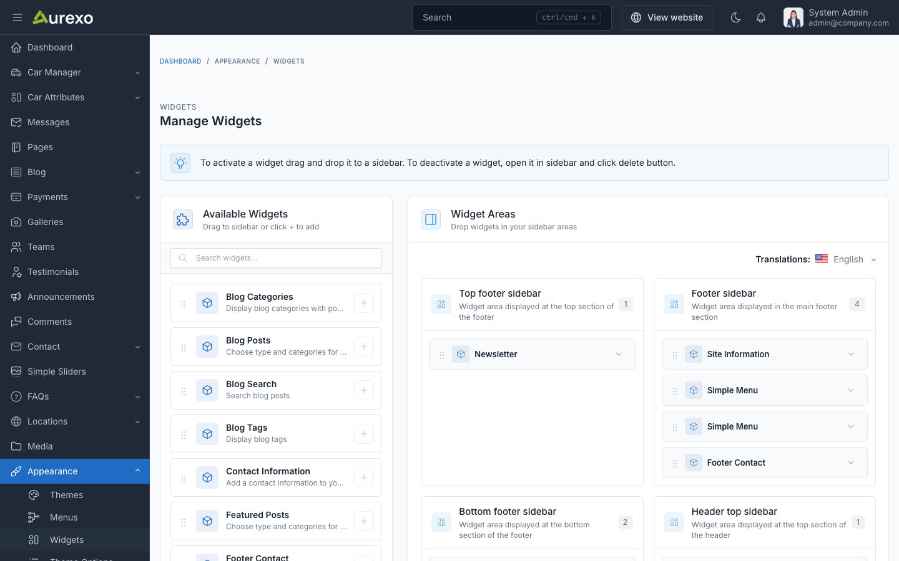
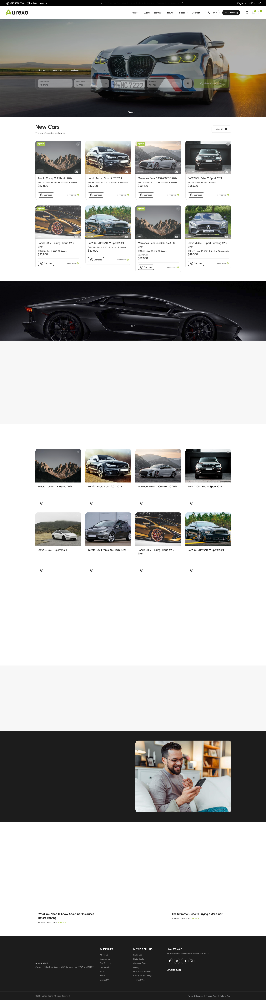
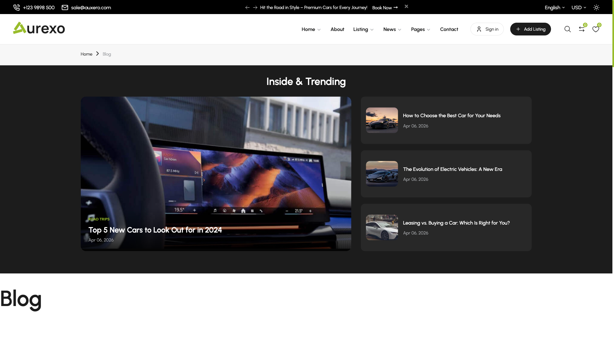

# Widgets

Auxero provides pre-made widget areas to help you customize the user interface and organize content strategically.

These widget areas offer flexibility in placement and functionality, allowing you to tailor the user experience on different
sections of your website.

## Manage Widgets

To manage the widgets, go to the `Appearance` -> `Widgets` menu in the admin panel.

To add a widget to a sidebar, drag and drop the widget from the left side to the sidebar area on the right side.

## Available Widgets

### Blog Widgets

| Widget | Description |
|--------|-------------|
| **Blog Posts** | Display blog posts filtered by type (popular, featured, recent) and category |
| **Featured Posts** | Showcase featured blog posts |
| **Blog Categories** | Display blog categories for navigation |
| **Blog Tags** | Display blog tags |
| **Blog Search** | Blog search form |

### General Widgets

| Widget | Description |
|--------|-------------|
| **Site Information** | Display general site information |
| **Site Copyright** | Display copyright text |
| **Contact Information** | Display contact details (address, phone, email) |
| **Footer Contact** | Contact information styled for footer area |
| **Social Links** | Display social media links |
| **Newsletter** | Newsletter subscription form |
| **Galleries** | Display image galleries |
| **Custom Menu** | Display a navigation menu |

## Footer

In footer widget areas, you can use: **Site Information**, **Custom Menu**, **Contact Information**, **Social Links**, **Newsletter**, and **Site Copyright** widgets.

## Blog Sidebar

In blog sidebar, you can use **Blog Search**, **Blog Posts**, **Featured Posts**, **Blog Categories**, **Blog Tags**, and **Galleries** widgets.

::: tip
You can reorder widgets by dragging and dropping them within the sidebar area. To remove a widget, click the delete icon on the widget.
:::
