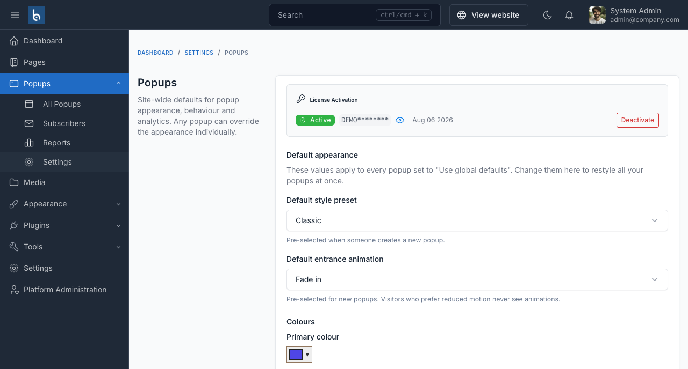

# Configuration

**Popups → Settings** holds the site-wide defaults. Every popup set to **Use global defaults** on its Design tab inherits these values, so changing a colour here restyles all of them at once.

## License activation

The panel at the top of the page holds your CodeCanyon purchase code. A license covers one domain at a time - use **Deactivate** before moving the site.

Creating and editing popups requires an active license. Existing popups keep rendering either way.

## Default appearance

| Setting | What it does |
|---|---|
| **Default style preset** | Pre-selected when someone creates a new popup. One of Classic, Flash Sale, Glass, Spotlight, Minimal, Bold, Gradient or Soft. |
| **Default entrance animation** | Pre-selected for new popups. Visitors who prefer reduced motion never see animations. |

### Colours

Nine colours make up the palette: primary, primary (hover), heading, body text, background, border, overlay, success and error.

- **Overlay** is the dimmed layer over the page behind the popup. Use an `rgba()` value to control how dark it is.
- **Primary (hover)** can be left empty - the primary colour is darkened automatically.
- Setting **border** to the same value as **background** gives a borderless look.

### Shape & typography

Corner radius, button radius, shadow, maximum width and font family. Maximum width is in pixels; a popup always shrinks to fit smaller screens. Leave the font family empty to inherit the theme's font.

## Behaviour

| Setting | Default | What it does |
|---|---|---|
| **Cache-safe delivery** | Off | Fetches popups over AJAX instead of embedding them in the page. Turn this on only if you use full-page caching. See [Display rules](./usage/display-rules.md#caching). |
| **Respect "prefers-reduced-motion"** | On | Skips animations for visitors whose operating system asks for reduced motion. Recommended. |
| **Disable all popups on mobile** | Off | A global off-switch for phones. Individual popups can also target devices from their Display Rules. |
| **Show the next eligible popup after one is closed** | Off | When off, only the highest-priority popup is shown per page view. |

::: tip Priority decides which popup wins
When several popups are eligible on the same page, the one with the highest **Priority** (set on its Detail tab) is shown. Turn on **Show the next eligible popup** if you want the runner-up to appear after the first is dismissed.
:::

## Analytics

**Keep statistics for** sets the retention window in days. Statistics older than this are deleted automatically each night by Laravel's scheduler - see [Installation](./installation.md#set-up-the-scheduler). The default is 365 days.

Deleting old rows does not change the totals already displayed for periods inside the window; it only limits how far back you can report.

## Overriding per popup

Any popup can ignore these defaults. On its **Design** tab, set **Appearance** to *Customise for this popup* and every colour, radius, shadow, width, font and animation becomes editable for that popup alone. See [Design](./usage/design.md).
