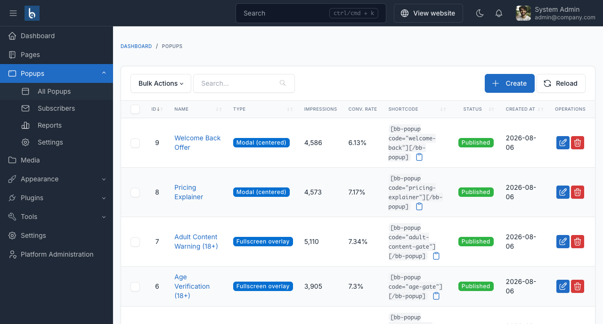

# Installation

## Requirements

- Botble CMS 7.5.0 or higher
- PHP 8.3 or higher

No other plugin is required.

## Install the plugin

1. Download the plugin from your [Botble Marketplace](https://marketplace.botble.com) account and extract the archive. Inside you will find `main.zip` - that is the plugin.
2. In your admin panel go to **Plugins → Installed plugins → Add new**, upload `main.zip`, and click **Activate**.

::: tip Installing manually
If you prefer to upload by FTP, extract `main.zip` into `platform/plugins/bb-popup` so that `plugin.json` sits directly inside that folder, then activate the plugin from **Plugins**.
:::

Activation creates the database tables and publishes the plugin's CSS and JavaScript. A new **Popups** entry appears in the admin sidebar.

## Activate your license

Go to **Popups → Settings** and enter the license key from your purchase in the **License Activation** panel.

::: warning
Until the license is activated you cannot create or edit popups. Popups that already exist keep rendering on the front end - an expired or missing license never breaks a live site.
:::

Each license covers one domain at a time. Use **Deactivate** before moving the site to a new domain.

## Create your first popup

Go to **Popups → All Popups → Create**.



The editor is a normal Botble form with tabs:

| Tab | What you set there |
|---|---|
| **Detail** | Name, layout, priority, start and end dates, status |
| **Content** | What the visitor reads - rich text, an image, an email capture form, or an embedded form |
| **Design** | Style preset, colours, radius, shadow, width, font, animation |
| **Triggers** | When it opens, how often, how it closes, countdown |
| **Display Rules** | Who sees it |
| **A/B Variants** | Alternative content to test against |
| **Advanced** | Scoped custom CSS, embedding on other sites, export |

For a first popup, fill in the **Detail** and **Content** tabs, set a trigger, and publish. With no display rules the popup shows on every page - see [Display rules](./usage/display-rules.md) to narrow it down.

## Optional: set your defaults first

**Popups → Settings** holds the site-wide appearance and behaviour defaults that every new popup inherits. Setting them once means you are not restyling each popup individually. See [Configuration](./configuration.md).

## Set up the scheduler

Analytics rows are pruned nightly by Laravel's scheduler. If you have not already added the cron entry for your site, add it:

```bash
* * * * * cd /path-to-your-project && php artisan schedule:run >> /dev/null 2>&1
```

Without it, popups and reports still work - old statistics simply are not deleted automatically.

## Updating

1. Download the latest version from your [Botble Marketplace](https://marketplace.botble.com) account
2. Go to **Plugins → Installed plugins**, find **BB Popup** and use **Update**, or upload the new `main.zip`
3. Clear your browser cache

Your popups, subscribers, statistics and settings are preserved across updates.
