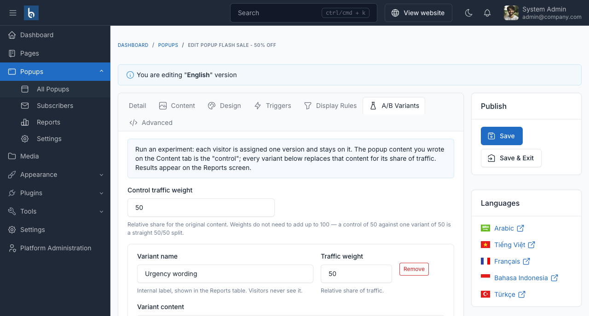
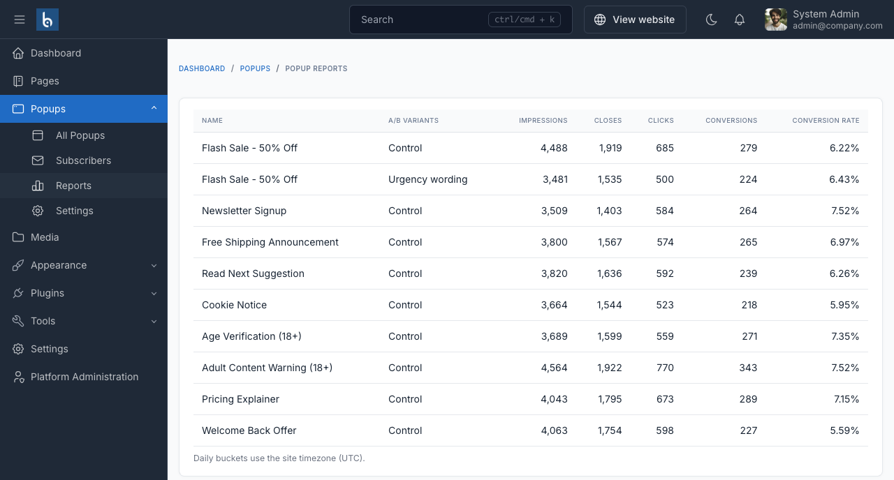

# A/B testing

The **A/B Variants** tab runs an experiment on a popup's content. Each visitor is assigned one version and stays on it.



## How it works

- The content you wrote on the **Content** tab is the **control**.
- Each variant you add replaces that content for its share of traffic.
- Assignment is sticky per visitor, so someone does not see a different version on every page.

Save the popup once before adding variants. You can add up to four.

## Traffic weights

Both the control and each variant have a **traffic weight**. Weights are relative and do not need to add up to 100 - a control of 50 against one variant of 50 is a straight 50/50 split, and so is 1 against 1.

| Control | Variant A | Variant B | Result |
|---|---|---|---|
| 50 | 50 | - | 50% / 50% |
| 80 | 20 | - | 80% / 20% |
| 1 | 1 | 1 | roughly a third each |

## Variant fields

| Field | Notes |
|---|---|
| **Variant name** | An internal label, shown in the Reports table. Visitors never see it. |
| **Traffic weight** | Relative share of traffic. |
| **Variant content** | Replaces the popup body. The same HTML and shortcodes as the main content, including `bp-cta` and `bp-confirm`. |

```html
<h3>Only a few hours left</h3>
<p>50% off everything.</p>
<a class="bp-cta" href="/collections/sale">Claim my discount</a>
```

## Reading the result

**Popups → Reports** gives each variant its own row, with impressions, closes, clicks, conversions and a conversion rate. Compare the control's row against each variant's.



::: warning Do not call it early
Nothing in the table warns you about sample size, so that judgement is yours. A few dozen impressions cannot separate a 6% conversion rate from a 7% one - let the test run.
:::

## Removing a variant

Removing a variant deletes its recorded statistics too. Export or note the numbers first if you want to keep them.
