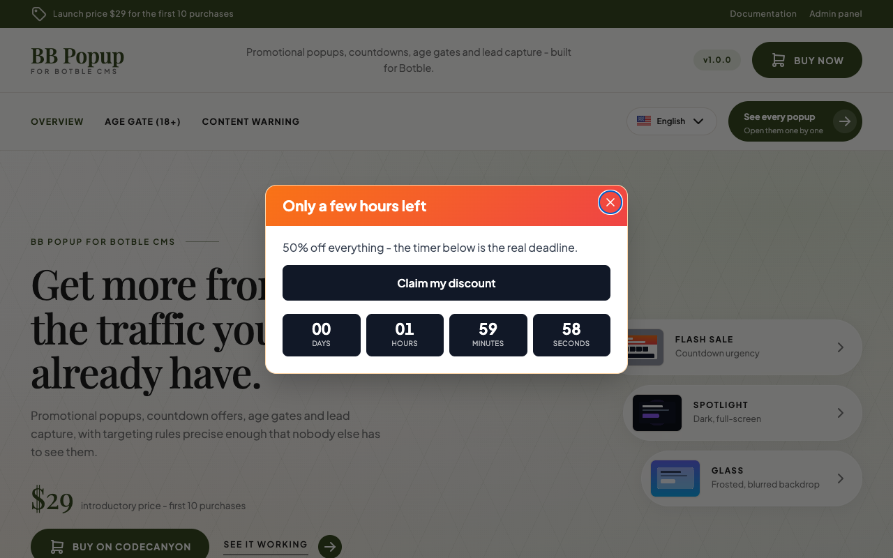
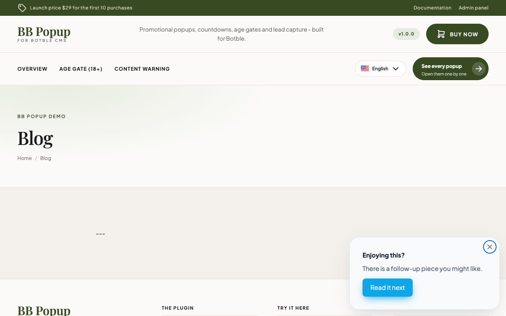
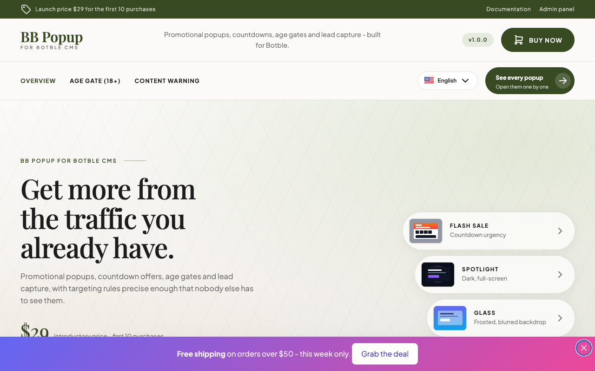
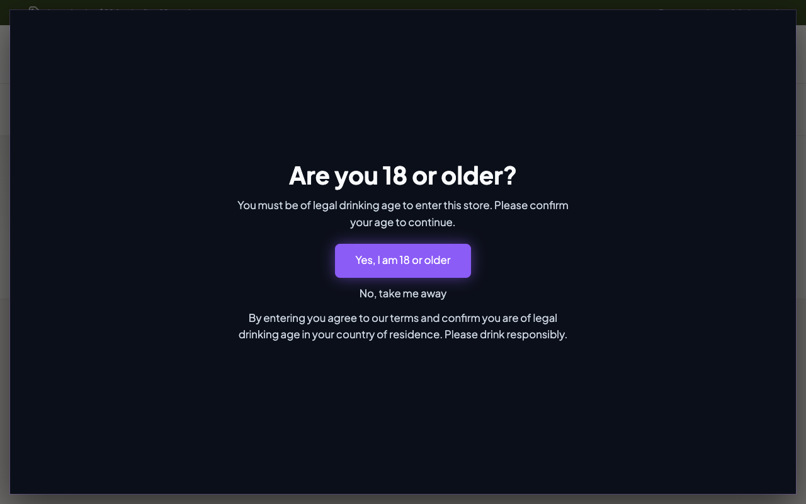
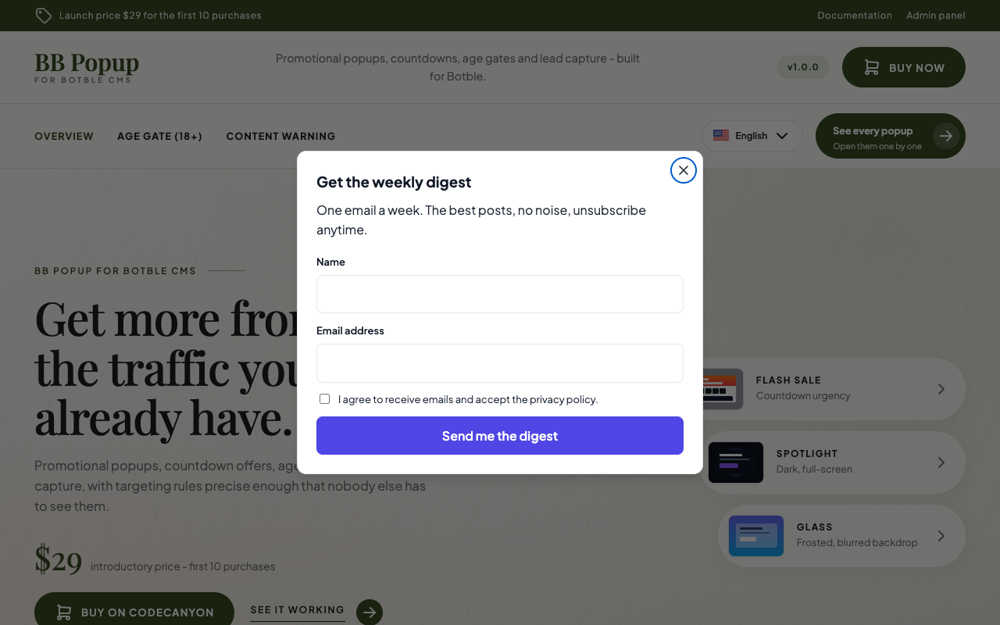

# Creating a popup

Go to **Popups → All Popups → Create**.


## Detail

| Field | Notes |
|---|---|
| **Name** | An internal label. It is not shown to visitors unless you turn on *Show the popup name as a heading* on the Design tab. |
| **Shortcode** | A slug such as `flash-sale`. It identifies the popup in the `[bb-popup]` shortcode and in embed snippets. |
| **Type** | The layout - see below. |
| **Priority** | Higher wins when several popups are eligible on the same page. |
| **Starts at / Ends at** | Optional. Leave empty to run indefinitely. |
| **Status** | Draft popups never render. |

## Layouts

Five layouts, each of which can wear any of the eight [style presets](./design.md).

### Modal (centered)

A centred panel over a dimmed page. The default choice for offers and announcements.



### Slide-in (corner)

A corner card that stays out of the way. Choose the corner on the Design tab.



### Notification bar

A full-width strip pinned to the top or bottom of the viewport. It is page chrome - it can sit there for the whole visit without blocking anything.



### Fullscreen overlay

Takes the whole viewport. Combined with a static backdrop, this is how you build an age gate.



### Inline (shortcode only)

Never injected automatically. It renders exactly where you place its `[bb-popup]` shortcode, in the page flow. Use it for an in-article signup block. See [Shortcode & embed](./shortcode-and-embed.md).

## Content

The **Content type** selector decides what the visitor reads.

### Rich text

The full editor, with shortcode support. Two class names are meaningful inside your content:

| Class | Effect |
|---|---|
| `bp-cta` | Counts a click toward click-through rate. |
| `bp-confirm` | The "I accept / I am over 18" affordance. Records a conversion and dismisses the popup **even behind a static backdrop**. |

```html
<h3>Only a few hours left</h3>
<p>50% off everything.</p>
<a class="bp-cta" href="/collections/sale">Claim my discount</a>
```

::: warning Use classes, not data attributes
Popup content is sanitised on save, and the sanitiser strips `data-*` attributes. That is why these are class names - a `data-` hook would be removed and an age gate would become undismissable.
:::

### Image only

A clickable full-bleed banner. Set the image path from the Media library, an optional link target, and alt text. The image fills the popup edge to edge.

### Email capture

The plugin's own signup form - no other plugin required. See [Email capture](./email-capture.md).



### Form

Embeds a published form from [BB Form Builder](/bb-form-builder/), optionally restyled to the popup's palette so it does not look pasted in. You can also close the popup a set number of seconds after a successful submit.

If BB Form Builder is not installed and activated, this content type tells you so rather than failing silently.

## Translating popup content

With the **Language Advanced** plugin active, popup content is translatable per language, and the editor shows a language switcher. There is also a `Language` display rule if you would rather show a completely different popup per language - see [Display rules](./display-rules.md).

The plugin's own admin strings ship in English.

## Duplicating

Use **Duplicate** in the popup list to copy an existing popup, including its design, triggers, rules and A/B variants. The copy gets a new shortcode slug and starts with no statistics of its own.
