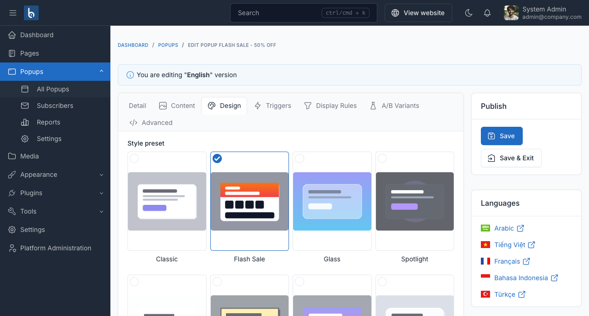

# Design

The **Design** tab controls how a popup looks. Layout and styling are independent - any of the five layouts can wear any of the eight presets.



## Style presets

Pick one from the visual picker. A preset is a starting point, not a lock: choosing one fills in the colours below, and you can change any of them afterwards.

| Preset | Look |
|---|---|
| **Classic** | Neutral panel on a white background |
| **Flash Sale** | Orange-to-red header band, dark buttons |
| **Glass** | Frosted, blurred backdrop |
| **Spotlight** | Dark, full-screen feel |
| **Minimal** | Almost no chrome |
| **Bold** | Heavy type, high contrast |
| **Gradient** | Two-colour gradient background |
| **Soft** | Muted palette, generous radius |

## Global defaults or a per-popup override

The **Appearance** selector has two positions:

- **Use global defaults** - inherit everything from **Popups → Settings**. Restyling all your popups later is then a single edit.
- **Customise for this popup** - unlocks the fields below for this popup only.

## Colours

Nine colours: primary, primary (hover), heading, body text, background, border, overlay, success and error.

- **Overlay** is the dimmed layer over the page behind the popup. Use an `rgba()` value to control how dark it is.
- **Primary (hover)** may be left empty - the primary colour is darkened automatically.
- For a borderless panel, set **border** to the same value as **background**.

### Gradient background

Turn on **Use a gradient background** to replace the flat background colour with a two-colour sweep. Set the start colour, the end colour and the angle in degrees - 135 gives the usual top-left to bottom-right direction.

## Shape and typography

| Field | Notes |
|---|---|
| **Corner radius** | `0px` gives sharp corners. |
| **Button radius** | Applies to the call-to-action. |
| **Shadow** | None, Subtle, Medium, Large, Soft glow, Hard offset or Neon glow. |
| **Maximum width** | In pixels. The popup always shrinks to fit smaller screens. |
| **Font family** | Leave empty to inherit the theme's font. |
| **Corner** | Which corner a slide-in appears from, or which edge a notification bar pins to. |

## Animation

Eight entrance animations: fade, zoom, slide up, slide down, slide in from the left, slide in from the right, bounce and flip.

::: tip
Visitors who have asked their operating system to reduce motion never see animations, as long as **Respect "prefers-reduced-motion"** is left on in [Settings](../configuration.md#behaviour). Leave it on.
:::

## Countdown timer

Also on this tab. A countdown adds a deadline to the offer.

| Mode | Behaviour |
|---|---|
| **No countdown** | No timer. |
| **Per visitor session** | Each visitor gets their own timer of the length you set in minutes, remembered across pages. |
| **Fixed deadline** | Everyone counts down to the same date and time, interpreted in the visitor's local timezone. |

**When the timer expires** offers seven actions:

| Action | Result |
|---|---|
| Close the popup | Dismisses it for this page view |
| Close it and never show it again to this visitor | Dismisses it permanently |
| Hide the timer but keep the popup open | The offer stays, the urgency goes |
| Replace the timer with a message | Shows your **Expiry message** in its place |
| Redirect to a URL | Sends the visitor to the URL you set |
| Restart the timer | Loops |
| Leave the timer at zero | Does nothing |

## Reopen icon

A small corner button that reappears after the popup is closed, so a dismissed offer stays reachable. Choose *Do not show*, or one of the four corners.

## Custom CSS

The **Advanced** tab takes per-popup CSS. It is automatically scoped to that popup, so a rule written here cannot affect the rest of your site. Angle brackets are rejected on save.

```css
.bp-title { letter-spacing: -0.02em; }
.bp-cta { text-transform: uppercase; }
```

## Showing the name as a heading

**Show the popup name as a heading** is off by default. The name is an internal label; most people write their own heading in the content instead.
