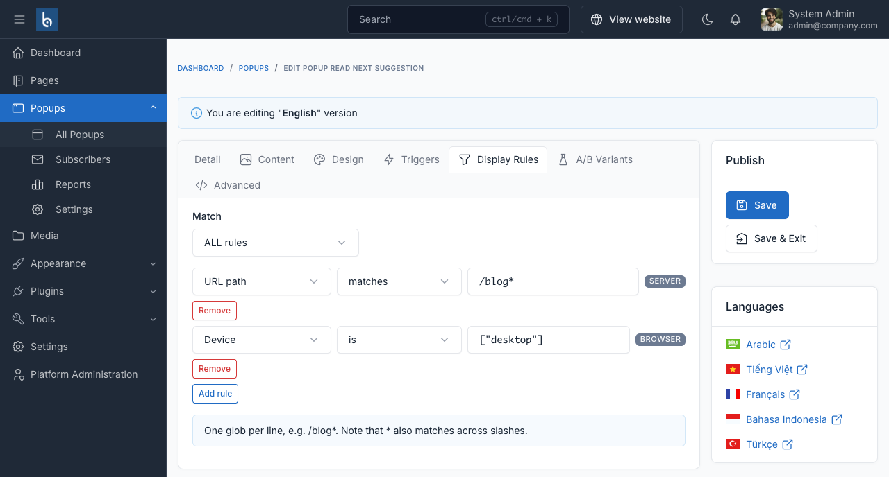

# Display rules

Display rules decide who sees a popup. With no rules, it shows everywhere.

## Match ALL or Match ANY

- **ALL rules** - every rule must pass.
- **ANY rule** - one passing rule is enough.

Add up to 30 rules per popup.

## The eleven rule types

Each row is tagged **SERVER** or **BROWSER**, which is what makes the plugin safe under full-page caching - see [Caching](#caching) below.

### Server-side rules

These vary with the page, not the person, so they can be decided before the HTML is cached.

| Rule | Operators | Value |
|---|---|---|
| **URL path** | matches, does not match | One glob per line, e.g. `/blog*`. Note that `*` also matches across slashes. |
| **Page type** | is, is not | Home, blog, post, category, page, product or 404. |
| **Language** | is, is not | A site language. |
| **Schedule** | between | A weekly time window. |

### Browser-side rules

These vary with the person, so they are evaluated in the visitor's browser after the page is delivered.

| Rule | Operators | Value |
|---|---|---|
| **Device** | is, is not | Mobile, tablet, desktop. |
| **Login status** | is | Logged in, or not. |
| **Visitor** | is | First-time, or returning. |
| **Referrer** | contains, does not contain, is empty | Matched against the referring URL. |
| **UTM parameter** | equals, exists | For example `utm_source` equals `newsletter`. |
| **Cookie** | exists, equals | By cookie name. |
| **Page views** | at least | Page views by this visitor. |

## Testing your rules

**Test against a URL** takes a path such as `/blog/my-post` and shows which rules pass. It only exercises the server-side rules - browser-side rules depend on a real visitor.

## Caching

A popup that ignores full-page caching shows the wrong visitor the wrong thing. BB Popup splits the decision:

1. The **server** applies only what the cache key already knows - URL, page type, language and schedule. A popup excluded by these is never written into the HTML.
2. The **browser** applies everything person-specific - device, login state, referrer, UTM, cookies and visit history - before the popup is displayed.

So one cached HTML document stays correct for every visitor who receives it.

::: tip Match ANY with mixed scopes
When a **Match ANY** set contains browser-side rules, the server cannot decide it alone - a single browser rule might still pass. In that case the popup is delivered to the browser and the decision is finished there, rather than hiding a popup that should have shown.
:::

### Cache-safe delivery mode

If your cached HTML must not contain popup markup at all - for example because a CDN serves it to everyone and you consider the popup content sensitive - turn on **Cache-safe delivery** in [Settings](../configuration.md#behaviour). Popups are then fetched over AJAX after the page loads instead of being embedded in it.

Leave it off otherwise: embedding is one fewer request, and the split above already keeps cached pages correct.
