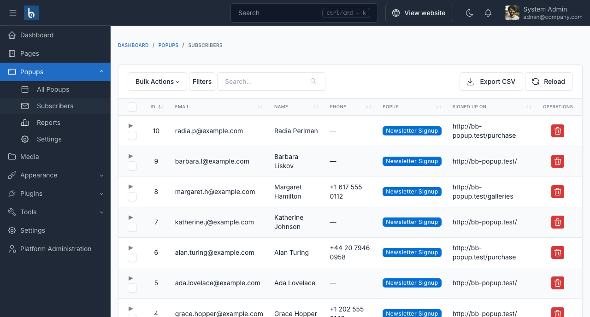

# Email capture

Set **Content type** to **Email capture** on the Content tab and the popup collects email addresses directly. No form plugin is required.


## Form fields

Only the email address is required. Everything else is optional.

| Setting | Notes |
|---|---|
| **Email field label** | Leave empty for the default, *Email address*. |
| **Email field placeholder** | Greyed-out example text inside the empty field, e.g. `you@example.com`. |
| **Also ask for a name** | Optional for the visitor. |
| **Also ask for a phone number** | Optional for the visitor. |
| **Button label** | Leave empty for the default, *Subscribe*. |
| **Success message** | Shown in place of the form once the signup is saved. |
| **Close popup after** | Seconds to wait after a successful signup before closing. `0` keeps it open. |

::: tip
Every extra field lowers completion. Ask only for what you will actually use.
:::

## Consent

Turn on **Require a consent checkbox** to add a tick box the visitor must check before subscribing, with your own wording in **Consent text**. Use this where GDPR or a similar consent rule applies.

A spam honeypot field is always included and always hidden from real visitors.

## Subscribers

Signups land under **Popups → Subscribers**.



Each row records the email address, the optional name and phone, which popup captured them, the page they were on, and when. The list is filterable and searchable like any Botble table.

## Exporting

**Export CSV** in the table header downloads every subscriber, newest first. The file is UTF-8 with a byte-order mark, so names with accents open correctly in Excel.

Columns: Email, Name, Phone, Popup, Page, Consented, Subscribed at.

::: tip Exporting one popup's signups
Append a popup id to the export URL:

```
/admin/bb-popup/subscribers/export?popup_id=3
```
:::

## Counting as a conversion

A successful signup is recorded as a conversion for that popup, so it appears in [Reports](./reports.md) and satisfies the **Until converted** frequency mode.

## Using BB Form Builder instead

If you already own [BB Form Builder](/bb-form-builder/), set **Content type** to **Form** and choose a published form. Turn on **Match the form to the popup colours** so it does not look pasted in, and optionally close the popup a few seconds after a successful submit.

Submissions then live with your other form entries, not under **Subscribers**.
