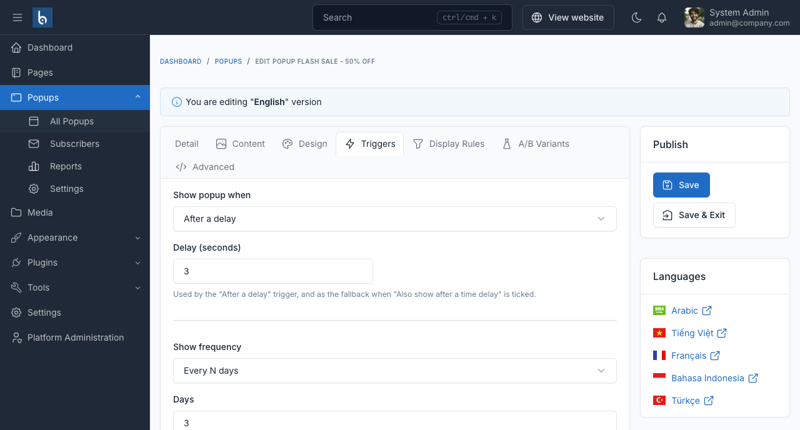

# Triggers & behaviour

The **Triggers** tab answers three questions: when does it open, how often may a visitor see it, and how can they get rid of it.



## When it opens

Pick one of seven triggers.

| Trigger | Extra field | Notes |
|---|---|---|
| **Page loads** | - | Fires immediately. |
| **After a delay** | Delay (seconds) | |
| **After scrolling** | Scroll percentage | Percentage of the page height. |
| **On exit intent** | - | Desktop only. Mobile browsers have no reliable exit-intent signal. |
| **On click** | CSS selector | Opens when any element matching the selector is clicked, e.g. `.pricing-help`. |
| **After inactivity** | Idle seconds | |
| **After N page views** | Page views | Counts page views by this visitor. |

### Combining with a delay

**Also show after a time delay** pairs any trigger with the **Delay** field: whichever happens first opens the popup. "After scrolling 50%, or after 20 seconds, whichever comes first" is one checkbox.

::: warning Exit intent on mobile
There is no exit-intent equivalent on touch devices. If a popup matters on phones, tick **Also show after a time delay** so mobile visitors still get it.
:::

## How often it shows

| Frequency | Behaviour |
|---|---|
| **Every time** | Every page view. |
| **Once per session** | Until the browser session ends. |
| **Once ever** | One time per visitor, remembered in local storage. |
| **Every N days** | Set the number of days. |
| **Until converted** | Keeps showing until the visitor converts - clicks a `bp-confirm` element, submits the built-in capture form, or is marked converted through the [JS API](./shortcode-and-embed.md#javascript-api). |

**Stop after N dismissals** caps the total number of times a visitor may close the popup before it gives up. Set it to `0` to never stop.

::: tip Frequency is stored in the browser
Frequency is per browser, in local storage - not per user account. Clearing site data resets it, and the same person on a second device is a new visitor.
:::

## How it closes

| Setting | Notes |
|---|---|
| **Show close button** | The × in the corner. |
| **Close when the overlay is clicked** | Clicking the dimmed page behind the popup. |
| **Close on the Escape key** | |
| **Static backdrop** | Overrides the two above: clicking outside and pressing Escape are both ignored. The close button is the only way out. |
| **Delay before closing is allowed** | Seconds. Shows a countdown on the close button. `0` allows closing immediately. |
| **Auto-close after** | Seconds. Closes the popup on its own. |

### Building an age gate

Use the **Fullscreen** layout with a **static backdrop** and no close button, then put a `bp-confirm` element in the content as the way through:

```html
<h2>Are you 18 or older?</h2>
<a class="bp-confirm" href="#">Yes, I am 18 or older</a>
<a href="https://example.com/">No, take me away</a>
```

`bp-confirm` dismisses the popup even behind a static backdrop, and records a conversion. Pair it with the **Until converted** frequency so a visitor who confirms is never asked again.

::: danger
A static backdrop with no close button and no `bp-confirm` element leaves visitors with no way to dismiss the popup at all. The editor warns you about this - do not ignore it.
:::
