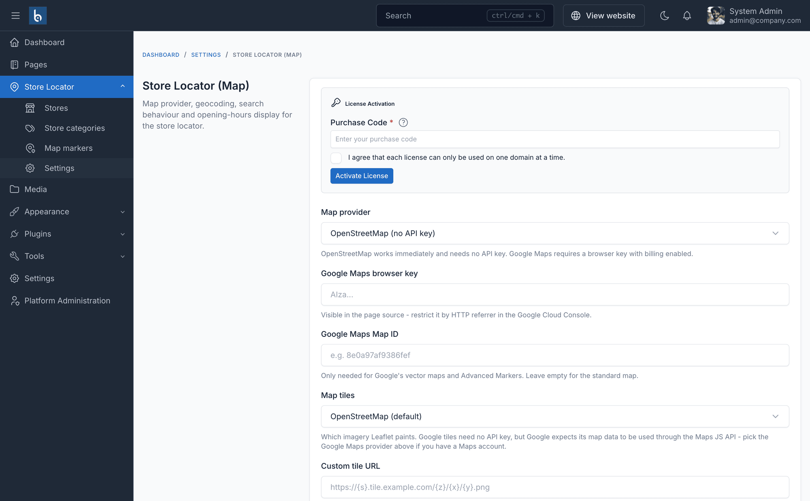

# Configuration

All settings live at **Settings → Store Locator (Map)**.

On an ecommerce site the entry sits in the commerce group and is titled *Store Locator (Map)* to distinguish it from the shipping-origin store list that the ecommerce plugin owns. On every other Botble site it sits under **Others**.

## Map

| Setting | What it does |
|---|---|
| **Map provider** | `Leaflet` (default, no key) or `Google Maps`. Google needs a JavaScript API key; without one the locator falls back to Leaflet rather than showing an empty box. |
| **Google Maps JS key** | Only used when the provider is Google. This key is public by design - restrict it by HTTP referrer in the Google Cloud console. |
| **Google Maps Map ID** | Optional. Enables cloud-based map styling. |
| **Tile provider** | `OpenStreetMap`, `Carto Light`, `Carto Dark`, `Google` or `Custom`. Applies to the Leaflet renderer. |
| **Tile URL** / **Tile attribution** | Only shown for the *Custom* provider. Attribution is mandatory - see [Map providers](./usage/map-providers.md). |
| **Default latitude / longitude** | Where the map opens before any search. |
| **Default zoom**, **Min zoom**, **Max zoom** | Opening zoom level and the limits a visitor can reach. |
| **Enable clustering** | Groups nearby pins into a numbered circle. Keep this on for more than about 30 stores. |
| **Scroll wheel zoom** | Turn off if the map sits in a long page and hijacks scrolling. |

## Markers

| Setting | What it does |
|---|---|
| **Marker style** | `pin`, `teardrop`, `circle`, `square`, `tag` or `dot`. Generated as SVG, so they stay crisp on any display. |
| **Marker colour** | A hex colour such as `#e11d48`. A store's category colour overrides it, and an uploaded marker image overrides both. |
| **Show image in popup** | Shows the store's logo, or its first gallery image, inside the map popup. |

## Geocoding

Geocoding converts a written address into coordinates. See [Geocoding](./usage/geocoding.md) for the full picture.

| Setting | What it does |
|---|---|
| **Geocoding provider** | `Manual`, `Google`, `Mapbox` or `Nominatim`. |
| **Google geocoding key** | Server-side only. Never sent to the browser - keep it separate from the JavaScript key above. |
| **Mapbox access token** | Server-side only. |
| **Nominatim endpoint** / **user agent** | Required by the OpenStreetMap usage policy. |
| **Nominatim consent** | You must confirm you accept the usage policy before Nominatim will run. Bulk geocoding stays disabled for Nominatim either way. |
| **Restrict to country** | An ISO country code that biases results, e.g. `GB`. |
| **Enable public suggestions** | Address autocomplete in the visitor-facing search box. Turn it off to keep geocoding quota for the admin panel only. |

## Search and results

| Setting | What it does |
|---|---|
| **Template** | The default layout - see [Layouts](./usage/layouts-and-shortcode.md). |
| **Distance unit** | Kilometres or miles. |
| **Default radius** / **Max radius** | The starting search distance and the furthest a visitor may set. |
| **Results limit** | Maximum stores returned per search. |
| **Geolocation mode** | `none` (never ask), `dialog` (ask on request) or `onload` (ask on page load). Browsers only allow location lookup over HTTPS. |
| **Enable directions** | Shows a Directions link that opens the route in Google Maps. |
| **Search requires location** | Show nothing until the visitor searches or shares their location. Useful for very large networks. |

## Opening hours

| Setting | What it does |
|---|---|
| **Time format** | 24-hour or 12-hour display. |
| **Hours style** | `today`, `week` or `grouped` (collapses consecutive identical days into "Mon - Fri"). |
| **Show open now** | The open/closed badge on cards and popups. |
| **Multi timezone** | Adds a timezone field to each store. Turn this on for an international network, so "open now" is correct everywhere. |
| **Closed label** | Wording used for a closed day, e.g. "Rest day". |

## URLs and integration

| Setting | What it does |
|---|---|
| **Slug prefix** | The path segment for store detail pages, default `store-locations`. |
| **Enable sitemap** | Includes store pages in the XML sitemap. |
| **Enable API** | Exposes the read-only REST endpoints - see [REST API](./usage/rest-api.md). |

## Per-page overrides

Many of these can be overridden on a single locator through shortcode attributes, without changing the site default. The allowed attributes are listed in [Layouts and the shortcode](./usage/layouts-and-shortcode.md).
