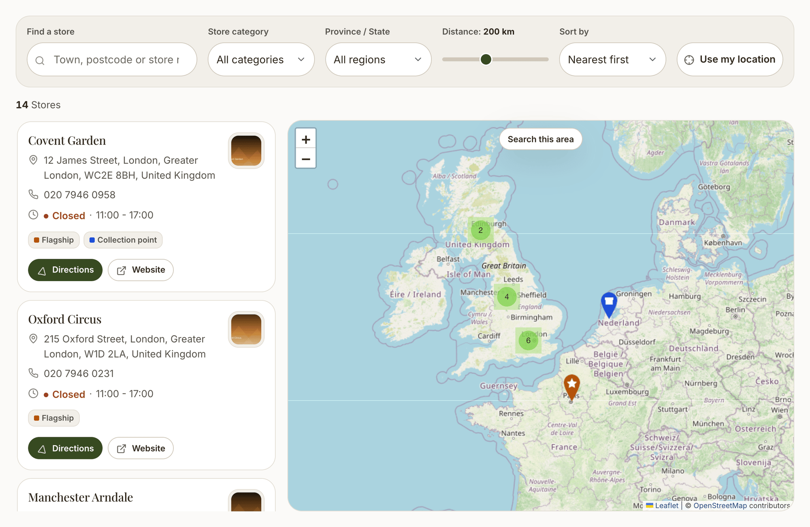

# BB Store Locator

A store locator for any Botble site. Put an interactive map of your branches on any page, let visitors search by town, postcode or their own location, and manage everything from the admin panel.

## Why this plugin

- **No API key required.** OpenStreetMap, Carto Light, Carto Dark and Google tiles all work out of the box, plus any custom tile server. Add a Google key later if you want to.
- **Works on every Botble script.** Blog, hotel, real estate, job board, plain CMS or ecommerce - there is no hard dependency on any other plugin.
- **Built for real chains.** Bulk CSV import, marker clustering, region browsing and six layouts that stay usable at 500 branches.

## Features

### Maps
- Five tile choices - OpenStreetMap, Carto Light, Carto Dark, Google or your own - plus the Google Maps JavaScript API as an alternative renderer
- Marker clustering that keeps hundreds of pins readable
- Six generated marker shapes in any colour, or upload your own
- Automatic fallback to Leaflet when no Google key is configured

### Finding a store
- Search by town, postcode or store name, with address autocomplete
- "Use my location" with distance sorting
- Adjustable radius in kilometres or miles
- Filter by category, by region, and by open-right-now
- "Search this area" after panning the map

### Layouts
Six templates - split, grid, list, compact, accordion and full map - all placed with a single shortcode.

### Store data
- Opening hours per day with multiple slots, 24-hour and closed states, correct past-midnight handling
- Per-store timezone, so "open now" is right for an international chain
- Logo, gallery, rich detail page, phone, email, website and directions
- Categories with their own colours and marker icons

### Bulk data
- CSV and Excel import that creates and updates stores
- Re-import a corrected file without duplicating branches
- Export with filters, including "only stores still missing coordinates"

### SEO
- `LocalBusiness` structured data and Open Graph tags on every store page
- Stores included in the XML sitemap
- A public REST API for stores, categories, suggestions and settings

## Quick links

| Guide | What it covers |
|---|---|
| [Installation](./installation.md) | Uploading, activating and placing your first locator |
| [Configuration](./configuration.md) | Every setting, grouped by what it affects |
| [Managing stores](./usage/managing-stores.md) | Adding stores, coordinates, opening hours, categories |
| [Map providers](./usage/map-providers.md) | Choosing tiles, and when you need a Google key |
| [Layouts](./usage/layouts-and-shortcode.md) | The six templates and every shortcode attribute |
| [Import & export](./usage/import-export.md) | Bulk loading a branch network from a spreadsheet |
| [Geocoding](./usage/geocoding.md) | Turning addresses into coordinates |
| [Troubleshooting](./troubleshooting.md) | When the map is blank or stores do not appear |
| [Backend configuration errors](./backend-configuration-errors.md) | Server and admin settings that break setup, imports or geocoding |
| [FAQ](./faq.md) | Short answers to common questions |

## Requirements

- Botble CMS 7.4.0 or higher
- PHP 8.3 or higher

No other plugin is required. If **Location** or **Language Advanced** happen to be installed, the locator uses them automatically - see [Integration](./integration.md).
