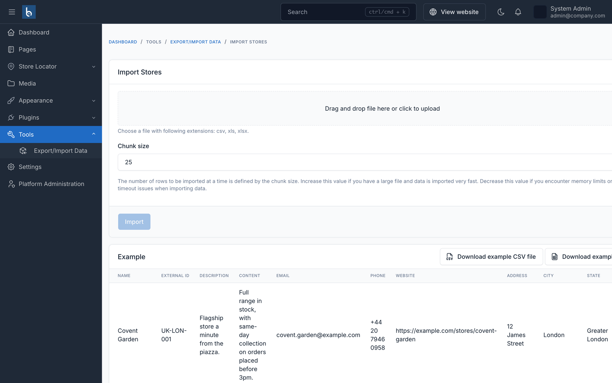
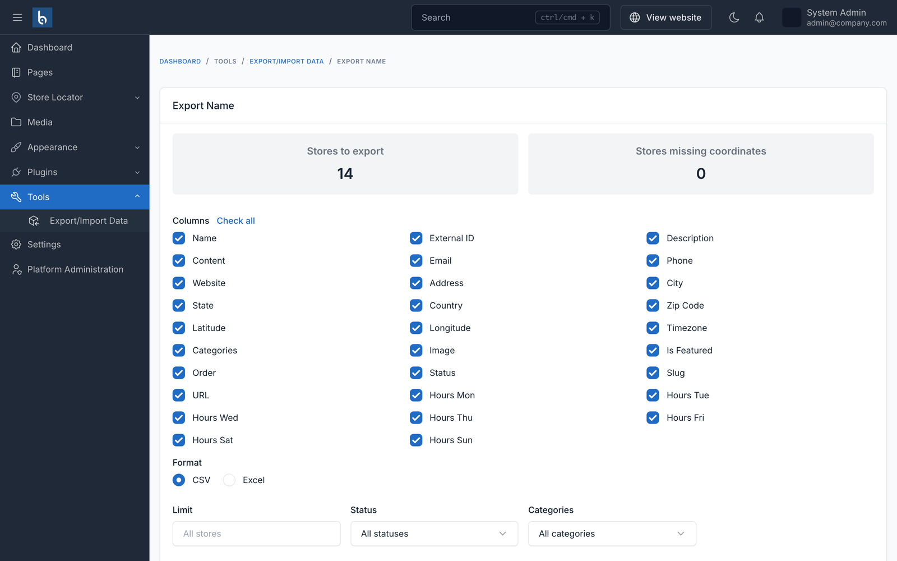

# Import and export

Nobody types a hundred branches by hand. **Tools → Export/Import Data → Import Stores** loads them from a CSV or Excel file.

## Getting the format right

Click **Download example CSV file** on the import screen. It contains real column headings and three filled-in example rows - the fastest way to see exactly what is expected.

Export and import share the same column set, so **export → edit in Excel → import back** works without any reshaping.

## Columns

| Column | Notes |
|---|---|
| `name` | Required |
| `external_id` | Your own reference for the branch. Strongly recommended - see below |
| `description`, `content` | Short summary and full detail-page body |
| `email`, `phone`, `website` | |
| `address`, `city`, `state`, `country`, `zip_code` | Plain place names |
| `latitude`, `longitude` | Leave blank to geocode from the address |
| `timezone` | e.g. `Europe/London`. Only matters with multi-timezone enabled |
| `categories` | Comma-separated names. Missing categories are created |
| `image` | A URL. Leave blank for no logo |
| `is_featured` | `Yes` or `No` |
| `order` | Sort order |
| `status` | `published`, `draft` or `pending` |
| `slug` | Leave blank to generate from the name |
| `hours_mon` … `hours_sun` | See below |

## Opening hours in a spreadsheet

Each day gets one plain column, written the way it appears on a shop door:

| Cell | Meaning |
|---|---|
| `09:00-18:00` | Open once |
| `08:00-12:00, 13:00-17:00` | Closed for lunch |
| `22:00-02:00` | Closes after midnight |
| `24h` | Open around the clock |
| `Closed` | Shut that day |
| *(empty)* | No hours recorded |

Parsing is forgiving: en dashes, the word "to", and missing minutes (`9-17`) all work, because spreadsheets like to rewrite what you typed.

::: warning Empty is not the same as Closed
Leave **every** day empty and the store records no hours at all - the frontend shows nothing. Write `Closed` in all seven and it is explicitly shut every day, and says so.
:::

## Re-importing without creating duplicates

This is what `external_id` is for. Give each branch a stable reference from your own systems - `UK-LON-001`, a franchise number, anything - and the importer **updates** the matching store instead of creating a second one.

That makes the obvious workflow safe: export, fix a phone number in Excel, import the same file back.

Without an `external_id` the importer falls back to matching on **name**. That works, but renaming a branch in the spreadsheet then creates a new store rather than renaming the old one.

## Stores without coordinates

Leave `latitude` and `longitude` blank and the importer geocodes from the address - but only when your configured provider both has credentials and permits bulk lookups. Nominatim's terms forbid it, so those rows are left marked *pending* rather than quietly running your site into a usage-policy violation.

To fix them afterwards, either:

- run the bulk geocode command (see [Geocoding](./geocoding.md)), or
- export with **Only stores missing coordinates** ticked, fill the two columns in, and import the file back.

## Exporting

**Tools → Export/Import Data → Export Stores** writes CSV or Excel, with filters for status, category, country, state, a row limit, and *only stores missing coordinates*.

Place names are always exported as readable text, never internal ids, so a file taken from one site imports cleanly into another.

## Chunk size

The import screen has a **chunk size** (default 25). Lower it if you hit memory or timeout limits on shared hosting; raise it to speed up a large file when rows do not need geocoding.
