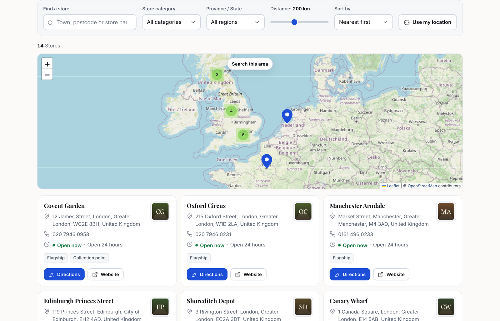
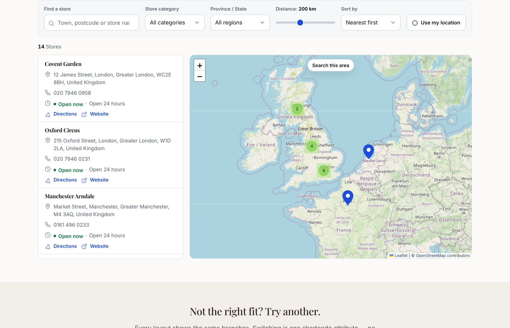
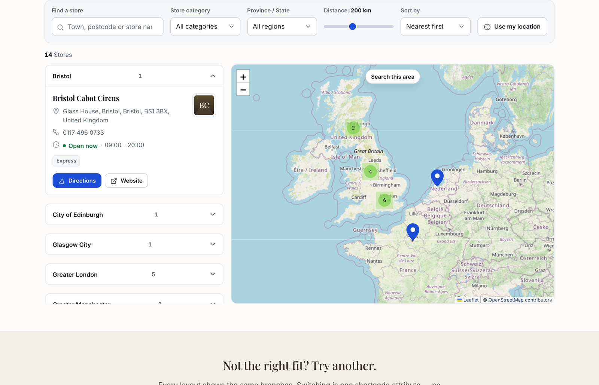
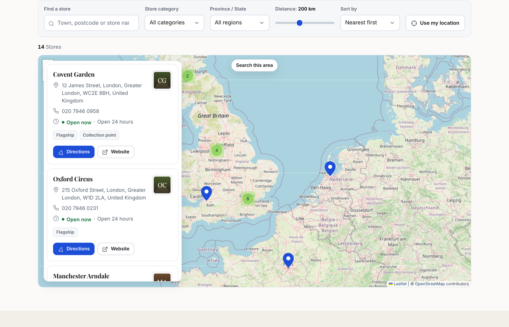

# Layouts and the shortcode

## The shortcode

Place a locator on any page, post or static block:

```
[store-locator][/store-locator]
```

Everything else is optional. Each attribute overrides the site default for that one locator, so you can have a full network finder on one page and a short regional list on another.

```
[store-locator template="compact" default_radius="100" distance_unit="mi" results_limit="50"][/store-locator]
```

In the admin panel the shortcode also has a visual builder, so you do not have to type attributes by hand.

### Attributes

| Attribute | Values | Default |
|---|---|---|
| `template` | `split`, `grid`, `list`, `compact`, `accordion`, `fullmap` | site setting |
| `categories` | Comma-separated category ids, e.g. `2,5` | all |
| `default_radius` | A number | site setting |
| `distance_unit` | `km` or `mi` | site setting |
| `geolocation_mode` | `none`, `ask`, `auto` | site setting |
| `results_limit` | A number | site setting |
| `height` | Any CSS length, e.g. `620px` | `520px` |

::: tip Unknown attributes are ignored
Only the attributes above are accepted. Anything else is dropped rather than passed through, which keeps the shortcode's behaviour predictable.
:::

## The six layouts

### Split

List beside the map. The default, and the right choice for most sites.


### Grid

Cards below the map. Good when stores have photos.



### Compact

Dense rows with inline text actions and no category tags. Built for chains with hundreds of branches, where every row of vertical space counts.



### Accordion

Stores grouped into collapsible sections by region, with the first section open. The natural fit when people think in terms of "which branches are in my county".



### Full map

Edge-to-edge map with the results floating over it. The most immersive option, and the one that benefits most from a full-width page template.



### List

No map at all - just the searchable, filterable list. Lightest to load, and the most accessible.

## Choosing a layout

| You have | Use |
|---|---|
| Under about 30 stores | `split` or `grid` |
| Hundreds of branches | `compact` or `accordion` |
| A dedicated "find us" landing page | `fullmap` |
| Stores with strong photography | `grid` |
| A page where the map is not the point | `list` |

## Give it room

The split and full-map layouts put the list beside the map. On a page template with a sidebar, that column gets narrow and the layout stacks. Most themes offer a "No sidebar" or full-width page template - use it.
