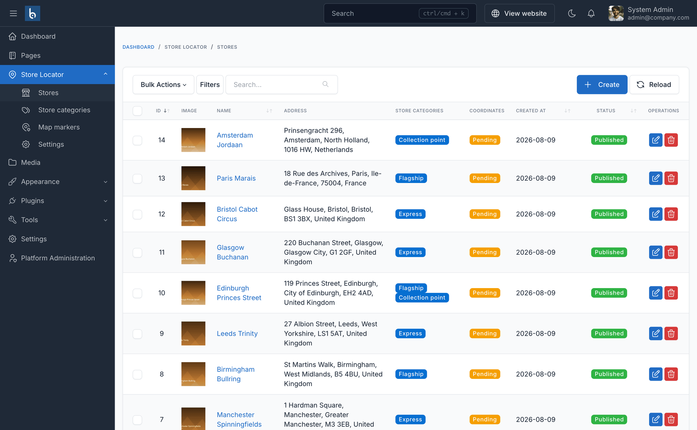
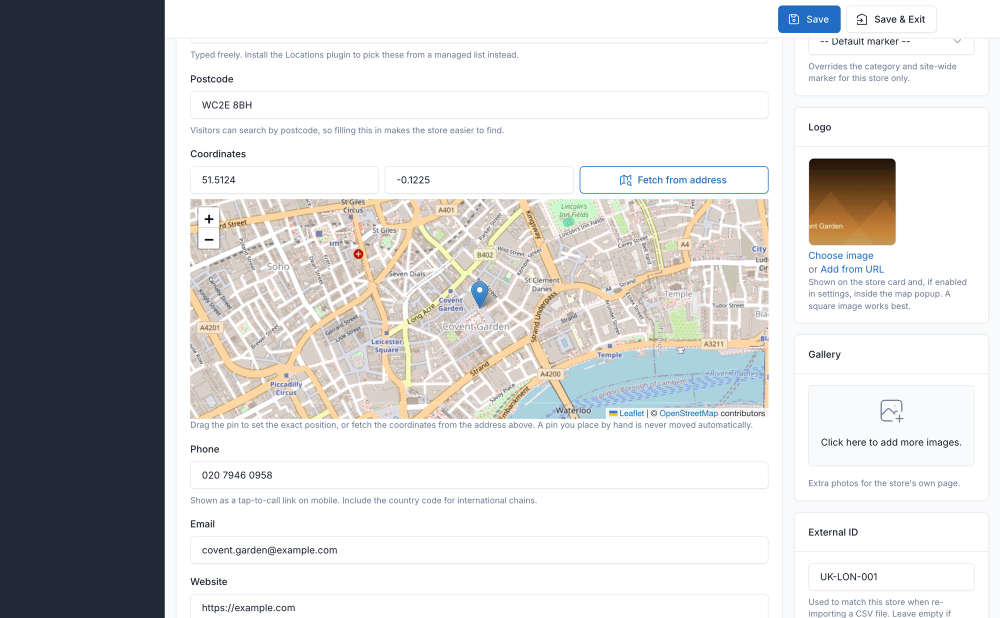
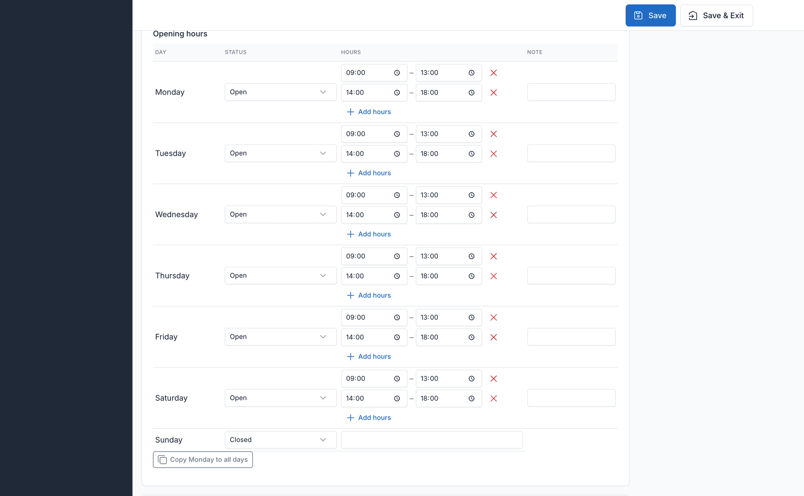
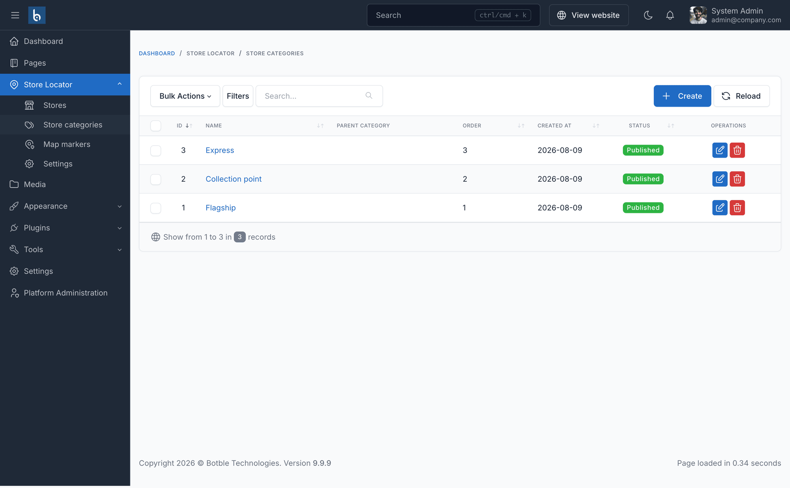
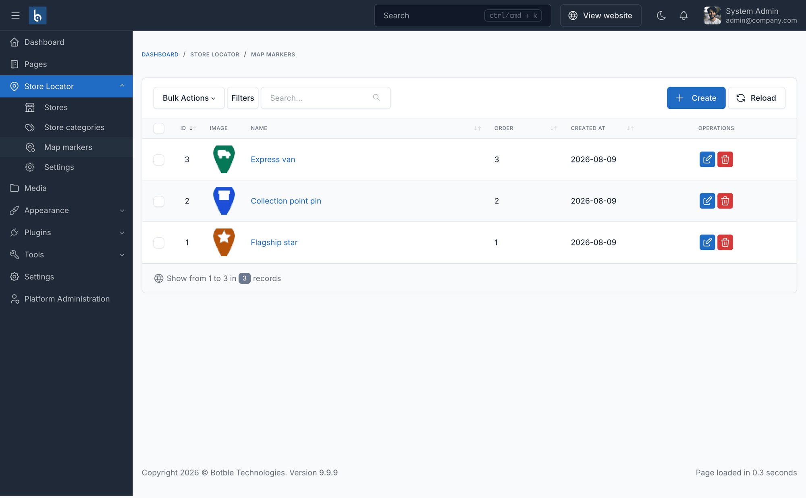
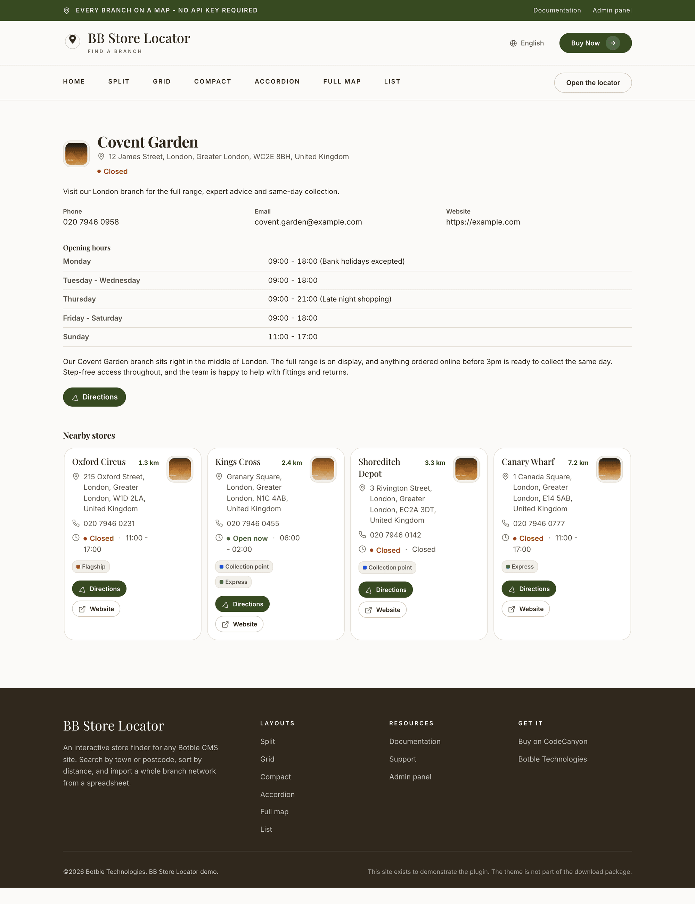

# Managing stores

**Store Locator → Stores** lists everything you have, with search, filters and bulk actions.

## Adding a store

The only genuinely required field is **Name**. Everything else improves the result.

### Address and coordinates

Fill in the address, then either click **Fetch from address** or drag the pin to the exact spot.

::: warning No coordinates, no pin
A store without coordinates is saved and appears in the list, but never on the map and never in a distance search. If you import addresses in bulk, check for stragglers afterwards - see [Geocoding](./geocoding.md).
:::

A pin you place by hand is marked as manual, and no later geocoding run will move it.

### Opening hours

Set a status per day - **Open**, **Open 24 hours** or **Closed** - and add one or more time slots.

- **Multiple slots** handle a lunchtime closure.
- **Past midnight** works: a slot from `22:00` to `02:00` is understood as running overnight, so a late bar is not wrongly shown as closed at 1am.
- **Copy Monday to all days** fills the week in one click.
- The **Note** column records a short internal remark such as "Bank holidays excepted". It is stored with the store and shown back in this editor; it is not rendered on the storefront.

### Timezone

With **Multi timezone** enabled in settings, each store gets its own timezone, so the open/closed badge is correct for an international network. Without it, every store uses the site timezone.

### Logo and gallery

The **Logo** appears on list cards and, if enabled, inside the map popup. The **Gallery** holds additional photos; the first is used in the popup when there is no logo.

### External ID

Your own reference for the branch. It is what lets you re-import a corrected spreadsheet without duplicating stores - see [Import & export](./import-export.md). Leave it empty if you are not importing.

## Categories

**Store Locator → Store categories**. Each category can have its own **colour** and **marker icon**, so a mixed network is readable at a glance without uploading a single image.

Categories drive the visitor-facing category filter. Stores can belong to several.

## Map markers

**Store Locator → Map markers** holds uploaded marker images for when the six generated shapes are not enough - a brand pin, for example.

Which icon a store gets is resolved in this order:

1. A marker set on the store itself
2. The marker or colour of its first category that defines one
3. The site-wide default shape and colour

## Duplicating

Every store has a **Duplicate** action. Useful when several branches share opening hours, categories and description, and differ only by address.

## Store detail pages

Each store gets its own page at `/store-locations/{slug}` (the prefix is configurable), with `LocalBusiness` structured data, Open Graph tags and an entry in the XML sitemap.

