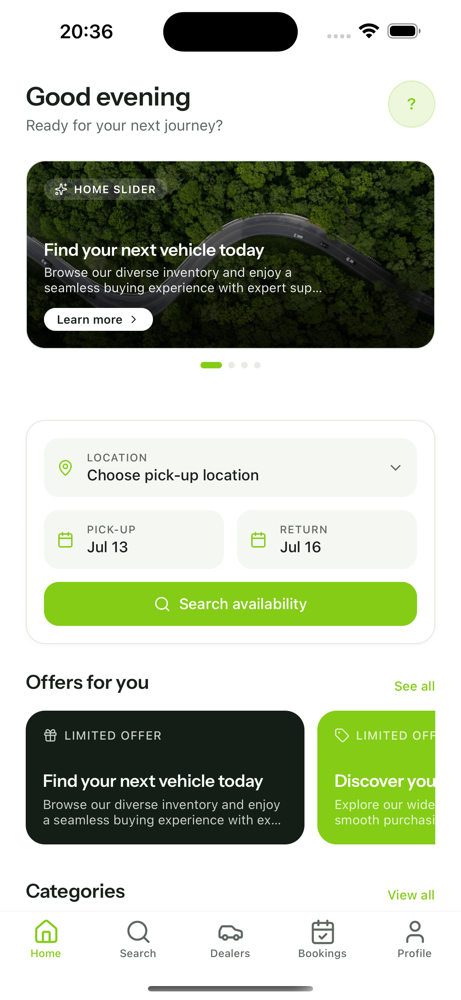
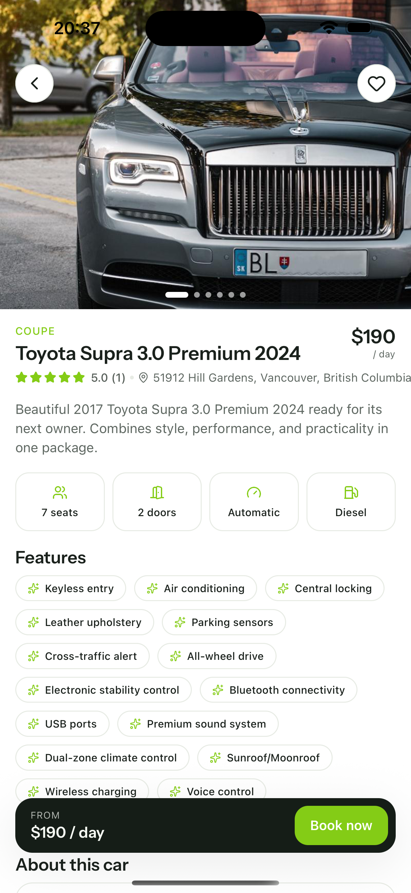
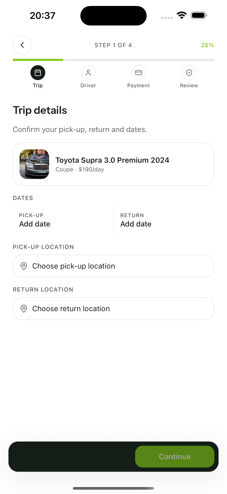

# Carento — React Native (Expo) Car-Rental App for Botble

A React Native (Expo SDK 54) mobile app that connects to a [Botble car-rental backend](https://botble.com) running the **car-manager** plugin. One codebase builds both iOS and Android — customers browse cars, book rentals, pay through a hosted checkout, and manage their account, all driven live from your Botble admin.

  
  
  

## Get started

1. [Overview](overview.md)
2. [Installation](installation.md)
3. [Configuration](configuration.md)
4. [Complete Setup & Publishing Guide](complete-setup-and-publishing-guide.md)

## Customize the app

| Topic | Guide |
|---|---|
| Theme colors | [01_theme_colors.md](01_theme_colors.md) |
| App font | [02_app_font.md](02_app_font.md) |
| App name | [04_app_name.md](04_app_name.md) |
| Logo and icons | [05_app_logo.md](05_app_logo.md) |
| API URL & key | [06_api_base_url.md](06_api_base_url.md) |
| Translations | [07_translations.md](07_translations.md) |

## Screens

- [Profile links](11_profile_links.md)
- [Splash screen](17_splash_screen.md)
- [Loading screen](18_loading_screen.md)
- [Version management](10_version_management.md)

## Build & deploy

- [Running the app](08_running_app.md)
- [Deploying to stores](09_deploying_app.md)
- [Push notifications](push_notifications.md)

## Social login

- [Google](14_google_login_setup.md)
- [Apple](13_apple_login_setup.md)
- [Facebook](15_facebook_login_setup.md)
- [Enable / disable providers](16_social_login_configuration.md)

## Feature list

- Browse cars, search and filter, car detail with photo gallery
- Booking flow with hosted checkout (WebView) — works with every Botble payment gateway
- Guest booking (no account required)
- Dealers directory and blog
- Favorites, profile and account management
- 4 languages (English, Vietnamese, Arabic, French) with RTL support
- Light / dark / system theme
- Social login (Google, Apple, Facebook), biometric unlock, push notifications

## Tech stack

- React Native + Expo SDK 54
- TypeScript (strict)
- Expo Router v6 (file-based routing)
- React Query + Context API
- NativeWind (Tailwind for React Native)
- react-i18next + RTL support
- expo-secure-store

## Reference

- [API Integration](api-integration.md)
- [Development Guide](development.md)
- [Upgrade Guide](upgrade.md)
- [Troubleshooting](troubleshooting.md)
- [FAQ](faq.md)
- [Support](support.md)
- [Release notes](releases.md)

## Resources

- Documentation: https://docs.botble.com/carento-react-native
- Demo: #
- API: [API Integration Guide](api-integration.md)
- Support tickets: https://botble.ticksy.com
- Email: contact@botble.com
