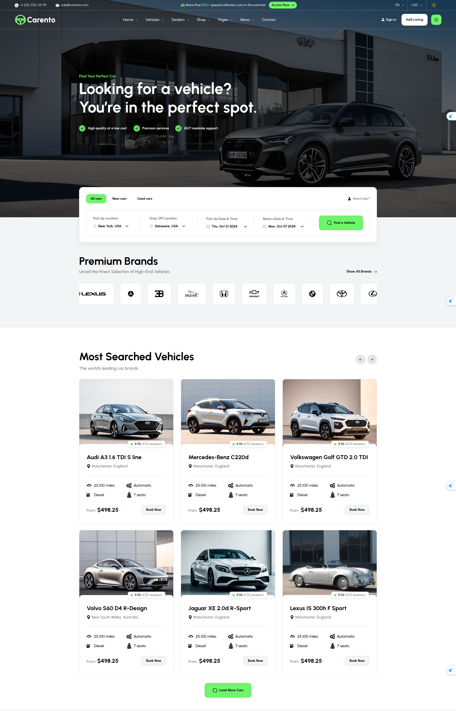

# Homepage

Homepage is the first page that users see when they visit your website. It is the most important page of your website.

## Create Homepage

To create a homepage, in admin panel, go to `Pages` and click on `Create` button.

In the `Create new page` page, fill in the following fields:

- **Title**: Enter the title of the page. For example, `Home`.
- **Permalink**: You can custom. But after set this page is homepage then permalink is `/`.
- **Content**: You have the option to customize the content or utilize our pre-defined [UI Block](./usage-ui-block.md).
- **Template**: Select `Homepage`.
- Other fields are optional, you can fill them if you want.

## Setup Homepage

After creating the homepage, you need to set it as the homepage of your website.

In admin panel, go to `Appearance` -> `Theme Options` -> `Page`, and select the homepage you just created in
the `Your homepage displays` field.

::: tip
If you are using the sample data of **Carento**, the homepage is already created and set up for you.
:::

## Customize Homepage

The homepage or any other page can be customized using UI Block. A list of available
shortcodes can be found in [UI Block](./usage-ui-block.md#available-shortcodes).
