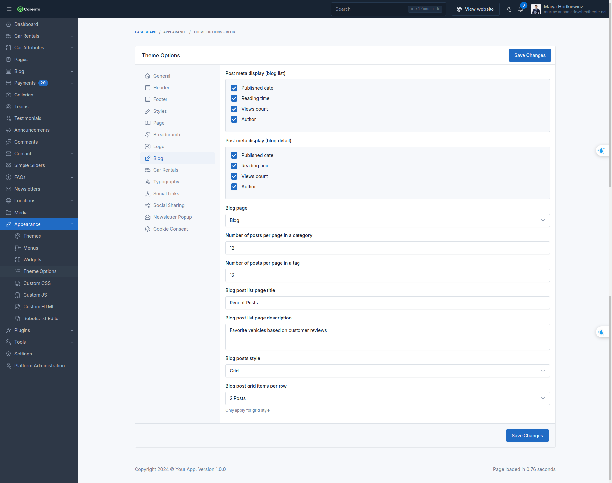

# Theme Options

Theme options are a great way to customize your theme. You can change the color, typography, layout, and more.

To access the theme options, go to `Appearance` -> `Theme Options` in your admin panel.

## General

The **General** tab allows you to configure fundamental settings that shape your website's identity and basic operation.

This section typically includes options for setting your site name, description, and other essential details.

## Header

The **Header** tab allowing users to adjust header visibility, text and background colors, choose between four different header styles, enable a transparent header, and configure action buttons with custom labels, URLs, and icons..

### Header Transparent

When this feature is enabled, the header will have a transparent background and will float to the top of the page.

Demo when `enabled`:

Demo when `disabled`:

## Footer

The **Footer** tab allowing users to adjust the background color, bottom background color, border color, text heading color, text color, and background image.

## Styles

The **Styles** tab allowing users to adjust the primary color, secondary color, heading color, and text color.

## Page

You can specify pages to use as homepage and galleries page at here.

## Breadcrumb

The **Breadcrumb** tab allowing users to adjust the breadcrumb visibility, text and background colors, and choose between two different breadcrumb styles.

## Blog

The **Blog** tab allowing users to adjust the number of posts, categories, tags per page, display style, post item display style, and more.

## Logo

The **Logo** tab allowing users to adjust the logo dark, favicon, logo, logo height.

## Typography

The **Typography** tab allowing users to adjust the font family.

## Social Links

Social links are a great way to connect with your audience. You can add your social media links in the **Social Links**
tab.

## Social Sharing

Social sharing are a great way to connect with your audience. You can add your social media links in the **Social Sharing**
tab.

