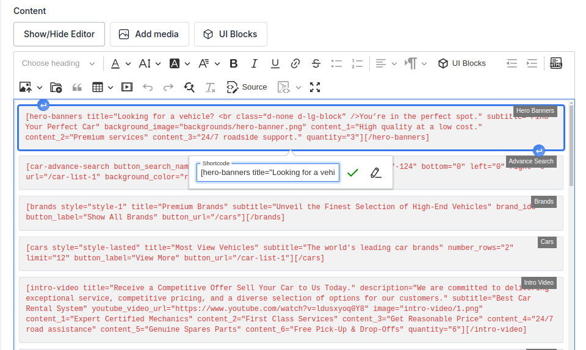
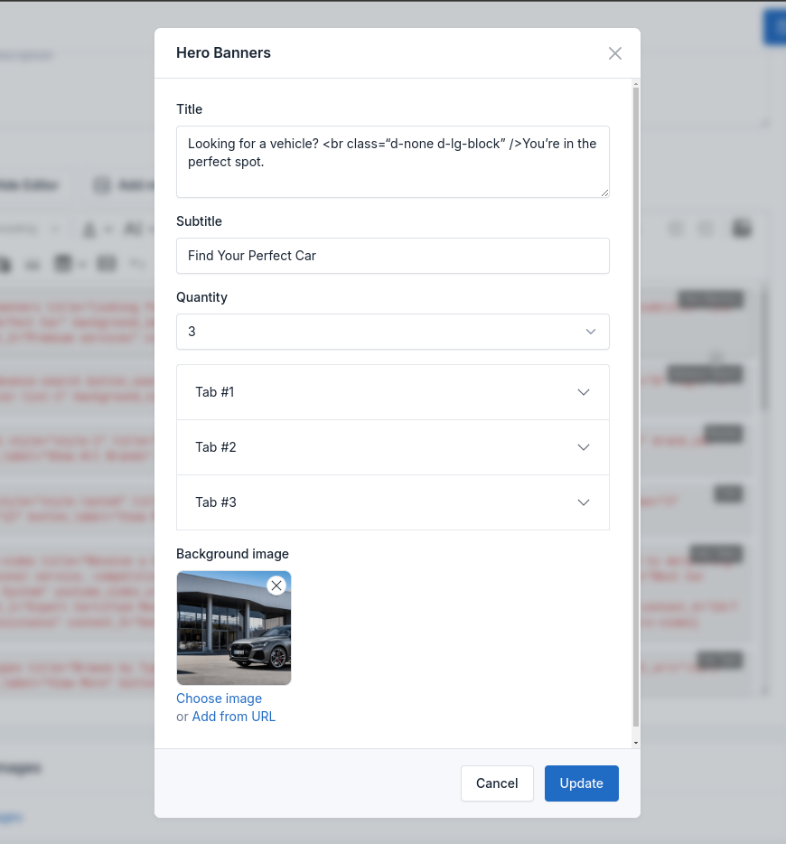
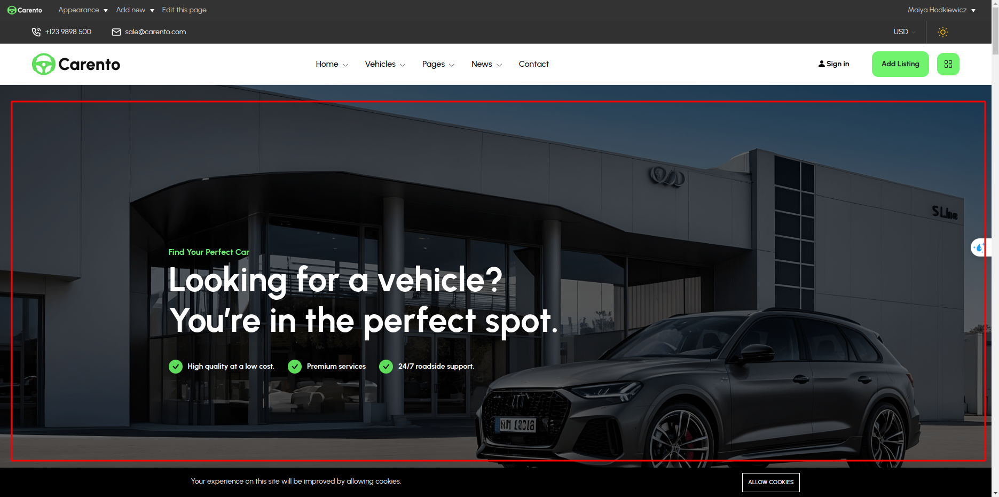

# UI Block (Shortcode)

UI Blocks, also known as Shortcodes, are small pieces of code that allow you to add predefined elements to your website.
They are used to enhance the functionality of your website without the need to write custom code.

## Usage

To use a shortcode, simply add the shortcode to the content of a page or post.

For example, to add a Blog posts to a page, use the following shortcode:

```html
[hero-banners title="Looking for a vehicle? <br class=“d-none d-lg-block” />You’re in the perfect spot." subtitle="Find Your Perfect Car" background_image="backgrounds/hero-banner.png" content_1="High quality at a low cost." content_2="Premium services" content_3="24/7 roadside support." quantity="3"][/hero-banners]
```





You can set attributes: `title`, `subtitle`, `quantity`, `background image`,... and more attributes.

The above shortcode will add a **Hero Banner**.

Go to the frontend of your website to see the result:



There are many more shortcodes but the setup is similar.
